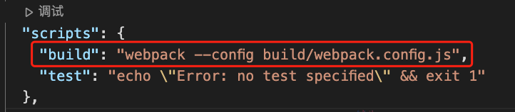
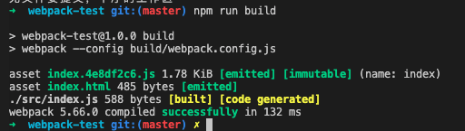
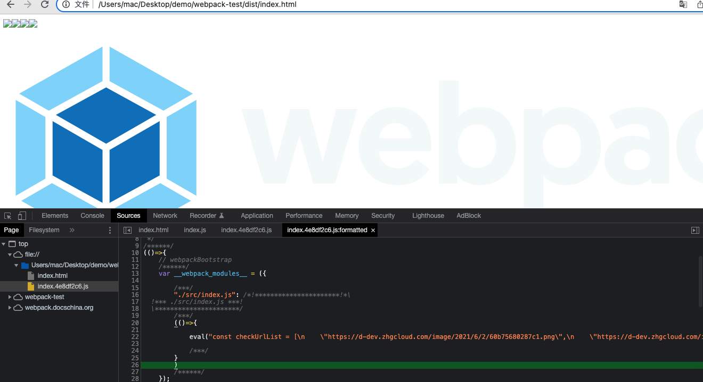
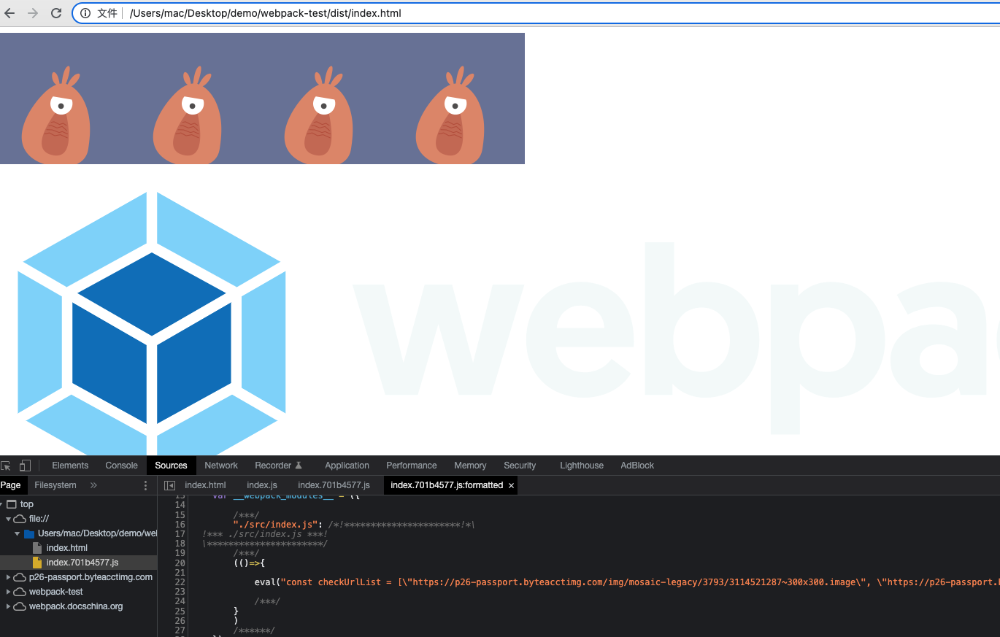

> `loader` 本质上是导出为函数的 `JavaScript` 模块。`loader runner` 中包含实用的方法`this.async()`可以使 `loader` 调用方式变为异步。

# 一、环境搭建

## 1\. 项目初始化

> 或许你期望按照官方给出的[指南](https://webpack.docschina.org/guides/getting-started/#basic-setup)来起步

新建目录并初始化项目

```js
mkdir webpack-loader
cd webpack-loader
npm init
```

安装`webpack`与`cli`

```js
npm i -D webpack webpack-cli

```

安装`html-webpack-plugin`与`clean-webpack-plugin`

```js
npm i -D html-webpack-plugin
npm i -D clean-webpack-plugin
```

-   html-webpack-plugin 会将 webpack 打包出来的 js 文件自动引入到 html 中
-   每次执行 npm run build 会发现 dist 文件夹里会残留上次打包的文件，clean-webpack-plugin 在打包输出前会清空文件夹

## 2\. 项目配置（模拟使用场景）

新建一个文件夹 src，然后新建一个文件 index.js，编写一段代码模拟使用场景

```js
const checkUrlList = [
    "https://d-dev.zhgcloud.com/image/2021/6/2/60b75680287c1.png",
    "https://d-dev.zhgcloud.com/image/2021/6/2/60b73e58b38d0.jpg",
    "https://d-dev.zhgcloud.com/image/2021/6/2/60b75758164c6.png",
    "https://d-dev.zhgcloud.com/image/2021/6/2/60b752cd01b1c.png",
    "https://webpack.docschina.org/site-logo.1fcab817090e78435061.svg",
];
for (let i = 0; i < 5; i++) {
    console.log(i);
    var img = document.createElement("img");
    img.setAttribute("src", checkUrlList[i]);
    document.getElementById("body").appendChild(img);
}
```

-   前四张图片地址是失效的，第五张可访问

新建一个文件夹 public，然后新建一个文件 index.html，用于在浏览器调试

```html
<!DOCTYPE html>
<html lang="en">
    <head>
        <meta charset="UTF-8" />
        <meta http-equiv="X-UA-Compatible" content="IE=edge" />
        <meta name="viewport" content="width=device-width, initial-scale=1.0" />
        <title>Document</title>
    </head>
    <body id="body"></body>
</html>
```

-   给`body`设置一个`id="body"`

## 3\. webpack 配置

新建一个 build 文件夹，里面新建一个 webpack.config.js，进行如下配置

```js
const path = require("path");
const HtmlWebpackPlugin = require("html-webpack-plugin");
const { CleanWebpackPlugin } = require("clean-webpack-plugin");
module.exports = {
    mode: "development", // 开发模式
    entry: {
        index: path.resolve(__dirname, "../src/index.js"),
    }, // 入口文件
    output: {
        filename: "[name].[chunkhash:8].js", // 打包后的文件名称
        path: path.resolve(__dirname, "../dist"), // 打包后的目录
    },

    plugins: [
        new CleanWebpackPlugin(),
        new HtmlWebpackPlugin({
            template: path.resolve(__dirname, "../public/index.html"),
            filename: "index.html",
            chunks: ["index"], // 与入口文件对应的模块名
        }),
    ],
};
```

在`package.json`添加打包命令



Tips: 需要注意的是`webpack`是运行在`node`环境中的，谨记这一点下面会用到

## 4\. 使用 loader 前打包

运行打包命令


在浏览器查看未使用 `loader` 打包的 `index.js`


-   页面按序加载了四张失效图和一张有效图

# 二、手写 loader

新建一个 `lib` 文件夹，里面新建一个 `replace-legal-img.js`，编写如下代码

```js
const https = require("https"); // 加载待检测的 图片`url`，根据其返回值决定是否替换成合法图片`url`
const parser = require("@babel/parser"); // 会将源代码解析成 `AST`
const traverse = require("@babel/traverse").default; // 对 `AST` 节点进行递归遍历，生成一个便于操作、转换的 `path` 对象
const generator = require("@babel/generator").default; // 将 `AST` 解码生成 `js` 代码
module.exports = async function (source) {
    const ast = parser.parse(source, { sourceType: "module" });
    var callback = this.async();
    let count = 0;
    let promiseAll = [];
    traverse(ast, {
        enter(path) {
            if (
                path.node.type === "StringLiteral" &&
                /^http[s]{0,1}:\/\/([\w.]+\/?)\S*[png|jpg|image|svg]$/.test(
                    path.node.value
                )
            ) {
                promiseAll[`${count}`] = new Promise((resolve, reject) => {
                    https.get(path.node.value, function (res) {
                        if (res.statusCode === 404) {
                            path.node.value =
                                "https://p26-passport.byteacctimg.com/img/mosaic-legacy/3793/3114521287~300x300.image";
                            resolve(path.node.value);
                        } else if (res.statusCode === 200) {
                            resolve(path.node.value);
                        }
                    });
                });
                count++;
            }
        },
    });
    Promise.all(promiseAll)
        .then((result) => {
            output = generator(ast, {}, source);
            callback(null, output.code);
        })
        .catch((error) => {
            console.log(error);
        });
};
```

-   由于 `webpack` 基于 `node`，所以使用`https`发起网络请求
-   图片`url` 是 `String` 类型的字面量即 `StringLiteral`，配合正则表达式可以排出非图片`url`类型的`StringLiteral`
-   由于网络请求是异步的，需要配合`this.async()`告知 `loader runner` 等待异步结果返回
-   `source`若包含多个图片`URL`会发起多个网络请求，这时需要使用 `promiseAll`组织所有`promise`的返回，使用 `count` 计数
-   当`source`中所有图片`URL`的请求全部执行完毕时`Promise.all(promiseAll)`给出返回值，这里再使用`generator`将检测替换新 `value` 后的 `AST`转换成 `js`，并使用 `callback`告知`loader runner`执行完毕

最后在 webpack.config.js 中引入这个 loader

```js
module.exports = {
    ...

    module: {
        rules: [
            {
                test: /\.js$/,
                use: path.resolve(__dirname, "../lib/replace-legal-img.js"),
            },
        ],
    },

    ...
};
```

在浏览器查看未使用 `loader` 打包的 `index.js`


-   页面按序加载了四张被替换的图片和一张有效图

# 三、参考

1\. [2020 年了,再不会 webpack 敲得代码就不香了(近万字实战)](https://juejin.cn/post/6844904031240863758#heading-1)
2\. [AST 抽象语法树——最基础的 javascript 重点知识，99%的人根本不了解](https://segmentfault.com/a/1190000016231512)
3\. [Webpack 手写 loader 和 plugin](https://juejin.cn/post/6888936770692448270#heading-2)
4\. [手写清除 console 的 loader](https://juejin.cn/post/7039258932845477925#heading-4)
5\. [babel-doc](https://babeljs.io/docs/en/babel-traverse)
[webpack-doc](https://webpack.docschina.org/api/loaders#thisasync)
