# 前置-密码学

> 比特币是基于`密码学`构建的` 去信任``数字货币 ` - 中本聪《比特币白皮书》

-   密码学
    > 离开密码学，我们就像是在网络世界中裸奔，毫无隐私可言
    > 密码学是先于区块链产生的基础学科，有完备的理论及技术体系。如 HTTPS 采用了非对称加密 + 对称加密 + 服务器身份认证来实现可靠的加密传输。

*   哈希算法

    -   正向快速
        MD5 、 SHA-256 每秒计算可在 500-1000 万次

    -   逆向困难
        一个优秀的哈希算法是不可能通过密文反推明文的
        ```js
            # echo "一串很长的文本信息" | md5sum
            e0aac893629b048e8797800294f55004
        ```
    -   输入敏感
        原始信息即使发生一丁点的变化，重新计算的哈希值与之前比较都应该有很大的不同

    -   避免碰撞
        避免不同的明文信息产生相同的哈希值

数据存储：哈希算法相当于是对信息提取摘要，是数据的指纹，在区块链数据落盘的时候，可以使用交易哈希、区块哈希分别作为交易及区块的数据主键，只要保持了数据与标识对应索引关系，就可以把交易跟区块存储在任意数据库中。

区块成链：区块链中每个区块属性中包含了前一个区块的哈希，从而构建成一条由区块哈希关联的数据链条。

-   非对称加密算法
    -   对称与非对称体现在对密钥的处理上。对称表示加密和解密都使用同一套密钥，非对称加密却分为公钥跟私钥，如果使用公钥加密，只有用对应的私钥才能解密，`私钥只有一把`。
    -   解决了对称加密算法使用过程中遇到的问题，但其加解密的效率是远不如对称加密算法。

在使用过程中常采用混用的方式，即明文数据采用对称加密算法进行加密，然后使用非对称加密算法加密对称加密的密钥和明文数据哈希。
在区块链中对非对称加密算法的使用并不是直接被用作数据加密，而是利用其具备身份确权的能力，也就是数字签名。
在诸如比特币以太坊等公有链中都有类似于地址、账户的概念，可以认为这就是区块链中的身份证，这个身份证不同于现实中需要政府统一颁发，而是分散的基于非对称加密算法的公钥的一种形变表示，每个人的私钥就相当于所有权证名。

==》 密码学是因，区块链是果。

-   去信任
    数字签名（非对称加密）有证明所有权的能力，所以基于数字签名去证明数字货币所有权问题。

-   数字货币
    比特币 BCH、`以太坊(经典 ETC、ETH)`、狗狗币...

# 前置-[拜占庭将军问题](https://baike.baidu.com/item/%E6%8B%9C%E5%8D%A0%E5%BA%AD%E5%B0%86%E5%86%9B%E9%97%AE%E9%A2%98/265656?fr=aladdin)

-   共识算法可以说是区块链技术的核心思想，是区块链运行的行为准则。

# 简介

-   本质：特殊的分布式数据库
-   目的：电子化数据储存方法
-   特点：去中心化（低成本的方式来实现可靠的契约关系）

# 详情

## 一、区块

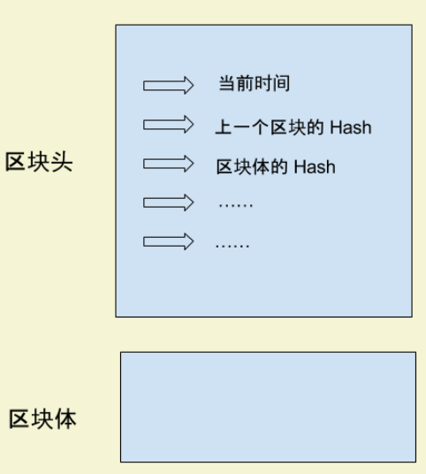

### keyword

-   区块头（Head）：时间戳、哈希（SHA256 函数生成）、Merkle Root
-   区块体（Body）：实际数据
-   哈希：SHA256 是区块链的哈希算法、哈希由区块头唯一决定。这意味着，如果当前区块体的内容变了，或者上一个区块的哈希变了，一定会引起当前区块的哈希改变。正是通过这种联动机制，区块链保证了自身的可靠性，数据一旦写入，就无法被篡改。
    <pre><code>
      Hash = SHA256( 区块头 )
    </code></pre>
    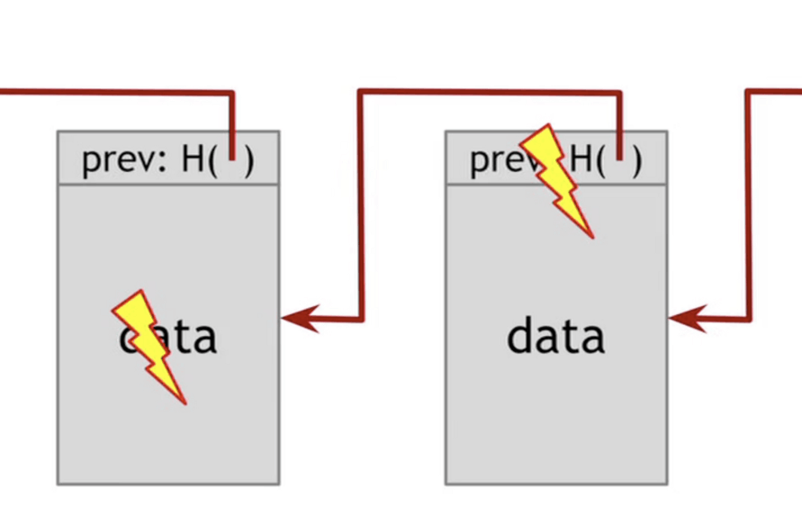
    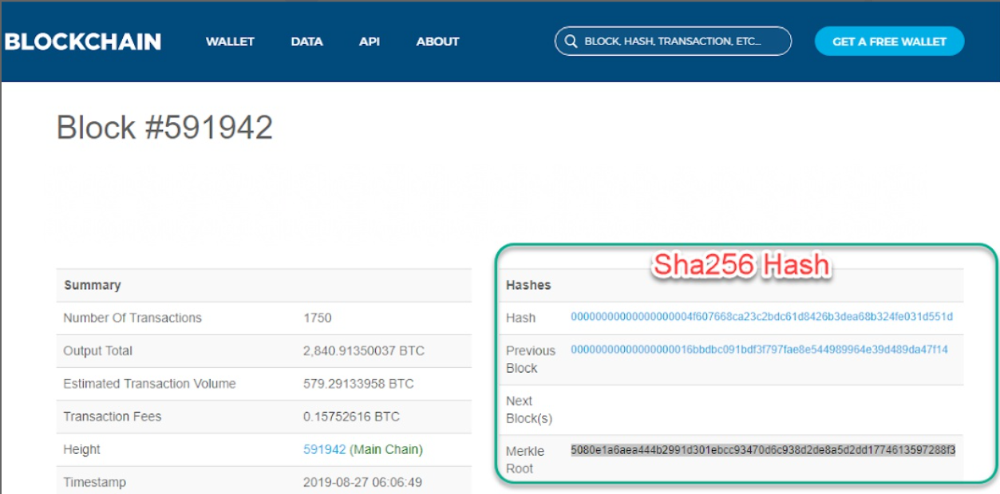

## 二、默克尔树（Merkle Root）

-   作用：通过节点 hash 计算交易在区块，从而验证交易
    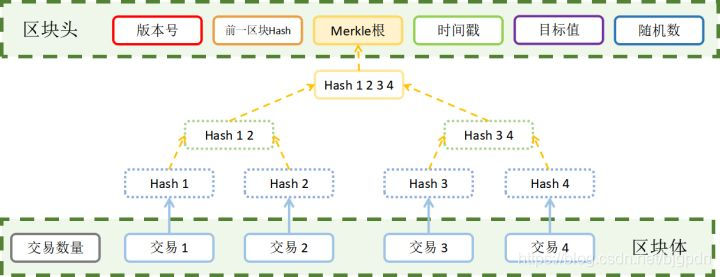
    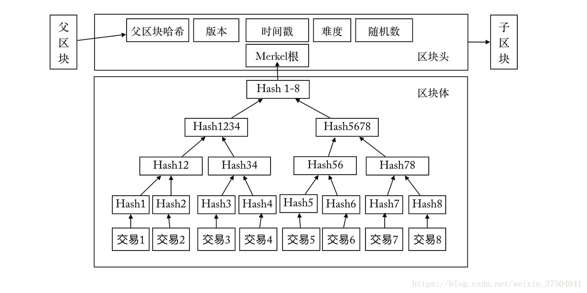

## 三、产生流程

1\. 数据交易

> 比特币区块链是现存历史最悠久的区块链，在比特币区块链上，每个区块的大小在 1 MB 左右。
> 发生交易，产生数据

2\.（通过哈希运算）链接区块
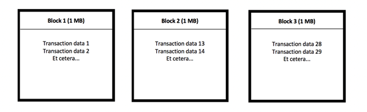

有三个独立的交易数据产生的区块，其中区块一根据其内部数据串生成一个特殊的（数字）签名
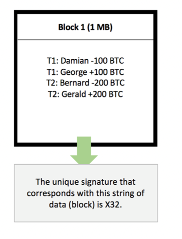

将区块一的签名放到区块二中，区块一与区块二产生关联，后续区块逐次添加前一区块产生的签名，关联成链
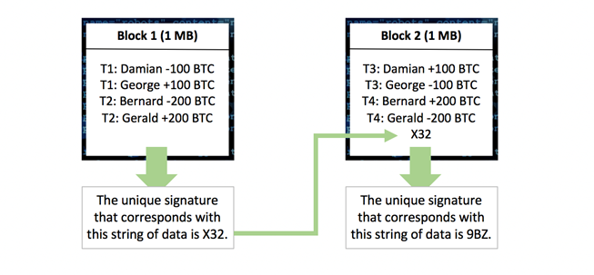

若区块一被修改，由于关联存在，后续每一区块需要重新计算其签名，理论上不可行，因而保证了其不可篡改性。
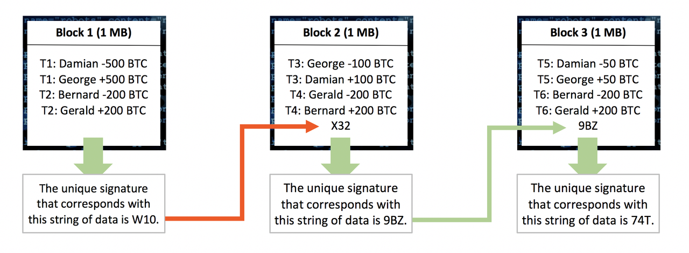

3\. 生成签名（哈希值）
在区块链上，区块签名是通过密码学哈希函数生成的。密码学哈希函数是一个极其复杂的数学公式：将任意数据串作为输入值代入公式，可以得到一个独一无二的 64 位输出值。
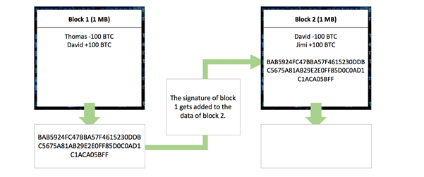

哈希函数的种类有很多，对于同一个密码学哈希函数来说，相同的输入必定会得到相同的输出，不同的输入必定会得到不同的输出。

4\. 合格的签名与区块签署
并非所有的签名都符合要求。区块链协议会预先确定一些要求，比如，在比特币区块链上，只有以连续的零开头的数字签名相对应的区块才能上链。（因此可以调整零的个数来应对算力增加）
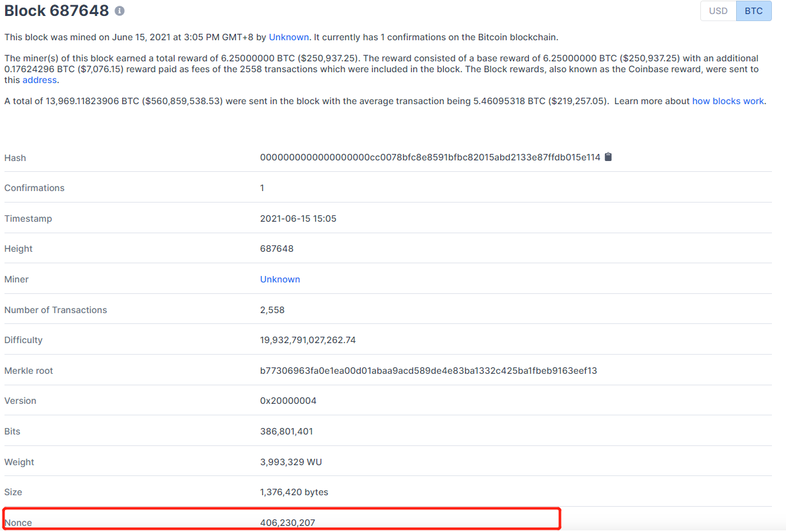

由上图知，每个区块里面还另外添加了一段特定长度的、可以改动的数据，这段数据就是区块的 <font color=red>nonce</font> 。由于交易数据和元数据（区块编号、时间戳等等）需要保持原样（否则意义就改变了）。所以需要反复更改 nonce、对区块数据进行哈希运算。
<font color=red>寻找合格签名的过程就叫做挖矿</font>，也就是矿工所做的事。矿工投入大量电力，转化成算力，不断代入 nonce 进行哈希运算，直到找到合格的签名（输出）为止。矿工手中掌握的算力越多，哈希运算的速度就越快，抢先找到合格签名的可能性就越高。这是一种反复试错的过程。

5\. 区块链的不可变性
“最长链规则”，是 Nakamoto Concensus（中本聪共识机制）的一部分。（并不是所有区块链都采用了中本聪共识），攻击者只有制造出一条比当前主链更长的链，才能成功改变大家共同认可的交易记录，这就要求攻击者的算力超过全网其他人的算力总和，叫做 51% 攻击。
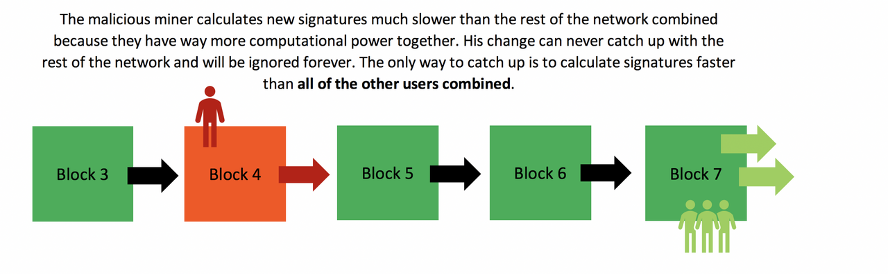

6\. 区块链的不可变性
区块链协议自动以最长链上的交易记录为准，将这条链视为代表绝大多数参与者的链。打造最长链需要消耗全网绝大部分算力。被篡改过的区块就与最长链断开了链接，因此会被全网绝大多数节点自动拒绝

7\. POS VS POW 挖矿机制
POS（Proof of Stake）最早出现在点点币的创始人 Sunny King 的白皮书中，它的目的就是为了解决使用 PoW 挖矿出现大量资源浪费的问题。

区块链共识机制的第一步就是随机筛选一个记账者，PoW 是通过计算能力来获得记账权，计算能力越强，获得记账权的概率越大。PoS 则将此处的计算能力更换为财产证明，就是节点所拥有的币龄（随 POS 版本机制变化，拥有币的数量/数量\*拥有时间）越多，获得的记账的概率就越大。

优点：PoS 似乎完美地解决了 PoW 挖矿资源浪费的问题，甚至还顺带解决了 51% 攻击的问题

缺点：

-   币发行的问题。一开始的时候，只有创始区块上有币，意味着只有这一个节点可以挖矿，所以让币分散出去才能让整个网络壮大，那么如何分散出去又是另外一个难题了。（ERC20 类型的标准合约代币的出现，这个问题被解决）
-   由于币龄是与时间挂钩的，这也意味着用户可以无限囤积一定的币，等过了很久再一次性挖矿发起攻击；所以解决方案是：PoS 机制需要引入一个时间上限来控制时间因素的自然增长。
-   虽然引入了时间上下限，用户还是倾向于囤积代币，这会造成币流通的不充分；基于此，所以瑞迪币引入了币龄按时间衰减，构造了权益速度证明，鼓励用户流动代币，而不是倾向于囤积代币。
-   离线攻击，即使引入了时间上下限，时间仍然是自然流动的，也就是可以不需要求挖矿节点长时间在线。挖矿是可以离线的，严重影响了区块链网络的健壮性。
-   致命问题：无成本利益问题。大体的意思在 PoS 系统中做任何事几乎没有成本，比如在 PoS 系统上挖矿几乎没有成本，这也就意味着分叉非常方便。任何持币较少的用户都可以尝试分叉，并且把分叉链广播出去。任何逐利的矿工并不会使这个系统变得更强壮稳定，而是更加的混乱。

8\. 以太坊与智能合约

> 区块链领域的合约表达的是可以“自治自理”的 计算机协议，这套协议具有自我执行、自我验证的属性。如果完全从技术角度来看，智能合约等价于一段事先就被规定好逻辑和条款的计算机代码被激活运行的状态，同时，智能合约也提供了通用的用户接口，用户可以通过接口与用户交互。

-   以太坊项目又被称作区块链 2.0 项目，这里 2.0 就是指智能合约

-   以太坊 Ethereum 项目的目标是打造一个去中心化的新一代互联网应用平台。

-   推出了 EVM——以太坊智能合约虚拟机，设计了自己的智能合约语言 Solidity（GO && C++）。

与 BCH 主要区别

-   研究并实现了自己的 PoW 挖矿算法——ETHASH，这是一个内存困难型的挖矿算法。

-   叔伯块激励机制，降低了挖矿中心化的趋势。取消了 UTXO 模型，采用了账户模型和世界状态，提供了数据结构的可塑性。

-   设计了 Gas 机制，避免程序死循环消耗全网资源的情况出现。
    Gas 是执行智能合约操作的燃料，智能合约的每一个步骤都会消耗 Gas，Gas 是由以太坊的平台代币以太币转化而来，最小单位是 wei，1ETH 相当于 10 的 18 次方 wei。
    以太币可以通过 PoW 挖矿而产生，目前`以太坊主要通过 GPU `挖矿。挖出一个块可以换得 5 个以太币，并且还有一定的交易费、以及叔伯块的奖励。

-   研究并实现了自己的 PoS 共识算法——Casper，可防止 Nothing-at-Stake 攻击。

-   以太坊提供了在区块链自由编程的能力，智能合约让所有人得以开发属于自己的 Dapp，这是与比特币作为单纯的数字货币所不具有的能力。

## 四、扩容、ETC/ETH 硬分叉-The Dao 事件、空气币传说由来-扩容之争引起的 IFO

[扩容](https://zhuanlan.zhihu.com/p/30930715)：区块传输部分的代码是中本聪从别处抄的，自带 32M 上限，有人觉得太高了：万一有人故意在区块链上传输很多交易，10 分钟 32M，对我们搞开发挺不方便的，看平时一个块最多就 1~2 kb 的交易，不如设 1M 上限，中本聪接受了。
[ETC/ETH 硬分叉-The Dao 事件](https://www.528btc.com/zhuanti/5344.html)：
2016 年 4 月 30 日，The DAO 项目开始众筹。项目代币 DAO，众筹时间为期 28 天，代币价格大约是 100 个 DAO 兑换 1 至 1.5 个以太坊。The DAO 项目总共筹到了超过 1200 万个以太坊，几乎占到了当时以太坊数量的 14%，当时价值超过 1.5 亿美金，参与众筹的人数超过 11000 人。之后 The DAO 项目迅速被黑客盯上。

2016 年 6 月 17 日，黑客利用 The DAO 代码里的一个递归漏洞，不停地从 The DAO 资金池里分离资产;随后，黑客利用了 The DAO 的第二个漏洞，避免分离后的资产被销毁。如果是正常情况，The DAO 的资产被分离之后，就会被销毁。但是，黑客在调用结束前，把盗来的 The DAO 资产转移到了其他账户，避免了被销毁。如此熟悉 The DAO 代码与机制的人，全世界或许不超过 100 个。黑客利用这两个漏洞，进行了两百多次攻击，总共盗走了 360 万的以太坊，超过了该项目筹集的以太坊总数目的三分之一。

[空气币传说由来-扩容之争引起的 IFO](https://time.geekbang.org/column/article/7690)
扩容之争基本在 2017 年 11 月结束，比特币硬分叉出比特币现金已经成了定局。比特币现金的出现还带来了一件新事物，就是 IFO——Initial Fork Offering，也就是分叉比特币形成新的数字代币，这其实就是 ICO 的替代品。

2017 年 9 月 4 号我国七部委发文明令禁止 [ICO](https://baike.baidu.com/item/ICO/21498451?fr=aladdin)，所有和人民币挂钩的交易所都必须限期关闭。“一刀切”政策让 ICO 在国内基本死掉了，于是国内的人坐不住了，就纷纷开始寻觅替代品。比特币的分叉带来了全新的灵感，于是 IFO 应运而生。ICO 的中文名是首次代币发行，又称为区块链众筹，这是一种新型的融资模式，投资者可以用手中的比特币或其他代币投到其他的区块链创始项目。ICO 从本质上来说就是一纸白皮书，接下来全靠吹，忽悠散户投币，“我要出一个新的代币了，你们快来买吧。”而 IFO 的集资依靠的是与比特币的关联，“我要出一个代币了，这个代币是由比特币分叉出来的哦，你们快来买吧！”靠着与比特币的连带性，IFO 打了一记集资的擦边球。所以国内诸多项目方和经验资深的投资方一拍即合，搞 IFO 吧。但是 IFO 比 ICO 限定在只能从比特币上分叉，所以技术的发挥仍然有限。

## 社区治理-女巫攻击、贿选、公地悲剧
