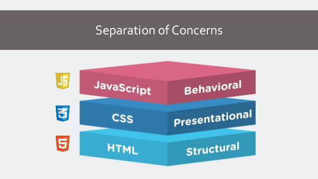
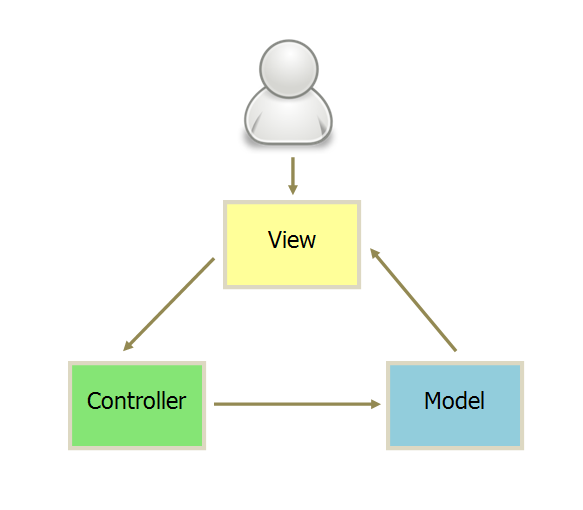
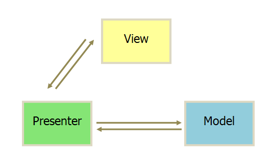
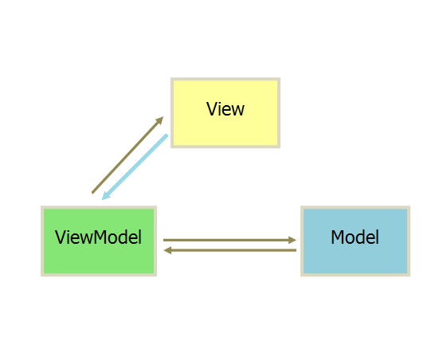
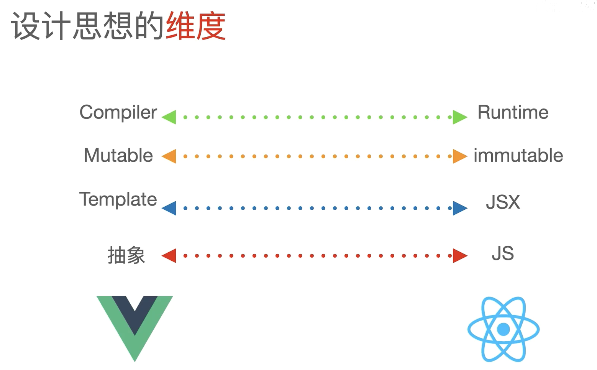
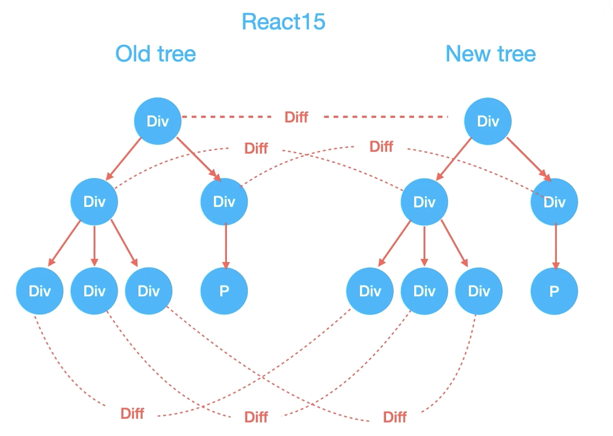
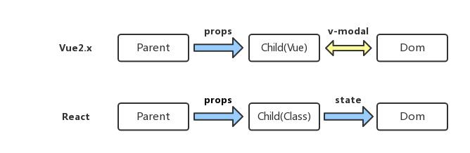

## 🚩 前置-[关注点分离原则](https://en.wikipedia.org/wiki/Separation_of_concerns#HTML.2C_CSS.2C_JavaScript) VS &nbsp;MVC & MVVM(MVP)

&emsp;&emsp;网页开发有一个原则，叫做[关注点分离（separation of concerns）](https://en.wikipedia.org/wiki/Separation_of_concerns#HTML.2C_CSS.2C_JavaScript)，旨在让各种技术只负责自己的领域以减少耦合。对于网页开发来说，主要是三种技术分离。


> -   HTML 语言：负责网页的结构，又称语义层
> -   CSS 语言：负责网页的样式，又称视觉层
> -   JavaScript 语言：负责网页的逻辑和交互，又称逻辑层或交互层

## 🚩 前置-[MVC & MVP & MVVM](https://www.ruanyifeng.com/blog/2015/02/mvcmvp_mvvm.html)

&emsp;&emsp; MVC 模式的意思是，软件可以分成三个部分，一般用户行为及各部分之间的通信方式如下。


> -   View（用户界面） 传送指令到 Controller
> -   Controller（业务逻辑） 完成业务逻辑后，要求 Model 改变状态
> -   Model（数据保存） 将新的数据发送到 View，用户得到反馈

&emsp;&emsp; 根据关注点分离原则很容易将 html 看成 view；将 js 的 ajax 当做 Model；js 看成 controller，负责处理用户与应用的交互，响应对 View 的操作（对事件的监听），调用 Model 对数据进行操作，完成 Model 与 View 的同步（根据 Model 的改变，通过选择器对 View 进行操作操作 DOM）。

```javascript
$("#alert-btn").on("click", function () {
    $("#app .input").val("hi");
});
```

[❌] 所有通信都是单向的，应用程序复杂性高，难以分工开发 <br>
[❌] View 直接操作 DOM 代价高，Model 被弱化，而 Controller 非常厚，所有逻辑都部署在这里 <br>
[❌] 内存浪费，程序运行缓慢效率低 <br>



-   MVP 模式将 Controller 改名为 Presenter，同时改变了通信方向
-   View 很薄，不部署任何业务逻辑，View 称为"被动视图"（Passive View）

&emsp;&emsp; MVVM 模式将 Presenter 改名为 ViewModel，基本上与 MVP 模式完全一致。
区别在于 ViewModal 与 View 的绑定，其中 React 使用单向绑定，Vue 使用双向绑定。


-   所谓 MVVM，就是在前端的场景下，把 Controller 变成了 View-Model 层，作为 Model 和 View 的桥梁，Model 数据层和 View 视图层交给 View-Model 来同步，简化了业务与界面的依赖，解决了数据频繁更新的问题
-   在 MVVM 中，View 不知道 Model 的存在，Model 和 ViewModel 也观察不到 View，这种低耦合模式提高了代码的可重用性

&emsp;&emsp; 需要注意的是 AngularJS 的诞生，引领了前端 MVVM 模式的潮流。现在前端三大框架 Angular、React、Vue 的发展主线，也就是从这里开始的。在前端 MVVM 模式下，不同框架的目标都是一致的，就是利用数据驱动页面，但是怎么处理数据的变化，各个框架走出了不同的路线。


[官网简介 React](https://reactjs.org/)

> A <font color="red">JavaScript library</font> for building user interfaces

[官网简介 Vue](https://reactjs.org/)

> The Progressive <font color="red">JavaScript Framework</font>



**简言之有以下几点**<br>
1\. React 相比 Vue 更重运行时，因做全量 diff 会关注 fps 卡顿问题，因而诞生了 fiber <br>  
2\. React 强调数据不可变性，中间状态方便获取，做全量 diff，Vue1 全量响应式 watcher，Vue2 可变数据做依赖收集 做组件间 diff <br>
3\. React 使用划时代引入了 vdom 概念，JSX 语法糖本质是 React.createElement 的函数，会将 html 语法转换成 js 对象，Vue 使用了 template 语法，在限制 js 语法灵活性的同时提供了一些自定义指令，编译阶段也可对这些自定义指令做标记优化（更多的预处理操作）<br>

从以 MVVM 角度对比

> -   MVVM-ViewModal（响应式）
> -   MVVM-View（组件-Components、mixin、HOC、Hooks）
> -   数据流-Props 与组件通信

从项目实践对比

> -   项目-脚手架
> -   项目-路由
> -   项目-状态管理

## 🎯ViewModal- JSX VS new Vue({})

> 包含两点-tree diff 策略、数据单双向绑定

React-对应组件中的 JSX，它实质上是 Virtual DOM 的语法糖。

-   React 负责维护 Virtual DOM ,用一个 JavaScript 对象来描述整个 DOM 树。可以很方便的通过虚拟 DOM 计算出变化的数据，去进行精确的修改真实 dom，这一过程为 diff 运算 <br>
-   [Reconciliation](https://reactjs.org/docs/reconciliation.html) 是 React 用来对比两颗虚拟 DOM 树的算法，以判断哪些 DOM 需要更新 ，fiber 可以简单地看作对页面帧数要求较高的情况下的对 Reconciliation 的一种优化方案，用见缝插针理解就好<br>
-   React-dom 会把 Virtual DOM 渲染成浏览器中的真实 DOM <br>

值得注意的是 DOM 只是 react 可以渲染的环境之一，其他的还有通过 react-native 实现 iOS 和 Android 视图的渲染。
react 之所以能做到这一点是因为 react 在设计的时候就已经考虑到了将 Reconciliation 和 render 分开。Reconciliation 负责计算树的更新，而 render 根据这些信息来负责应用程序的更新。



Vue-虽然没有完全遵循 MVVM 模型，但是 Vue 的设计也受到了它的启发。因此在 Vue 文档中也使用了 ViewModel 表示 Vue 实例。

-   每个 Vue 应用都是通过用 Vue 函数创建一个新的 Vue 实例开始，所有的 Vue 组件都是 Vue 实例，并且接受相同的[选项对象](https://cn.vuejs.org/v2/api/#%E9%80%89%E9%A1%B9-%E6%95%B0%E6%8D%AE)，称之为 Options api
-   vue 使用了可遍历的 template 语法

```javascript
var vm = new Vue({
    data: {
        // 声明 message 为一个空值字符串
        message: "",
    },
    template: "<div>{{ message }}</div>",
});
// 之后设置 `message`
vm.message = "Hello!";
```

-   当一个 Vue 实例被创建时，它将 data 对象中的所有的 property 加入到 Vue 的<font color="yellow">[响应式系统](https://cn.vuejs.org/v2/guide/reactivity.html)</font>中。当这些 [property 的值发生改变时](https://developer.mozilla.org/zh-CN/docs/Web/JavaScript/Reference/Global_Objects/Object/defineProperty)，视图将会产生“响应”，即匹配更新为新的值。

```javascript
function myclass() {}

Object.defineProperty(myclass.prototype, "x", {
    get() {
        return this.stored_x;
    },
    set(x) {
        this.stored_x = x;
    },
});

var a = new myclass();
a.x = 1;
console.log(a.x); // 1
```

-   Vue 如何做双向绑定

```javascript
var vm = new Vue({
    data: {
        // 声明 message 为一个空值字符串
        message: "",
    },
    template: "<div>{{ message }}</div>",
});
// 之后设置 `message`
vm.message = "Hello!";

Object.defineProperty(vm.prototype, "message", {
    get() {
        return this.data.message;
    },
    set(newMessage) {
        this.data.message = newMessage;
    },
});
```

-   Vue 1 的解决方案也是使用响应式，初始化的时候，Watcher 监听了数据的每个属性，这样数据发生变化的时候，我们就能精确地知道数据的哪个 key 变了，去针对性修改对应的 DOM

-   vue3 使用了 Proxy 代理，在 dom 层面做了更精确的 block 标记，静态节点会提升，另外做了拆包，[@vue/reactivity](https://www.jianshu.com/p/d347958c23ff)可以引入到 react 或其他框架内实现响应式

```javascript
var vm = new Vue({
    data: {
        // 声明 message 为一个空值字符串
        message: "",
    },
    template:
    "<div>
        <span>name</span>
        <span>age</span>
        <span>{{ message }}</span>
    </div>
    ",
});
```

### 小结

vdom（响应式） 优点

-   最短路径计算，对象描述 DOM，适合跨端开发

Vue 响应式

-   Vue 1、2 内部运行时，直接执行浏览器 API 的。但这样就会在 Vue 的跨端方案中带来问题，如要兼容小程序端还要引入小程序版本的 Vue（nvue），Vue 3 做了拆包处理，编译器核心和运行时核心与平台无关，使得 Vue 3 更容易与任何平台
-   Vue 2 响应式基于 Object.defineProperty() 实现，是对某个属性进行拦截，所以有很多缺陷，比如：删除数据就无法监听，需要 $delete 等 API 辅助才能监听到，Vue 3 proxy 才是真正意义上的代理。
-   Vue 2 中 this 是一个黑盒，使用 Option API 来组织数据和方法，然而所有的 methods、computed 都在一个对象里配置，代码冗长，并且由于所有数据都挂载在 this 之上，对 TypeScript 的类型推导也不友好，并且这样也不好做 [Tree-shaking](https://developer.mozilla.org/zh-CN/docs/Glossary/Tree_shaking)剪除无用代码，Vue3 采用 Composition API

-   Vue 2 代码不好复用，组件很难抽离通用逻辑，只能使用 mixin，还会带来命名冲突的问题，Vue3 采用 Composition API 借（抄）鉴（袭）了 react 的 Hooks 做视点分离，代码更内聚

react 运行时

-   [Design Principles](https://reactjs.org/docs/design-principles.html)声明了，一些流行的库实现了“push”方法，在有新数据更新的时候可用。但是 React 坚持使用“pull”方法，这可以将计算延迟到需要的时候。
-   React Scheduling（在 React 中确定何时 work 的过程）原则认为 不必立即应用每个更新，更新有优先级，React 在应用程序中唯一的作用就是计算什么相关，什么不相关。

## 🎯 组件-Components、slot、mixin、HOC、Hooks

> 如何在多个组件之间共享代码是一个重要问题，在 Vue 中组合不同功能的方式是通过 mixin、slot，而在 React 中通过 HoC（已不推荐使用） 以及 Hooks

### mixins

React 最早也是使用 mixins 的，不过后来他们觉得这种方式对组件侵入太强会导致很多问题([由于声明式渲染和自上而下的数据流，许多团队在采用 React 时能够在发布新功能的同时修复一堆错误](https://reactjs.bootcss.com/blog/2016/07/13/mixins-considered-harmful.html))

### [react]Class=>HOC=>Hooks

> 为什么会诞生 HOC ？
> React 出现之时，主流的方式还是基于对象去考虑问题。例如获得一个对话框的实例，然后通过 dialog.show(), dialog.hide() 这样的方式细粒度地去控制 UI 的变化，React 也顺应了这一方式，Class 天然的符合这一要求且本身自带状态操作，因此采用 Class 来组织状态和函数

Class 在作为 React 组件的载体时有些牵强的，主要有两方面的原因。

1\. React 组件之间是不会互相继承的。比如说，你不会创建一个 Button 组件，然后再创建一个 DropdownButton 来继承 Button。所以说，React 中其实是没有利用到 Class 的继承特性的。 <br >

2\. 所有 UI 都是声明出来由状态驱动的，因此很少会在外部去调用一个类实例（即组件）的方法。因此，通过函数去描述 State => View 这样的一个映射是最为自然的方式。

当时有一个局限是，函数组件无法存在内部状态，必须是纯函数，而且也无法提供完整的生命周期机制。

> Hooks
> 梳理一下上述需求- 能够把一个外部的数据绑定到函数的执行。当数据变化时，函数能够自动重新执行，产生更新后的结果。这样的话，任何会影响 UI 展现的外部数据，都可以通过这个机制绑定到 React 的函数组件。这就是 hooks

### [Vue]插槽 slot

往往我们可能会因为不同的插槽，做不同的事情，比如有一个 footer 插槽用来改变模态框底部的内容，header 用来改变顶部的内容。可以通过传入一个对象的形式进行具名插槽的一个场景模拟。同样的也会将其传递到一个 Props 当中去。
[vue]在 Vue 中通过 slot 传递组件模板给组件进行渲染。

```javascript
<Model>
    <slot name="header"></slot>
    <div>{info}</div>
    <slot name="footer"></slot>
</Model>
```

[React]React 没有插槽的概念，但其实在组件内部中不论是 JSX 还是 DOM 都会被传入到 Props 的 children 当中去，隐含的实现了类似于 Vue 的普通插槽。

```javascript
<Model>
    <slot name="header"></slot>
    <div>{info}</div>
    <slot name="footer"></slot>
</Model>
```

### CSS

[❌]

```javascript
<h1 style="color:red;font-size:46px;" onclick="alert('Hi')">
    Hello World
</h1>
```

[✅react] cssModule 方案

```javascript
import 'styles' from './index.scss'
export default () => {
   return (
       <>
            <div className="styles.main"><div/>
       </>
   )
}

===> index.scss
.main{
    padding: 0
}
```

[✅vue] 选择器（在 style 标签上声明一个 scoped 以区分组件样式。最后组件打包时加入一个 hash 值）

```javascript
<template>
    <div class="main"></div>
</template>

<script>
</script>

<style scoped>
    .main{
        padding: 0
    }
</style>
```

-   [Style Component](https://juejin.cn/post/6844903878580764686#heading-6)

    ```javascript
    import React from "react";
    import Styled from "styled-components";

    export default () => {
        const Wrapper = Styled.div`
              & >.title { 
                  color: red;
              }
          `;
        return (
            <Wrapper>
                Red Text Wrapper....
                <p className="title">1111</p>
            </Wrapper>
        );
    };
    ```

-   [Css in js](https://www.ruanyifeng.com/blog/2017/04/css_in_js.html)

## 🎯 数据流-单向数据流 VS 双向数据流



```javascript
[❌]this.state.Status === 'OK'
[✔️]this.setState({ Status: 'OK' })
```

[React] 开发者通过 setState 更新 state 的值来达到重新 render <br>
[Vue] 响应式数据渲染，通过 getter/setter(vue2.x)以及一些函数的劫持可以精确感知数据变化

1\. Vue 和 React 设计理念上的区别，Vue 使用的是可变数据，而 React(onChange/setState()模式)更强调数据的不可变 <br>
2\. 由于一般会用 Vuex 以及 Redux 等单向数据流的状态管理框架，因此很多时候我们感受不到这一点区别
## 🎯 项目-脚手架

[Vue]VueCli <br>
[React] <br>
[❌]create-react-app <br>
[✔️]umi => 蚂蚁团队 ant design, dva <br>

react：umi+dva+antd vue: vue-cli+vuex+element

## 🎯 项目-路由

[Vue]

```javascript
export default {
    routes: [
        { path: "/login", component: "login" },
        {
            path: "/",
            component: "@/layouts/index",
            children: [
                { path: "/list", component: "list" },
                { path: "/main", component: "main" },
            ],
        },
    ],
};
```

[React]

```javascript
export default {
    routes: [
        { path: "/login", component: "login" },
        {
            path: "/",
            component: "@/layouts/index",
            routes: [
                { path: "/list", component: "list" },
                { path: "/main", component: "main" },
            ],
        },
    ],
};
```

[对照 umi]

|   属性   |             vue-router             | react-router  | umi |
| :------: | :--------------------------------: | :-----------: | :-: |
| 路由变化 | beforeRouteLeave ｜ RouterListener | onRouteChange |
| 路由新增 |    addRoutes ｜ RouterListener     |  patchRoutes  |

## 🎯 项目-状态管理

[Vue]vuex

```javascript
export default {
    // 同样的命名空间
    namespace: "todo",
    state: {
        // 类似Vuex State
        list: [],
    },
    Mutations: {
        // 类似Vuex Mutations
        save(state, { payload: { list } }) {
            return { ...state, list };
        },
    },
    actions: {},
};
```

[React]redux 全家桶 ,Mobx ==> dva

```javascript
export default {
    // 同样的命名空间
    namespace: "todo",
    state: {
        // 类似Vuex State
        list: [],
    },
    reducers: {
        // 类似Vuex Mutations
        save(state, { payload: { list } }) {
            return { ...state, list };
        },
    },
    effects: {
        *queryUserInfo({ payload: value }, { call, put, select }) {
            // 对比Vuex Actions
        },
    },
    subscriptions: {
        setup({ dispatch, history }) {
            // 监听路由的变化，请求页面数据
        },
    },
};
```

## ⛩️ 小结

1\. 在 Vue 框架下，如果数据变了，那框架会主动告诉你修改了哪些数据；而 React 的数据变化后，我们只能通过新老数据的计算 Diff 来得知数据的变化。

2\. Vue 的 template 在处理上更加优雅于 React 的 jsx；而 Class Component 中在 render 中会存在大量 porps, state 的解构算是一个痛点 Vue 对 template 则不需要通过 this.data.xxx 来渲染 options api，不过在 Vue3 发布后也摒弃了单一的 template，采用了类似 Hooks 的机制，需要开发人员自己取舍。

3\. Vue 作为 framWork 略厚重，在响应式、虚拟 DOM、运行时和编译优化之间，做了比较好的权衡和取舍，随着 Vue3 的发布，在给开发人员自由的同时也提供了一些比较好的效率提升工具，对新手还是友好的；React 作为 library 很轻巧，给了开发人员更多的发挥空间，也意味着开发人员要发挥更多的主观能动性。

## 📖 参考

[CSS in JS 简介](https://www.ruanyifeng.com/blog/2017/04/css_in_js.html) <br>
[MVC，MVP 和 MVVM 的图示](https://www.ruanyifeng.com/blog/2015/02/mvcmvp_mvvm) <br>
[理解 MVVM 在 react、vue 中的使用](https://www.cnblogs.com/momozjm/p/11542635.html) <br>
[React Fiber 中文文档](https://www.jianshu.com/p/86366581163d/)
