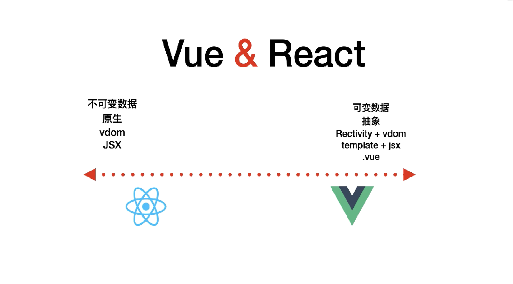

# 前置
## 🚩前置-[关注点分离原则](https://en.wikipedia.org/wiki/Separation_of_concerns#HTML.2C_CSS.2C_JavaScript)

网页开发有一个原则，叫做[关注点分离（separation of concerns）](https://en.wikipedia.org/wiki/Separation_of_concerns#HTML.2C_CSS.2C_JavaScript)，旨在让各种技术只负责自己的领域以减少耦合。对于网页开发来说，主要是三种技术分离。

> - HTML 语言：负责网页的结构，又称语义层
> - CSS 语言：负责网页的样式，又称视觉层
> - JavaScript 语言：负责网页的逻辑和交互，又称逻辑层或交互层

## 🚩前置-[MVC & MVP & MVVM](https://www.ruanyifeng.com/blog/2015/02/mvcmvp_mvvm)

   MVC模式的意思是，软件可以分成三个部分，一般用户行为及各部分之间的通信方式如下。


> - View（用户界面） 传送指令到 Controller
> - Controller（业务逻辑） 完成业务逻辑后，要求 Model 改变状态
> - Model（数据保存） 将新的数据发送到 View，用户得到反馈

   根据关注点分离原则很容易将html看成view；将js的ajax当做Model；js看成controller，负责处理用户与应用的交互，响应对View的操作（对事件的监听），调用Model对数据进行操作，完成Model与View的同步（根据Model的改变，通过选择器对View进行操作操作DOM）。

[❌] 所有通信都是单向的，应用程序复杂性高，难以分工开发 <br>
[❌] View直接操作DOM代价高，Model被弱化，而Controller非常厚，所有逻辑都部署在这里 <br>
[❌] 内存浪费，程序运行缓慢效率低 <br>


- MVP 模式将 Controller 改名为 Presenter，同时改变了通信方向
- View很薄，不部署任何业务逻辑，View称为"被动视图"（Passive View）
  
&emsp;&emsp; MVVM 模式将 Presenter 改名为 ViewModel，基本上与 MVP 模式完全一致。
区别在于ViewModal与View的绑定，其中React使用单向绑定，Vue使用双向绑定。


- M<->VM，VM<->V双向通信，简化了业务与界面的依赖，解决了数据频繁更新的问题
- 在MVVM中，View不知道Model的存在，Model和ViewModel也观察不到View，这种低耦合模式提高了代码的可重用性

 
## 🎯本质-js库 VS js框架
[官网简介React](https://reactjs.org/)
> A <font color="red">JavaScript library</font> for building user interfaces

[官网简介Vue](https://reactjs.org/)
> The Progressive <font color="red">JavaScript Framework</font>

**简言之有以下两点**<br>
1\. [React] VS [Vue] = [js库] VS [js框架] = [lib] VS [framwork]<br>
2\. Vue做的更多，React需要开发者做的更多



从VM我们挑选以下部分进行对比分析
- [lib] VS [framwork] 核心ViewModal
- 数据流
- 组件通信
- 项目-脚手架
- 项目-状态管理


# 对比
## [ViewModal] JSX vs new Vue({})
React-对应组件中的JSX，它实质上是Virtual DOM的语法糖。
- React负责维护 Virtual DOM以及对其进行diff运算
- React-dom 会把Virtual DOM渲染成浏览器中的真实DOM 

Vue-虽然没有完全遵循 MVVM 模型，但是 Vue 的设计也受到了它的启发。因此在Vue文档中使用了ViewModel表示 Vue 实例。
- 每个 Vue 应用都是通过用 Vue 函数创建一个新的 Vue 实例开始，所有的 Vue 组件都是 Vue 实例，并且接受相同的[选项对象](https://cn.vuejs.org/v2/api/#%E9%80%89%E9%A1%B9-%E6%95%B0%E6%8D%AE)
```javascript
var vm = new Vue({
  data: {
    // 声明 message 为一个空值字符串
    message: ''
  },
  template: '<div>{{ message }}</div>'
})
// 之后设置 `message`
vm.message = 'Hello!'
```
- 当一个 Vue 实例被创建时，它将 data 对象中的所有的 property 加入到 Vue 的<font color="yellow">[响应式系统](https://cn.vuejs.org/v2/guide/reactivity.html)</font>中。当这些 [property 的值发生改变时](https://developer.mozilla.org/zh-CN/docs/Web/JavaScript/Reference/Global_Objects/Object/defineProperty)，视图将会产生“响应”，即匹配更新为新的值。
```javascript
function myclass() {
}

Object.defineProperty(myclass.prototype, "x", {
  get() {
    return this.stored_x;
  },
  set(x) {
    this.stored_x = x;
  }
});

var a = new myclass();
a.x = 1;
console.log(a.x); // 1
```
Vue
```javascript
var vm = new Vue({
  data: {
    // 声明 message 为一个空值字符串
    message: ''
  },
  template: '<div>{{ message }}</div>'
})
// 之后设置 `message`
vm.message = 'Hello!'

Object.defineProperty(vm.prototype, "message", {
  get() {
    return this.data.message;
  },
  set(newMessage) {
    this.data.message = newMessage;
  }
});


```


## [数据流] 单向数据流 VS 双向数据流


```javascript
[❌]this.state.Status === 'OK'
[✔️]this.setState({ Status: 'OK' })
```

[React] 开发者通过setState更新state的值来达到重新render <br>
[Vue] 响应式数据渲染，通过getter/setter(vue2.x)以及一些函数的劫持可以精确感知数据变化

1\. Vue 和 React 设计理念上的区别，Vue 使用的是可变数据，而React(onChange/setState()模式)更强调数据的不可变
2\. 由于一般会用 Vuex 以及 Redux 等单向数据流的状态管理框架，因此很多时候我们感受不到这一点区别

## [组件通信] 单向数据流 VS 双向数据流


[React]  Vue 中有三种方式可以实现组件通信 <br>
1\. 父组件通过 props 向子组件传递数据或者回调，虽然可以传递回调，但是我们一般只传数据，而通过 事件的机制来处理子组件向父组件的通信

[Vue] 响应式数据渲染，通过getter/setter(vue2.x)以及一些函数的劫持可以精确感知数据变化

1\. Vue 和 React 设计理念上的区别，Vue 使用的是可变数据，而React(onChange/setState()模式)更强调数据的不可变
2\. 由于一般会用 Vuex 以及 Redux 等单向数据流的状态管理框架，因此很多时候我们感受不到这一点区别


## [API] 
[Vue]Vue的template在处理上更加优雅于React的jsx  <br>
[React]Class Component中在render中会存在大量porps, state的解构算是一个痛点
Vue对template则不需要通过this.data.xxx来渲染options api


## 上手
#### 脚手架
[Vue]VueCli
[React]
[❌]create-react-app
[✔️]umi => 蚂蚁团队ant design, dva

#### 路由
[Vue]
```javascript
export default {
  routes: [
    { path: '/login', component: 'login' },
    {
      path: '/',
      component: '@/layouts/index',
      children: [
        { path: '/list', component: 'list' },
        { path: '/main', component: 'main' },
      ],
    }, 
  ],
}
```
[React]
```javascript
export default {
  routes: [
    { path: '/login', component: 'login' },
    {
      path: '/',
      component: '@/layouts/index',
      routes: [
        { path: '/list', component: 'list' },
        { path: '/main', component: 'main' },
      ],
    }, 
  ],
}
```

[对照umi]
  | onRouteChange

  addRoutes | patchRoutes
#### 状态管理
[Vue]vuex
```javascript
export default {
  // 同样的命名空间
  namespace: 'todo',
  state: {
    // 类似Vuex State
    list: []
  },
  Mutations: {
    // 类似Vuex Mutations
    save(state, { payload: { list } }) {
      return { ...state, list }
    }
  },
  actions: {
    
  }
}
```
[React]redux全家桶 ,Mobx  ==> dva
```javascript
export default {
  // 同样的命名空间
  namespace: 'todo',
  state: {
    // 类似Vuex State
    list: []
  },
  reducers: {
    // 类似Vuex Mutations
    save(state, { payload: { list } }) {
      return { ...state, list }
    }
  },
  effects: {
    *queryUserInfo({ payload: value }, { call, put, select }) {
      // 对比Vuex Actions
    }
  },
  subscriptions: {
    setup({ dispatch, history }) {
      // 监听路由的变化，请求页面数据
    }
  }
}
```

## 特殊的
#### [Vue]插槽
[vue]在Vue中通过slot传递组件模板给组件进行渲染。
[React]React没有插槽的概念，但其实在组件内部中不论是JSX还是DOM 都会被传入到Props的children当中去，隐含的实现了类似于Vue的普通插槽。

往往我们可能会因为不同的插槽，做不同的事情，比如有一个footer插槽用来改变模态框底部的内容，header用来改变顶部的内容。可以通过传入一个对象的形式进行具名插槽的一个场景模拟。同样的也会将其传递到一个Props当中去。
```javascript
<Model>
{{
	header: <div>header slot</div>,
	footer: <div>footer slot</div>
}}
</Model>
```


#### [React]HOC 与[Vue]mixin
> 如何在多个组件之间共享代码是一个重要问题，在 Vue 中组合不同功能的方式是通过 mixin，而在React中通过 HoC (高阶组件）

React 最早也是使用 mixins 的，不过后来他们觉得这种方式对组件侵入太强会导致很多问题([由于声明式渲染和自上而下的数据流，许多团队在采用 React 时能够在发布新功能的同时修复一堆错误](https://reactjs.bootcss.com/blog/2016/07/13/mixins-considered-harmful.html))

#### CSS


```javascript
[bad]
<h1 style="color:red;font-size:46px;"  onclick="alert('Hi')">
Hello World
</h1>
```


[vue]在style标签上声明一个scoped以区分组件样式。最后组件打包时加入一个hash值
[react]使用的cssModule方案来进行
- [Bem](https://juejin.cn/post/6844903672162304013) CssName
- [Style Component](https://juejin.cn/post/6844903878580764686#heading-6)
  ```javascript
    import React from 'react';
    import Styled from 'styled-components'

    export default () => {
        const Wrapper = Styled.div`
            & >.title { 
                color: red;
            }
        `
        return (
            <Wrapper>Red Text Wrapper....
                <p className="title">1111</p>
            </Wrapper>
        );
    }
  ```
- CssModule
- [Css in js](https://www.ruanyifeng.com/blog/2017/04/css_in_js.html)


react：umi+dva+antd vue: vue-cli+vuex+element

参考：
[CSS in JS 简介](https://www.ruanyifeng.com/blog/2017/04/css_in_js.html)
[MVC，MVP 和 MVVM 的图示](https://www.ruanyifeng.com/blog/2015/02/mvcmvp_mvvm)
[理解MVVM在react、vue中的使用](https://www.cnblogs.com/momozjm/p/11542635.html)


vdom优点
- 最短路径计算
- 对象描述DOM，适合跨端开发

vue template写法可遍历，vue3做了精确的block标记，静态节点提升


vue2 this黑盒


react  runtime  框架