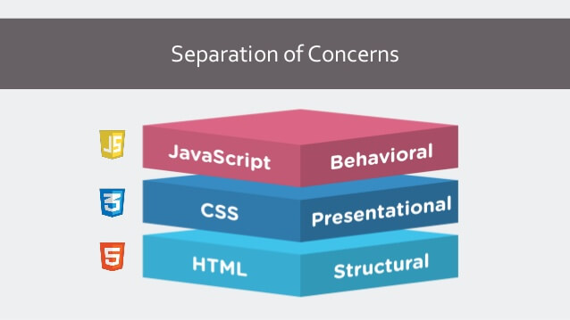
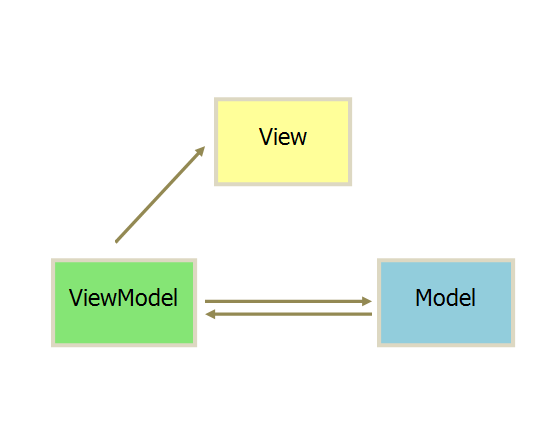
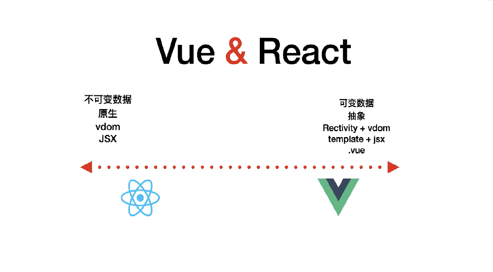

# 一、前置

## 🚩 关注点分离原则

&emsp;&emsp;网页开发有一个原则，叫做[关注点分离（separation of concerns）](https://en.wikipedia.org/wiki/Separation_of_concerns#HTML.2C_CSS.2C_JavaScript)，旨在让各种技术只负责自己的领域以减少耦合。对于网页开发来说，主要是三种技术分离。


> -   HTML 语言：负责网页的结构，又称语义层
> -   CSS 语言：负责网页的样式，又称视觉层
> -   JavaScript 语言：负责网页的逻辑和交互，又称逻辑层或交互层

## 🚩 MVC & MVP & MVVM

&emsp;&emsp; [MVC](https://www.ruanyifeng.com/blog/2015/02/mvcmvp_mvvm) 模式的意思是，软件可以分成三个部分，一般用户行为及各部分之间的通信方式如下。


> -   View（用户界面） 传送指令到 Controller
> -   Controller（业务逻辑） 完成业务逻辑后，要求 Model 改变状态
> -   Model（数据保存） 将新的数据发送到 View，用户得到反馈

&emsp;&emsp; 根据关注点分离原则很容易将 html 看成 view；将 js 的 ajax 当做 Model；js 看成 controller，负责处理用户与应用的交互，响应对 View 的操作（对事件的监听），调用 Model 对数据进行操作，完成 Model 与 View 的同步（根据 Model 的改变，通过选择器对 View 进行操作操作 DOM）。

[❌] 所有通信都是单向的，应用程序复杂性高，难以分工开发 <br>
[❌] View 直接操作 DOM 代价高，Model 被弱化，而 Controller 非常厚，所有逻辑都部署在这里 <br>
[❌] 内存浪费，程序运行缓慢效率低 <br>


-   MVP 模式将 Controller 改名为 Presenter，同时改变了通信方向
-   View 很薄，不部署任何业务逻辑，View 称为"被动视图"（Passive View）

&emsp;&emsp; MVVM 模式将 Presenter 改名为 ViewModel，基本上与 MVP 模式完全一致。
区别在于 ViewModal 与 View 的绑定，其中 React 使用单向绑定，Vue 使用双向绑定。



-   M<->VM，VM<->V 双向通信，简化了业务与界面的依赖，解决了数据频繁更新的问题
-   在 MVVM 中，View 不知道 Model 的存在，Model 和 ViewModel 也观察不到 View，这种低耦合模式提高了代码的可重用性

# 二、本质

## 🎯 js 库 VS js 框架

[官网简介 React](https://reactjs.org/)

> A <font color="red">JavaScript library</font> for building user interfaces

[官网简介 Vue](https://reactjs.org/)



**简言之有以下两点**<br>
1\. [React] VS [Vue] = [js 库] VS [js 框架] = [lib] VS [framwork]<br>
2\. Vue 做的更多，React 需要开发者做的更多

从以 MVVM 角度对比

> -   MVVM-ViewModal
> -   数据流-Props
> -   组件通信
> -   组件-Components、HOC

从项目实践对比

> -   项目-脚手架
> -   项目-状态管理

# 三、对比

## 🎯 [vdom]-JSX vs new Vue({})

vdom 优点

-   最短路径计算
-   对象描述 DOM，适合跨端开发

react runtime 框架

React-对应组件中的 JSX，它实质上是 Virtual DOM 的语法糖。

-   React 负责维护 Virtual DOM 以及对其进行 diff 运算 <br>
-   React-dom 会把 Virtual DOM 渲染成浏览器中的真实 DOM <br>

Vue-虽然没有完全遵循 MVVM 模型，但是 Vue 的设计也受到了它的启发。因此在 Vue 文档中使用了 ViewModel 表示 Vue 实例。

-   每个 Vue 应用都是通过用 Vue 函数创建一个新的 Vue 实例开始，所有的 Vue 组件都是 Vue 实例，并且接受相同的[选项对象](https://cn.vuejs.org/v2/api/#%E9%80%89%E9%A1%B9-%E6%95%B0%E6%8D%AE)

React-对应组件中的 JSX，它实质上是 Virtual DOM 的语法糖。

-   React 负责维护 Virtual DOM 以及对其进行 diff 运算
-   React-dom 会把 Virtual DOM 渲染成浏览器中的真实 DOM

```javascript
var vm = new Vue({
    data: {
        // 声明 message 为一个空值字符串
        message: "",
    },
    template: "<div>{{ message }}</div>",
});
// 之后设置 `message`
vm.message = "Hello!";
```

-   当一个 Vue 实例被创建时，它将 data 对象中的所有的 property 加入到 Vue 的<font color="yellow">[响应式系统](https://cn.vuejs.org/v2/guide/reactivity.html)</font>中。当这些 [property 的值发生改变时](https://developer.mozilla.org/zh-CN/docs/Web/JavaScript/Reference/Global_Objects/Object/defineProperty)，视图将会产生“响应”，即匹配更新为新的值。

```javascript
function myclass() {}

Object.defineProperty(myclass.prototype, "x", {
    get() {
        return this.stored_x;
    },
    set(x) {
        this.stored_x = x;
    },
});

var a = new myclass();
a.x = 1;
console.log(a.x); // 1
```

Vue 中实现双向绑定

```javascript
var vm = new Vue({
    data: {
        // 声明 message 为一个空值字符串
        message: "",
    },
    template: "<div>{{ message }}</div>",
});
// 之后设置 `message`
vm.message = "Hello!";

Object.defineProperty(vm.prototype, "message", {
    get() {
        return this.data.message;
    },
    set(newMessage) {
        this.data.message = newMessage;
    },
});
```

## 🎯 单向数据流 VS 双向数据流


```javascript
[❌]this.state.Status === 'OK'
[✔️]this.setState({ Status: 'OK' })
```

[React] 开发者通过 setState 更新 state 的值来达到重新 render <br>
[Vue] 响应式数据渲染，通过 getter/setter(vue2.x)以及一些函数的劫持可以精确感知数据变化

1\. Vue 和 React 设计理念上的区别，Vue 使用的是可变数据，而 React(onChange/setState()模式)更强调数据的不可变 <br>
2\. 由于一般会用 Vuex 以及 Redux 等单向数据流的状态管理框架，因此很多时候我们感受不到这一点区别

## 🎯 组件通信


[Vue] Vue 中有三种方式可以实现组件通信 <br>
1\. 父组件通过 props 向子组件传递数据或者回调，虽然可以传递回调，但是我们一般只传数据，而通过 事件的机制来处理子组件向父组件的通信

[React] React

1\. 父组件通过 props 向子组件传递函数，父组件可在被调用时改变自身状态
2\. Context

## 🎯 组件

vue template 写法可遍历，vue3 做了精确的 block 标记，静态节点提升

vue2 this 黑盒

### [Vue]插槽

[vue]在 Vue 中通过 slot 传递组件模板给组件进行渲染。
[React]React 没有插槽的概念，但其实在组件内部中不论是 JSX 还是 DOM 都会被传入到 Props 的 children 当中去，隐含的实现了类似于 Vue 的普通插槽。

往往我们可能会因为不同的插槽，做不同的事情，比如有一个 footer 插槽用来改变模态框底部的内容，header 用来改变顶部的内容。可以通过传入一个对象的形式进行具名插槽的一个场景模拟。同样的也会将其传递到一个 Props 当中去。

```javascript
<Model>
    {{
        header: <div>header slot</div>,
        footer: <div>footer slot</div>,
    }}
</Model>
```

### 逻辑复用 [React]HOC 与[Vue]mixin

> 如何在多个组件之间共享代码是一个重要问题，在 Vue 中组合不同功能的方式是通过 mixin，而在 React 中通过 HoC (高阶组件）
> React 最早也是使用 mixins 的，不过后来他们觉得这种方式对组件侵入太强会导致很多问题([由于声明式渲染和自上而下的数据流，许多团队在采用 React 时能够在发布新功能的同时修复一堆错误](https://reactjs.bootcss.com/blog/2016/07/13/mixins-considered-harmful.html))

## 🎯 脚手架与路由

[Vue]VueCli <br>
[React] <br>
[❌]create-react-app <br>
[✔️]umi => 蚂蚁团队 ant design, dva

react：umi+dva+antd vue: vue-cli+vuex+element

[Vue]

```javascript
export default {
    routes: [
        { path: "/login", component: "login" },
        {
            path: "/",
            component: "@/layouts/index",
            children: [
                { path: "/list", component: "list" },
                { path: "/main", component: "main" },
            ],
        },
    ],
};
```

[React]

```javascript
export default {
    routes: [
        { path: "/login", component: "login" },
        {
            path: "/",
            component: "@/layouts/index",
            routes: [
                { path: "/list", component: "list" },
                { path: "/main", component: "main" },
            ],
        },
    ],
};
```

[对照 umi]

|   属性   |  vue-router  | react-router  |      umi       |
| :------: | :----------: | :-----------: | :------------: |
| 路由变化 |      ｜      | onRouteChange |
| 路由新增 | addRoutes ｜ | onRouteChange | patchRoutes ｜ |

## 🎯 状态管理

[Vue]vuex

```javascript
export default {
    // 同样的命名空间
    namespace: "todo",
    state: {
        // 类似Vuex State
        list: [],
    },
    Mutations: {
        // 类似Vuex Mutations
        save(state, { payload: { list } }) {
            return { ...state, list };
        },
    },
    actions: {},
};
```

[React]redux 全家桶 ,Mobx ==> dva

```javascript
export default {
    // 同样的命名空间
    namespace: "todo",
    state: {
        // 类似Vuex State
        list: [],
    },
    reducers: {
        // 类似Vuex Mutations
        save(state, { payload: { list } }) {
            return { ...state, list };
        },
    },
    effects: {
        *queryUserInfo({ payload: value }, { call, put, select }) {
            // 对比Vuex Actions
        },
    },
    subscriptions: {
        setup({ dispatch, history }) {
            // 监听路由的变化，请求页面数据
        },
    },
};
```

## 小结

[Vue]Vue 的 template 在处理上更加优雅于 React 的 jsx <br>
[React]Class Component 中在 render 中会存在大量 porps, state 的解构算是一个痛点
Vue 对 template 则不需要通过 this.data.xxx 来渲染 options api

### CSS

```javascript
[bad]
<h1 style="color:red;font-size:46px;"  onclick="alert('Hi')">
Hello World
</h1>
```

[vue]在 style 标签上声明一个 scoped 以区分组件样式。最后组件打包时加入一个 hash 值
[react]使用的 cssModule 方案来进行

-   [Bem](https://juejin.cn/post/6844903672162304013) CssName
-   [Style Component](https://juejin.cn/post/6844903878580764686#heading-6)

    ```javascript
    import React from "react";
    import Styled from "styled-components";

    export default () => {
        const Wrapper = Styled.div`
              & >.title { 
                  color: red;
              }
          `;
        return (
            <Wrapper>
                Red Text Wrapper....
                <p className="title">1111</p>
            </Wrapper>
        );
    };
    ```

-   CssModule
-   [Css in js](https://www.ruanyifeng.com/blog/2017/04/css_in_js.html)

参考：
[CSS in JS 简介](https://www.ruanyifeng.com/blog/2017/04/css_in_js.html)
[MVC，MVP 和 MVVM 的图示](https://www.ruanyifeng.com/blog/2015/02/mvcmvp_mvvm)
[理解 MVVM 在 react、vue 中的使用](https://www.cnblogs.com/momozjm/p/11542635.html)
