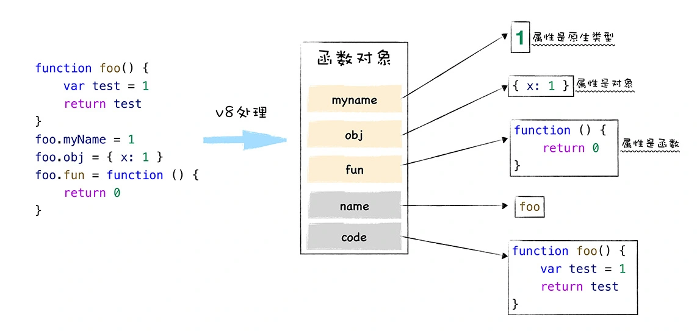
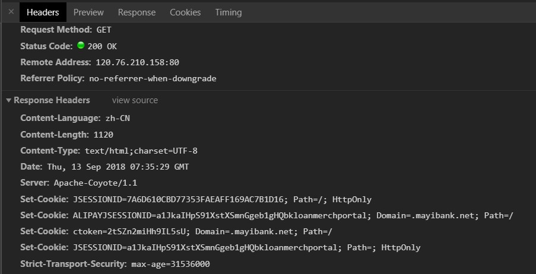

# 一、环境准备

-   `axios` 版本 `v0.24.0`

-   通过 `github1s` 网页可以 [查看](https://github1s.com/axios/axios/blob/HEAD/lib/helpers/cookies.js) axios 源码
-   调试需要 `clone` 到本地

```shell
git clone https://github.com/axios/axios.git

cd axios

npm start

http://localhost:3000/
```

# 二、函数研读

## 1. 辅助函数 helper 总览

### 浏览器适配器 xhr

```js
var utils = require("./../utils");
var settle = require("./../core/settle");
var cookies = require("./../helpers/cookies");
var buildURL = require("./../helpers/buildURL");
var buildFullPath = require("../core/buildFullPath");
var parseHeaders = require("./../helpers/parseHeaders");
var isURLSameOrigin = require("./../helpers/isURLSameOrigin");
var createError = require("../core/createError");
var defaults = require("../defaults");
var Cancel = require("../cancel/Cancel");
```

### node 适配器 http

```js
var utils = require("./../utils");
var settle = require("./../core/settle");
var buildFullPath = require("../core/buildFullPath");
var buildURL = require("./../helpers/buildURL");
var http = require("http");
var https = require("https");
var httpFollow = require("follow-redirects").http;
var httpsFollow = require("follow-redirects").https;
var url = require("url");
var zlib = require("zlib");
var VERSION = require("./../env/data").version;
var createError = require("../core/createError");
var enhanceError = require("../core/enhanceError");
var defaults = require("../defaults");
var Cancel = require("../cancel/Cancel");
```

我们找到其中使用到的 `helper` 函数 `cookies、buildURL、parseHeaders、isURLSameOrigin`

## 2. 辅助函数 cookies

> 在浏览器环境对 `cookie` 进行增删查改

```js
"use strict";

var utils = require("./../utils");

module.exports = utils.isStandardBrowserEnv()
    ? // Standard browser envs support document.cookie
      (function standardBrowserEnv() {
          return {
              write: function write(
                  name,
                  value,
                  expires,
                  path,
                  domain,
                  secure
              ) {
                  var cookie = [];
                  cookie.push(name + "=" + encodeURIComponent(value));

                  if (utils.isNumber(expires)) {
                      cookie.push("expires=" + new Date(expires).toGMTString());
                  }

                  if (utils.isString(path)) {
                      cookie.push("path=" + path);
                  }

                  if (utils.isString(domain)) {
                      cookie.push("domain=" + domain);
                  }

                  if (secure === true) {
                      cookie.push("secure");
                  }

                  document.cookie = cookie.join("; ");
              },

              read: function read(name) {
                  var match = document.cookie.match(
                      new RegExp("(^|;\\s*)(" + name + ")=([^;]*)")
                  );
                  return match ? decodeURIComponent(match[3]) : null;
              },

              remove: function remove(name) {
                  this.write(name, "", Date.now() - 86400000);
              },
          };
      })()
    : // Non standard browser env (web workers, react-native) lack needed support.
      (function nonStandardBrowserEnv() {
          return {
              write: function write() {},
              read: function read() {
                  return null;
              },
              remove: function remove() {},
          };
      })();
```

-   引用了工具函数 `utils`，使用其中的 `isStandardBrowserEnv` 方法判断是否标准开发环境
-   根据判断结果进入对应 `IIFE(Immediately Invoked Function Expression)`立即调用函数表达式

Tips： 标准开发环境提供了 `document api`，可以操作 `cookie`
Tips： 在 `ES6` 推出块级作用域前 `IIFE` 是一种常用的作用域隔离手段，所以在这里使用 `IIFE` 也是为了兼容宿主环境不支持 `ES6` 的情形
Tips： 函数除了常用类型的属性值之外还拥有两个隐藏属性，分别是 `name` 属性和 `code` 属性，`IIFE` 函数默认的 `name` 属性值就是 `anonymous`，因此也被称为匿名函数


## 3. 辅助函数 buildURL

> 为了避免服务器收到不可预知的请求，对任何用户输入的作为 `URL` 部分的内容都需要用 [encodeURIComponent](https://developer.mozilla.org/en-US/docs/Web/JavaScript/Reference/Global_Objects/encodeURIComponent) 进行转义

```js
"use strict";

var utils = require("./../utils");

function encode(val) {
    return encodeURIComponent(val)
        .replace(/%3A/gi, ":")
        .replace(/%24/g, "$")
        .replace(/%2C/gi, ",")
        .replace(/%20/g, "+")
        .replace(/%5B/gi, "[")
        .replace(/%5D/gi, "]");
}

/**
 * Build a URL by appending params to the end
 *
 * @param {string} url The base of the url (e.g., http://www.google.com)
 * @param {object} [params] The params to be appended
 * @returns {string} The formatted url
 */
module.exports = function buildURL(url, params, paramsSerializer) {
    /*eslint no-param-reassign:0*/
    if (!params) {
        return url;
    }

    var serializedParams;
    if (paramsSerializer) {
        serializedParams = paramsSerializer(params);
    } else if (utils.isURLSearchParams(params)) {
        serializedParams = params.toString();
    } else {
        // 默认序列化方法
        var parts = [];

        utils.forEach(params, function serialize(val, key) {
            if (val === null || typeof val === "undefined") {
                return;
            }

            if (utils.isArray(val)) {
                key = key + "[]";
            } else {
                val = [val];
            }

            utils.forEach(val, function parseValue(v) {
                if (utils.isDate(v)) {
                    // 如果v是date对象使用ISO-8601标准进行格式化处理，结果为YYYY-MM-DDTHH:mm:ss.sssZ形式
                    v = v.toISOString();
                } else if (utils.isObject(v)) {
                    v = JSON.stringify(v);
                }
                parts.push(encode(key) + "=" + encode(v));
            });
        });

        serializedParams = parts.join("&");
    }

    if (serializedParams) {
        var hashmarkIndex = url.indexOf("#");
        if (hashmarkIndex !== -1) {
            url = url.slice(0, hashmarkIndex);
        }

        url += (url.indexOf("?") === -1 ? "?" : "&") + serializedParams;
    }

    return url;
};
```

-   `encode` 封装的 `encodeURIComponent` 将对 `URL` 中的参数进行转义，但其中包含的一些合法字符不转义，包含`: $ , + [ ]`
-   根据入参 `paramsSerializer` 和 `params` 格式选择对应的序列化逻辑，其中 `paramsSerializer` 是用户给定的序列化方法
-   如果用户未给定 `encodeURIComponent` 且 `params` 是一个 `URLSearchParams` 对象，就返回 `toString()`的结果
-   如果用户未给定序列化方法且 URL 也不是 URLSearchParams 类型就进入默认序列化逻辑

Tips：`encodeURIComponent` 不转义的字符包括`A-Z a-z 0-9 - \_ . ! ~ \* ' ( )`

## 4. 辅助函数 parseHeaders

> 通过换行符 `\n` 分割 `Headers` 并转化为一个对象

````js
"use strict";

var utils = require("./../utils");

// Headers whose duplicates are ignored by node
// c.f. https://nodejs.org/api/http.html#http_message_headers
var ignoreDuplicateOf = [
    "age",
    "authorization",
    "content-length",
    "content-type",
    "etag",
    "expires",
    "from",
    "host",
    "if-modified-since",
    "if-unmodified-since",
    "last-modified",
    "location",
    "max-forwards",
    "proxy-authorization",
    "referer",
    "retry-after",
    "user-agent",
];

/**
 * Parse headers into an object
 *
 * ```
 * Date: Wed, 27 Aug 2014 08:58:49 GMT
 * Content-Type: application/json
 * Connection: keep-alive
 * Transfer-Encoding: chunked
 * ```
 *
 * @param {String} headers Headers needing to be parsed
 * @returns {Object} Headers parsed into an object
 */
module.exports = function parseHeaders(headers) {
    var parsed = {};
    var key;
    var val;
    var i;

    if (!headers) {
        return parsed;
    }

    utils.forEach(headers.split("\n"), function parser(line) {
        i = line.indexOf(":");
        key = utils.trim(line.substr(0, i)).toLowerCase();
        val = utils.trim(line.substr(i + 1));

        if (key) {
            // 忽略ignoreDuplicateOf中的重复配置
            if (parsed[key] && ignoreDuplicateOf.indexOf(key) >= 0) {
                return;
            }
            // 多个相同键配置项，其中set-cookie类型使用数组存储，其他用逗号分隔，参见下图http请求头header
            if (key === "set-cookie") {
                parsed[key] = (parsed[key] ? parsed[key] : []).concat([val]);
            } else {
                parsed[key] = parsed[key] ? parsed[key] + ", " + val : val;
            }
        }
    });

    return parsed;
};
````


-   忽略`ignoreDuplicateOf`中的重复的请求头配置项
-   `http`协议规定应用程序间的内容传输采用文本形式，一个 `HTTP` 请求报文由请求行`request line`、请求头部 `Headers`、空行和请求数据 4 个部分组成。其中请求头部 `Headers` 使用换行符 `\n` 隔开， `parser`函数主要用于处理请求头信息



## 5. 辅助函数 isURLSameOrigin

> 判断 `location` 和给定的 `url` 是否同源

```js
"use strict";

var utils = require("./../utils");

module.exports = utils.isStandardBrowserEnv()
    ? //  标准浏览器完支持给定URL与当前URL是否同源的检测
      (function standardBrowserEnv() {
          //  判断是否IE浏览器
          var msie = /(msie|trident)/i.test(navigator.userAgent);
          var urlParsingNode = document.createElement("a");
          var originURL;

          /**
           * 解析一个URL，将其分解为各个部分
           * @param {String} url The URL to be parsed
           * @returns {Object}
           */
          function resolveURL(url) {
              var href = url;

              if (msie) {
                  // IE浏览器需要设置两次才能标准化属性
                  urlParsingNode.setAttribute("href", href);
                  href = urlParsingNode.href;
              }

              urlParsingNode.setAttribute("href", href);

              // urlParsingNode 提供了 UrlUtils 接口 - http://url.spec.whatwg.org/#urlutils
              return {
                  href: urlParsingNode.href,
                  protocol: urlParsingNode.protocol
                      ? urlParsingNode.protocol.replace(/:$/, "")
                      : "",
                  host: urlParsingNode.host,
                  search: urlParsingNode.search
                      ? urlParsingNode.search.replace(/^\?/, "")
                      : "",
                  hash: urlParsingNode.hash
                      ? urlParsingNode.hash.replace(/^#/, "")
                      : "",
                  hostname: urlParsingNode.hostname,
                  port: urlParsingNode.port,
                  pathname:
                      urlParsingNode.pathname.charAt(0) === "/"
                          ? urlParsingNode.pathname
                          : "/" + urlParsingNode.pathname,
              };
          }

          originURL = resolveURL(window.location.href);

          /**
           * 判断URL与location是否同源，需要protocol、hostname、port都相等
           * @param {String} requestURL The URL to test
           * @returns {boolean} True if URL shares the same origin, otherwise false
           */
          return function isURLSameOrigin(requestURL) {
              var parsed = utils.isString(requestURL)
                  ? resolveURL(requestURL)
                  : requestURL;
              return (
                  parsed.protocol === originURL.protocol &&
                  parsed.host === originURL.host
              );
          };
      })()
    : // 非标准的浏览器环境(web workers, react-native)默认为同源
      (function nonStandardBrowserEnv() {
          return function isURLSameOrigin() {
              return true;
          };
      })();
```

-   引用了工具函数 `utils`，使用其中的 `isStandardBrowserEnv` 方法判断是否标准开发环境
-   根据判断结果进入对应 `IIFE(Immediately Invoked Function Expression)`立即调用函数表达式
-   借助了浏览器的 `a` 标签进行 `url` 解析，然后判断协议、主机和端口是否相同

Tips：关于为什么 `IE` 浏览器需要设置两次`href`，我也不知道，网上也没有找到对这个问题的解答，可以看一下[stack overflow](https://stackoverflow.com/questions/49272427/why-setattributehref-need-twice-in-ie)关注一下这个问题

# 三、参考

1\. `林景宜`的文章[林景宜的记事本 - Axios 源码解析（五）：核心工具方法](https://linjingyi.cn/posts/f3c7b914.html#more)

2\. `李冰`老师的专栏[图解 Google V8 - 函数即对象：一篇文章彻底搞懂 JavaScript 的函数特点](https://time.geekbang.org/column/article/212123)
