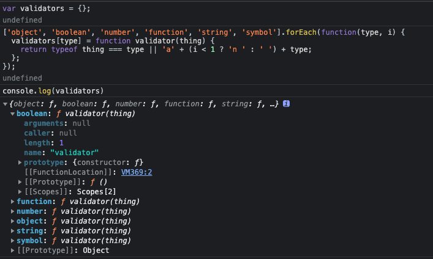

> transitional options for backward compatibility that may be removed in the newer versions

> `Validator`共`81`行代码，在发送请求时会检测`axios`版本以便作一些兼容性配置

# 一、环境准备

-   `axios` 版本 `v0.24.0`

-   通过 `github1s` 网页可以 [查看](https://github1s.com/axios/axios/blob/HEAD/CONTRIBUTING.md) axios 源码
-   调试需要 `clone` 到本地

```shell
git clone https://github.com/axios/axios.git

cd axios

npm start

http://localhost:3000/
```

# 二、函数研读

> transitional options for backward compatibility that may be removed in the newer versions

> 可在较新版本中删除的向后兼容性过渡选项

## 1. 调用场景

在核心库函`core-Axios`函数中有以下调用代码段

```js
var transitional = config.transitional;

if (transitional !== undefined) {
    validator.assertOptions(
        transitional,
        {
            silentJSONParsing: validators.transitional(validators.boolean),
            forcedJSONParsing: validators.transitional(validators.boolean),
            clarifyTimeoutError: validators.transitional(validators.boolean),
        },
        false
    );
}
```

-   使用`validator`模块的`assertOptions`函数将`transitional`中的值初始化过度属性配置项[`silentJSONParsing`、`forcedJSONParsing`、`clarifyTimeoutError`]
-   这里重点关注初始化数据来源`transitional`，来自[axios-defaults](./Default.md)中的配置与自定义配置的合并，参见[`core-axios` line-43](https://github1s.com/axios/axios/blob/HEAD/lib/core/Axios.js)与[`lib-axios` line-34]。但我们知道[axios 请求配置](http://www.axios-js.com/zh-cn/docs/#%E8%AF%B7%E6%B1%82%E9%85%8D%E7%BD%AE)并不支持自定义配置这三个配置项，所以这些工作对开发者是个黑盒，并不可见，往往也是造成我们开发困惑的原因

|               配置项               | 作用                                                                 |
| :--------------------------------: | :------------------------------------------------------------------- |
|  [transitional-silentJSONParsing]  | 版本兼容配置-返回值转换为 Json 出错时是否置为 null 返回              |
|  [transitional-forcedJSONParsing]  | 版本兼容配置-responseType 设置非 json 类型时是否强制转换成 json 格式 |
| [transitional-clarifyTimeoutError] | 版本兼容配置-请求超时时是否默认返回 ETIMEDOUT 类型错                 |

Tips: 更多内容可以参考上一篇文章[axios-defaults 源码](./Default.md)中`构造对象 defaults`这一节三种过度属性的使用场景
Tips: 从 v0.22.0 版本已经废弃，可参见 github[axios - Release/v0.22.0](https://github.com/axios/axios/pull/4107/files)

## 2. 正文

### 【2.1】获取版本号

```js
var VERSION = require('../env/data').version;

===>
module.exports = {
  "version": "0.24.0"
};
```

-   首先会去 env 下读取当前的`axios`版本号，这里的`version`是固定的，取决于我们下载的 axios 版本

### 【2.2】类型校验器对象

```js
var validators = {};

// eslint-disable-next-line func-names
["object", "boolean", "number", "function", "string", "symbol"].forEach(
    function (type, i) {
        validators[type] = function validator(thing) {
            return typeof thing === type || "a" + (i < 1 ? "n " : " ") + type;
        };
    }
);
```



-   分别用`object`, `boolean`, `number`, `function`, `string`, `symbol`作为键初始化对象`validators`，键值为`validator`函数被调用时的返回值
-   `validator`函数的返回值为`Boolean`类型或`String`类型，这取决于入参`thing`，当`thing`与当前键`type`表示的类型相等时返回 true，否则返回一个字符串`a ${type}`或`an ${type}`表示当前键`type`的类型

Tips: [`func-names`](https://eslint.org/docs/rules/func-names)规则可以强制或禁止使用命名函数表达式

### 【2.3】内部函数 transitional

```js
/**
 * Transitional option validator
 * @param {function|boolean?} validator - set to false if the transitional option has been removed
 * @param {string?} version - deprecated version / removed since version
 * @param {string?} message - some message with additional info
 * @returns {function}
 */
validators.transitional = function transitional(validator, version, message) {
    function formatMessage(opt, desc) {
        return (
            "[Axios v" +
            VERSION +
            "] Transitional option '" +
            opt +
            "'" +
            desc +
            (message ? ". " + message : "")
        );
    }

    // eslint-disable-next-line func-names
    return function (value, opt, opts) {
        if (validator === false) {
            throw new Error(
                formatMessage(
                    opt,
                    " has been removed" + (version ? " in " + version : "")
                )
            );
        }

        if (version && !deprecatedWarnings[opt]) {
            deprecatedWarnings[opt] = true;
            // eslint-disable-next-line no-console
            console.warn(
                formatMessage(
                    opt,
                    " has been deprecated since v" +
                        version +
                        " and will be removed in the near future"
                )
            );
        }

        return validator ? validator(value, opt, opts) : true;
    };
};
```

-   过度选项配置校验函数，挂载在`validators`上，提醒用户旧版本的[`silentJSONParsing`、`forcedJSONParsing`、`clarifyTimeoutError`]选项将被遗弃
-   入参为`validator`, `version`, `message`，从前文知从 v0.22.0 版本过度配置选项已经废弃，这里的`version`和`message`都是空
-   `validator`为 false 时，当开发者试图配置过度属性[`silentJSONParsing`、`forcedJSONParsing`、`clarifyTimeoutError`]时始终会抛出 Error 而不是在控制台输出 warn，因此达到了过度的功能 🐶，同时始终返回 true 给`assertOptions`从而 continue 进入下一配置选项的断言
-   `validator`为 true 时，会返回当前类型校验器`validator`函数的返回值

### 【2.4】内部函数 assertOptions

```js
/**
 * Assert object's properties type
 * @param {object} options
 * @param {object} schema
 * @param {boolean?} allowUnknown
 */

function assertOptions(options, schema, allowUnknown) {
    if (typeof options !== "object") {
        throw new TypeError("options must be an object");
    }
    var keys = Object.keys(options);
    var i = keys.length;
    while (i-- > 0) {
        var opt = keys[i];
        var validator = schema[opt]; // validator = validators.transitional(validators.boolean)
        if (validator) {
            var value = options[opt]; // Boolean
            var result = value === undefined || validator(value, opt, options);
            if (result !== true) {
                throw new TypeError("option " + opt + " must be " + result);
            }
            continue;
        }
        if (allowUnknown !== true) {
            throw Error("Unknown option " + opt);
        }
    }
}
```

-   版本断言函数
-   配置项`options`必须是`object`否则抛出类型错
-   当禁止开发者配置过度属性时入参`options`只能来自[axios-defaults](./Default.md)中的`构造对象 defaults`默认配置[silentJSONParsing: true, forcedJSONParsing: true, clarifyTimeoutError: false]
-   `validator`由`validators.boolean`
-   `allowUnknown`配置当 opt 类型不属于过度配置选项三者之一时是否会直接抛出错误

### 【2.5】导出

```js
module.exports = {
    assertOptions: assertOptions,
    validators: validators,
};
```

# 三、参考

1\. `我`的文章[【axios 源码】- 实例化配置函数 defaults 研读解析](https://juejin.cn/post/7054850632544419848)

2\. [林景宜的记事本 - Axios 源码解析（二）：通用工具方法](https://linjingyi.cn/posts/fe9fb5af.html)

3\. [MDN](https://developer.mozilla.org/zh-CN/)
