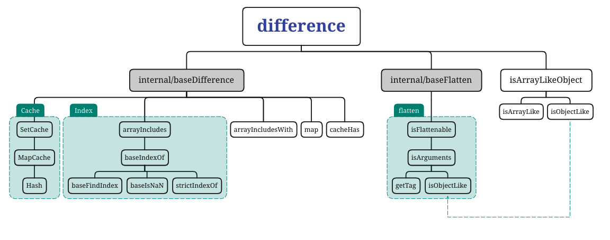

> A modern JavaScript utility library delivering modularity, performance & extras.

> `lodash` 是一个一致性、模块化、高性能的 `JavaScript` 实用工具库

# 一、环境准备

-   `lodash` 版本 `v4.0.0`

-   通过 `github1s` 网页可以 [查看](https://github1s.com/lodash/lodash/blob/HEAD/difference.js) `lodash - difference` 源码
-   调试测试用例可以 `clone` 到本地

```shell
git clone https://github.com/lodash/lodash.git

cd axios

npm install

npm run test
```

# 二、结构分析



&emsp;&emsp;这是一张 `difference` 依赖引用路径图，相对复杂一些，按照功能划分，大致包括 `Cache` 模块、`index` 模块和 `flatten` 模块。接下来会自底向上分析各个依赖模块。由于依赖较多，篇幅较长，将按照模块分成四个部分，本篇主要讲述 `Cache` 模块，包含 `Hash`、`MapCache`、`SetCache`三部分的解读。


# 三、函数研读

## 1. Hash 类

> Used to stand-in for `undefined` hash values.
> 用于替代 “未定义” 的哈希值

```js
const HASH_UNDEFINED = '__lodash_hash_undefined__'

class Hash {
  /**
   * 创建一个 hash object.
   * @private
   * @constructor
   * @param {Array} [entries] 需要缓存的 key-value 对
   */
  constructor(entries) {
    let index = -1
    const length = entries == null ? 0 : entries.length

    this.clear()
    while (++index < length) {
      const entry = entries[index]
      this.set(entry[0], entry[1])
    }
  }

  /**
   * 从hash中删除所有的 key-value 
   * @memberOf Hash
   */
  clear() {
    this.__data__ = Object.create(null)
    this.size = 0
  }

  /**
   * Removes `key` and its value from the hash.
   * @memberOf Hash
   * @param {string} key The key of the value to remove.
   * @returns {boolean} Returns `true` if the entry was removed, else `false`.
   */
  delete(key) {
    const result = this.has(key) && delete this.__data__[key]
    this.size -= result ? 1 : 0
    return result
  }

  /**
   * Gets the hash value for `key`.
   * @memberOf Hash
   * @param {string} key The key of the value to get.
   * @returns {*} Returns the entry value.
   */
  get(key) {
    const data = this.__data__
    const result = data[key]
    return result === HASH_UNDEFINED ? undefined : result
  }

  /**
   * Checks if a hash value for `key` exists.
   * @memberOf Hash
   * @param {string} key The key of the entry to check.
   * @returns {boolean} Returns `true` if an entry for `key` exists, else `false`.
   */
  has(key) {
    const data = this.__data__
    return data[key] !== undefined
  }

  /**
   * Sets the hash `key` to `value`.
   * @memberOf Hash
   * @param {string} key The key of the value to set.
   * @param {*} value The value to set.
   * @returns {Object} Returns the hash instance.
   */
  set(key, value) {
    const data = this.__data__
    this.size += this.has(key) ? 0 : 1
    data[key] = value === undefined ? HASH_UNDEFINED : value
    return this
  }
}

export default Hash

```

-   使用了 [`es6-class`](https://es6.ruanyifeng.com/#docs/class) 语法，导出一个 `Hash` 类
-   在构造函数 `constructor` 中遍历 `entries`，按需调用 `set` 方法存储键值对信息，遍历前调用 `clear()` 清除缓存
-   `clear()` 内通过将全局变量 `__data__` 设定为 `null`，并将对应 `size` 置成 `0` 实现 `clear`
-   `has`、`set`、`get` 直接通过 `key` 查找/操作 `__data__`，在遇到 `value === undefined` 情形时 `set` 存储常量 `HASH_UNDEFINED = '__lodash_hash_undefined__'` 达到替换未定义键值效果

## 2. MapCache 类

```js
import Hash from './Hash.js'

/**
 * Gets the data for `map`.
 * @private
 * @param {Object} map The map to query.
 * @param {string} key The reference key.
 * @returns {*} Returns the map data.
 */
function getMapData({ __data__ }, key) {
  const data = __data__
  return isKeyable(key)
    ? data[typeof key === 'string' ? 'string' : 'hash']
    : data.map
}

/**
 * Checks if `value` is suitable for use as unique object key.
 * @private
 * @param {*} value The value to check.
 * @returns {boolean} Returns `true` if `value` is suitable, else `false`.
 */
function isKeyable(value) {
  const type = typeof value
  return (type === 'string' || type === 'number' || type === 'symbol' || type === 'boolean')
    ? (value !== '__proto__')
    : (value === null)
}

class MapCache {

  /**
   * 创建一个 map 缓存对象去存储 key-value 对
   * @private
   * @constructor
   * @param {Array} [entries] The key-value pairs to cache.
   */
  constructor(entries) {
    let index = -1
    const length = entries == null ? 0 : entries.length

    this.clear()
    while (++index < length) {
      const entry = entries[index]
      this.set(entry[0], entry[1])
    }
  }

  /**
   * Removes all key-value entries from the map.
   * @memberOf MapCache
   */
  clear() {
    this.size = 0
    this.__data__ = {
      'hash': new Hash,
      'map': new Map,
      'string': new Hash
    }
  }

  /**
   * Removes `key` and its value from the map.
   * @memberOf MapCache
   * @param {string} key The key of the value to remove.
   * @returns {boolean} Returns `true` if the entry was removed, else `false`.
   */
  delete(key) {
    const result = getMapData(this, key)['delete'](key)
    this.size -= result ? 1 : 0
    return result
  }

  /**
   * Gets the map value for `key`.
   * @memberOf MapCache
   * @param {string} key The key of the value to get.
   * @returns {*} Returns the entry value.
   */
  get(key) {
    return getMapData(this, key).get(key)
  }

  /**
   * Checks if a map value for `key` exists.
   * @memberOf MapCache
   * @param {string} key The key of the entry to check.
   * @returns {boolean} Returns `true` if an entry for `key` exists, else `false`.
   */
  has(key) {
    return getMapData(this, key).has(key)
  }

  /**
   * Sets the map `key` to `value`.
   * @memberOf MapCache
   * @param {string} key The key of the value to set.
   * @param {*} value The value to set.
   * @returns {Object} Returns the map cache instance.
   */
  set(key, value) {
    const data = getMapData(this, key)
    const size = data.size

    data.set(key, value)
    this.size += data.size == size ? 0 : 1
    return this
  }
}

export default MapCache
```

-   使用了 [`es6-class`](https://es6.ruanyifeng.com/#docs/class) 语法，导出一个 `MapCache` 类
-   构造函数 `constructor` 逻辑同 `Hash` 类中构造函数逻辑，不同的是调用的 `clear()` 函数内部逻辑不同
-   `clear()` 内通过将全局变量 `__data__` 通过 `new` 操作符初始化为包含 `hash` , `map` , `string` 三种类型的 `object`，并将对应 `size` 置成 `0` 实现 `clear`
-   由于 `__data__` 是一个包含了 `hash` , `map` , `string` 三种类型的 `object`，所以在进行`has`、`set`、`get` 操作时无法直接通过 `key` 直接查找/操作 `__data__`。这时候需要一个辅助函数来帮助我们找到 `key` 所对应的键值对集合是 `hash` , `map` , `string` 三种类型中的哪一种，然后才进行操作，所以相比`Hash` 类多了两个内部辅助函数 `getMapData`、`isKeyable`。
-   `isKeyable` 用于判断 `key` 类型，如果key是 `string`, `number`, `boolean`, `symbol`, `null`中的一种且不是`__proto__`就会去`hash`, `string` 两种类型中查找，两者均由 `Hash` 类构造生成，否则去 `map` 中查找。（`null` 判断和 非`__proto__`判断 互斥）


Tips：理解 `getMapData`、`isKeyable` 的关键在于为什么有三种存储的数据类型？为什么`hash|string`类型使用自定义的 `Hash` 类存储？我们知道 `Hash` 类是按照 `Object` 存储，而 `map` 使用的js自身的 `Map` 类型是按照 `map` 存储，一个`Object`的键只能是`String`或者`Symbol`，但一个 `Map` 的键可以是任意值，包括函数、对象、基本类型。

Tips：关于对`value !== '__proto__'`的单独判断主要是由于 `'__proto__'`的特殊性。作为一个 `Property`，如果 `'__proto__'`被当做一个 `Object` 的 `key` 去进行读写操作，将会直接读取/修改当前原型信息。为了修复这个问题，一般会采取转义操作，将 `__proto__` 转义成 `__proto__%`，更多内容可以查看《Speaking JavaScript》这本书，相信面试遇到这个问题，也是一个考察点。


## 3. SetCache 类

```js
import MapCache from './MapCache.js'

/** Used to stand-in for `undefined` hash values. */
const HASH_UNDEFINED = '__lodash_hash_undefined__'

class SetCache {

  /**
   * Creates an array cache object to store unique values.
   * @private
   * @constructor
   * @param {Array} [values] The values to cache.
   */
  constructor(values) {
    let index = -1
    const length = values == null ? 0 : values.length

    this.__data__ = new MapCache
    while (++index < length) {
      this.add(values[index])
    }
  }

  /**
   * Adds `value` to the array cache.
   * @memberOf SetCache
   * @alias push
   * @param {*} value The value to cache.
   * @returns {Object} Returns the cache instance.
   */
  add(value) {
    this.__data__.set(value, HASH_UNDEFINED)
    return this
  }

  /**
   * Checks if `value` is in the array cache.
   * @memberOf SetCache
   * @param {*} value The value to search for.
   * @returns {boolean} Returns `true` if `value` is found, else `false`.
   */
  has(value) {
    return this.__data__.has(value)
  }
}

SetCache.prototype.push = SetCache.prototype.add

export default SetCache
```

-  操作同上述分析，需要注意的是 `this.__data__ = new MapCache` 这里，一般来说，我们都会写 `new MapCahe()`， 区别在于后续的运算优先级。由于 `new` 运算优先级要小于 `.` 运算优先级，如 `new MapCache.add()` 会报错，因为会先执行 `MapCache.add` 然后才执行 `new`。