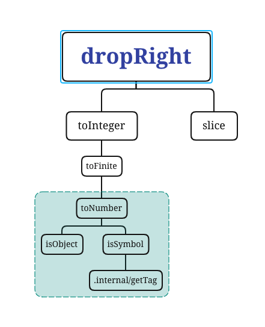

> A modern JavaScript utility library delivering modularity, performance & extras.

> `lodash` 是一个一致性、模块化、高性能的 `JavaScript` 实用工具库

# 一、环境准备

-   `lodash` 版本 `v4.0.0`

-   通过 `github1s` 网页可以 [查看](https://github1s.com/lodash/lodash/blob/HEAD/dropRight.js) `lodash - drop` 源码
-   调试测试用例可以 `clone` 到本地

```shell
git clone https://github.com/lodash/lodash.git

cd axios

npm install

npm run test
```

# 二、结构分析



这是一张 `dropRight` 依赖引用路径图，其中使用到了 `slice`、`toInteger`、`toFinite`、`toNumber`、`isObject`、`isSymbol`、`internal/getTag`，接下来会自底向上分析各个依赖模块。
# 三、函数研读

## 1. internal/getTag 模块

**获取 `value` 的 `toStringTag`**

```js
const toString = Object.prototype.toString;
/**
 * @private
 * @param {*} value The value to query.
 * @returns {string} Returns the `toStringTag`.
 */
function getTag(value) {
    if (value == null) {
        return value === undefined ? "[object Undefined]" : "[object Null]";
    }
    return toString.call(value);
}

export default getTag;
```
- 使用非严格等 `==` 无法判断 `value` 是 `null` or `undefined`
- 使用严格等 `===` 判断 `value` 是 `null` or `undefined` 并设定 [toStringTag](https://developer.mozilla.org/zh-CN/docs/Web/JavaScript/Reference/Global_Objects/Symbol/toStringTag)(准确的说应该是`Symbol.toStringTag`)
- 如果 `null` or `undefined` 直接使用 `Object` 原型链函数 `toString()` 获取 `toStringTag`

Tips：许多内置的 `JavaScript` 对象类型即便没有 `toStringTag` 属性，也能被 `toString()` 方法识别并返回特定的类型标签，比如：`Object.prototype.toString.call([1, 2]);   // "[object Array]"`，但是有些对象类型则不然，`toString()` 方法能识别它们是因为`引擎`为它们设置好了 `toStringTag` 标签，比如：`Object.prototype.toString.call(new Map());   // "[object Map]"`

## 2. isSymbol 模块

**检查 `value` 是否是原始 `Symbol` 或者对象**

```js
import getTag from "./.internal/getTag.js";

/**
 * @since 4.0.0
 * @category Lang
 * @param {*} value The value to check.
 * @returns {boolean} Returns `true` if `value` is a symbol, else `false`.
 * @example
 *
 * isSymbol(Symbol.iterator)
 * // => true
 *
 * isSymbol('abc')
 * // => false
 */
function isSymbol(value) {
    const type = typeof value;
    return (
        type == "symbol" ||
        (type === "object" &&
            value != null &&
            getTag(value) == "[object Symbol]")
    );
}

export default isSymbol;
```

-   可以通过 `typeof` 来获取 `未经计算的操作数` 的类型

## 3. isObject 模块

**检查 `value` 是否为 `Object` 的[language type](http://www.ecma-international.org/ecma-262/6.0/#sec-ecmascript-language-types)。  *(例如： arrays, functions, objects, regexes,`new Number(0)`, 以及 `new String('')`)***

```js
/**
 * @since 0.1.0
 * @category Lang
 * @param {*} value The value to check.
 * @returns {boolean} Returns `true` if `value` is an object, else `false`.
 * @example
 *
 * isObject({})
 * // => true
 *
 * isObject([1, 2, 3])
 * // => true
 *
 * isObject(Function)
 * // => true
 *
 * isObject(null)
 * // => false
 */
function isObject(value) {
    const type = typeof value;
    return value != null && (type === "object" || type === "function");
}

export default isObject;
```

-   检查 value 是否是普通对象，即排除掉 null 类型的所有对象类型，包含 array、date、function 等对象类型

## 4. toNumber 模块

**转换 `value` 为一个数字**

```js
import isObject from "./isObject.js";
import isSymbol from "./isSymbol.js";

/** 用作各种“数字”常量的引用 */
const NAN = 0 / 0;

/** 用于匹配前导和尾随空格 */
const reTrim = /^\s+|\s+$/g;

/** 用于检测错误的有符号十六进制字符串值 */
const reIsBadHex = /^[-+]0x[0-9a-f]+$/i;

/** 用于检测二进制字符串值 */
const reIsBinary = /^0b[01]+$/i;

/** 用于检测八进制字符串值 */
const reIsOctal = /^0o[0-7]+$/i;

/** 不依赖 `root` 的内置方法引用 */
const freeParseInt = parseInt;

/**
 * @since 4.0.0
 * @category Lang
 * @param {*} value The value to process.
 * @returns {number} Returns the number.
 * @see isInteger, toInteger, isNumber
 * @example
 *
 * toNumber(3.2)
 * // => 3.2
 *
 * toNumber(Number.MIN_VALUE)
 * // => 5e-324
 *
 * toNumber(Infinity)
 * // => Infinity
 *
 * toNumber('3.2')
 * // => 3.2
 */
function toNumber(value) {
    if (typeof value === "number") {
        return value;
    }
    if (isSymbol(value)) {
        return NAN;
    }
    if (isObject(value)) {
        const other =
            typeof value.valueOf === "function" ? value.valueOf() : value;
        value = isObject(other) ? `${other}` : other;
    }
    if (typeof value !== "string") {
        return value === 0 ? value : +value;
    }
    value = value.replace(reTrim, "");
    const isBinary = reIsBinary.test(value);
    return isBinary || reIsOctal.test(value)
        ? freeParseInt(value.slice(2), isBinary ? 2 : 8)
        : reIsBadHex.test(value)
        ? NAN
        : +value;
}

export default toNumber;
```

-   `NAN` 是一个不可写、不可配置、不可枚举的数据类型，表示未定义或不可表示的值。常在浮点数运算中使用。首次引入 NaN 的是 1985 年的 IEEE 754 浮点数标准。比如 0/0、0×∞、∞ + (−∞)、∞ - ∞、NANx1、ix1 等计算结果均会返回`NAN`

-   如果是 Number 类型则直接返回，如果是 symbol 类型返回 `NAN`
-   valueOf() 方法返回指定对象的原始值，配合 `typeof value.valueOf === "function"`，如果是 `function`类型则会返回函数本身，如果是其他非 `null`类型的 object 类型，则会返回对象本身
-   如果是非 string 类型且不为 0 则使用 + 操作符转换成 Number 类型
-   去掉首尾空格
-   在返回前对二进制、八进制、十六进制数据格式做最后检查，如果正确就使用 + 操作符转换成 Number 类型返回否则返回 NUll 🐶

## 5. toFinite 模块

**转换 `value` 为一个有限数字**

```js
import toNumber from "./toNumber.js";

/** 用作各种“数字”常量的引用 */
const INFINITY = 1 / 0;
const MAX_INTEGER = 1.7976931348623157e308;

/**
 * @since 4.12.0
 * @category Lang
 * @param {*} value The value to convert.
 * @returns {number} Returns the converted number.
 * @example
 *
 * toFinite(3.2)
 * // => 3.2
 *
 * toFinite(Number.MIN_VALUE)
 * // => 5e-324
 *
 * toFinite(Infinity)
 * // => 1.7976931348623157e+308
 *
 * toFinite('3.2')
 * // => 3.2
 */
function toFinite(value) {
    if (!value) {
        return value === 0 ? value : 0;
    }
    value = toNumber(value);
    if (value === INFINITY || value === -INFINITY) {
        const sign = value < 0 ? -1 : 1;
        return sign * MAX_INTEGER;
    }
    return value === value ? value : 0;
}

export default toFinite;
```

-   首先拿到 toNumber 返回的 value 值，判断是否为正负无穷，然后根据其正负状态转换成 js 可以表示的双精度浮点数。其中使用常量`INFINITY = 1 / 0` 表示无穷。


## 6. toInteger 模块

**转换 `value` 为一个整数**

```js
import toFinite from "./toFinite.js";

/**
 * **Note:** This method is loosely based on
 * [`ToInteger`](http://www.ecma-international.org/ecma-262/7.0/#sec-tointeger).
 *
 * @since 4.0.0
 * @category Lang
 * @param {*} value The value to convert.
 * @returns {number} Returns the converted integer.
 * @see isInteger, isNumber, toNumber
 * @example
 *
 * toInteger(3.2)
 * // => 3
 *
 * toInteger(Number.MIN_VALUE)
 * // => 0
 *
 * toInteger(Infinity)
 * // => 1.7976931348623157e+308
 *
 * toInteger('3.2')
 * // => 3
 */
function toInteger(value) {
    const result = toFinite(value);
    const remainder = result % 1;

    return remainder ? result - remainder : result;
}

export default toInteger;
```

-   将 value 转换成整形操作步骤很简单，关键在于处理各种边界情况，相信也是日常开发以及面试的考察点。
-   这里主要是使用了 toFinite 做了边界处理，然后使用求余运算 `Number.MIN_VALUE`的余数为其本身，其余整数余数为 0 的性质将 `Number.MIN_VALUE`返回值置成 0

## 7. slice 模块

**裁剪数组`array`，从 `start` 位置开始到`end`结束，但不包括 `end` 本身的位置**

```js
/**
 * **Note:** This method is used instead of
 * [`Array#slice`](https://mdn.io/Array/slice) to ensure dense arrays are
 * returned.
 *
 * @since 3.0.0
 * @category Array
 * @param {Array} array The array to slice.
 * @param {number} [start=0] The start position. 负索引将被视为与末尾的偏移量
 * @param {number} [end=array.length] The end position. 负索引将被视为与末尾的偏移量
 * @returns {Array} Returns the slice of `array`.
 * @example
 *
 * var array = [1, 2, 3, 4]
 *
 * _.slice(array, 2)
 * // => [3, 4]
 */
function slice(array, start, end) {
    let length = array == null ? 0 : array.length;
    if (!length) {
        return [];
    }
    start = start == null ? 0 : start;
    end = end === undefined ? length : end;

    if (start < 0) {
        start = -start > length ? 0 : length + start;
    }
    end = end > length ? length : end;
    if (end < 0) {
        end += length;
    }
    length = start > end ? 0 : (end - start) >>> 0;
    start >>>= 0;

    let index = -1;
    const result = new Array(length);
    while (++index < length) {
        result[index] = array[index + start];
    }
    return result;
}

export default slice;
```

-   如果 array 是 null 直接返回空数组
-   如果 start 是 null 则默认为 0
-   如果 end 未定义则默认为 array 的 length 值
-   start 为负数即负索引，则将被视为与末尾的偏移量，需要注意的是如果偏移量大于 length 则默认为 0
-   end 为负数即负索引，则将被视为与末尾的偏移量，若为正数即正索引且大于 length 则默认与 length 值相等
-   根据 start 与 end 计算返回区间，其中 `>>> 0` 确保了 start 和 length 落在 js 双精度有效表达范围【0 ～ 0xFFFFFFFF】中，详情可以查看[js 中表达式 >>> 0 浅析](https://segmentfault.com/a/1190000014613703)
-   最后使用 `new Array(length)`重新创建一个 slice 数组并逐一赋值后返回

## 8. dropRight 模块

**创建一个`array`片段，从末尾删除`n`个元素**

```js
import slice from './slice.js'
import toInteger from './toInteger.js'
/**
 * @since 3.0.0
 * @category Array
 * @param {Array} array The array to query.
 * @param {number} [n=1] The number of elements to drop.
 * @returns {Array} Returns the slice of `array`.
 * @example
 *
 * dropRight([1, 2, 3])
 * // => [1, 2]
 *
 * dropRight([1, 2, 3], 2)
 * // => [1]
 *
 * dropRight([1, 2, 3], 5)
 * // => []
 *
 * dropRight([1, 2, 3], 0)
 * // => [1, 2, 3]
 */
function dropRight(array, n=1) {
  const length = array == null ? 0 : array.length
  n = length - toInteger(n)
  return length ? slice(array, 0, n < 0 ? 0 : n) : []
}

export default dropRight
```

- `array` 为 `null` 或 `undefined`，则 `length = 0` 否则取 `array.length`
- `array` 为 `null` 或 `undefined` 或 `[]` 返回 `[]`，否则进入 `slice` 逻辑

# 四、参考

1\. [探秘 JavaScript 世界的神秘數字 1.7976931348623157e+308](https://copyfuture.com/blogs-details/20210915164159432s)

2\. [MDN-Math-ceil](https://developer.mozilla.org/zh-TW/docs/Web/JavaScript/Reference/Global_Objects/Math/ceil)

3\. [MDN-toStringTag](https://developer.mozilla.org/zh-CN/docs/Web/JavaScript/Reference/Global_Objects/Symbol/toStringTag)