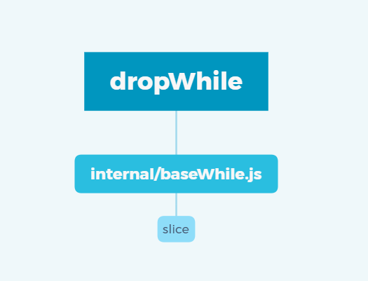

> A modern JavaScript utility library delivering modularity, performance & extras.

> `lodash` 是一个一致性、模块化、高性能的 `JavaScript` 实用工具库

# 一、环境准备

-   `lodash` 版本 `v4.0.0`

-   通过 `github1s` 网页可以 [查看](https://github1s.com/lodash/lodash/blob/HEAD/dropWhile.js) `lodash - dropWhile` 源码
-   调试测试用例可以 `clone` 到本地

```shell
git clone https://github.com/lodash/lodash.git

cd axios

npm install

npm run test
```

# 二、结构分析



&emsp;&emsp;这是一张 `dropWhile` 依赖引用路径图，其中使用到了 `slice`、`internal/baseWhile.js`、`dropWhile`，接下来会自底向上分析各个依赖模块。

# 三、函数研读

**创建从 `start` 到 `end` 的 `array` 片段，但不包括 `end`**

## 1. slice 模块

**裁剪数组`array`，从 `start` 位置开始到`end`结束，但不包括 `end` 本身的位置**

```js
/**
 * **Note:** This method is used instead of
 * [`Array#slice`](https://mdn.io/Array/slice) to ensure dense arrays are
 * returned.
 *
 * @since 3.0.0
 * @category Array
 * @param {Array} array The array to slice.
 * @param {number} [start=0] The start position. 负索引将被视为与末尾的偏移量
 * @param {number} [end=array.length] The end position. 负索引将被视为与末尾的偏移量
 * @returns {Array} Returns the slice of `array`.
 * @example
 *
 * var array = [1, 2, 3, 4]
 *
 * _.slice(array, 2)
 * // => [3, 4]
 */
function slice(array, start, end) {
    let length = array == null ? 0 : array.length;
    if (!length) {
        return [];
    }
    start = start == null ? 0 : start;
    end = end === undefined ? length : end;

    if (start < 0) {
        start = -start > length ? 0 : length + start;
    }
    end = end > length ? length : end;
    if (end < 0) {
        end += length;
    }
    length = start > end ? 0 : (end - start) >>> 0;
    start >>>= 0;

    let index = -1;
    const result = new Array(length);
    while (++index < length) {
        result[index] = array[index + start];
    }
    return result;
}

export default slice;
```

-   如果 array 是 null 直接返回空数组
-   如果 start 是 null 则默认为 0
-   如果 end 未定义则默认为 array 的 length 值
-   start 为负数即负索引，则将被视为与末尾的偏移量，需要注意的是如果偏移量大于 length 则默认为 0
-   end 为负数即负索引，则将被视为与末尾的偏移量，若为正数即正索引且大于 length 则默认与 length 值相等
-   根据 start 与 end 计算返回区间，其中 `>>> 0` 确保了 start 和 length 落在 js 双精度有效表达范围【0 ～ 0xFFFFFFFF】中，详情可以查看[js 中表达式 >>> 0 浅析](https://segmentfault.com/a/1190000014613703)
-   最后使用 `new Array(length)`重新创建一个 slice 数组并逐一赋值后返回

## 2. internal/baseWhile 模块

**`dropWhile` 和 `takeWhile` 等方法的基本实现**

```js
import slice from '../slice.js'

/**
 * @private
 * @param {Array} array The array to query.
 * @param {Function} predicate 每次迭代调用的函数
 * @param {boolean} [isDrop] 指定删除元素而不是获取它们
 * @param {boolean} [fromRight] 指定从右向左迭代
 * @returns {Array} Returns the slice of `array`.
 */
function baseWhile(array, predicate, isDrop, fromRight) {
  const { length } = array
  let index = fromRight ? length : -1

  while ((fromRight ? index-- : ++index < length) &&
    predicate(array[index], index, array)) {}

  return isDrop
    ? slice(array, (fromRight ? 0 : index), (fromRight ? index + 1 : length))
    : slice(array, (fromRight ? index + 1 : 0), (fromRight ? length : index))
}

export default baseWhile

```

- 入参 `isDrop`、`fromRight` 默认为 `true` 即从右向左删除元素，此时 `index` 取 `array.length`(解构获取)
- 借助 `while` 循环调用 `predicate` ，若 `predicate` 返回值始终为 `Truthy` 则直至 `index = 0` 退出循环，此时切片入参为 `slice(array, 0, 0)`， 返回值为空
- 若在循环过程中 `predicate` 返回值为 `Falsy`，此时退出 `while` 循环，直接从当前 `index` 向前做切片，返回值即为 `Array[0] - Array[index]`


## 3. dropWhile 模块

**创建一个切片数组，去除array中从起点开始到 predicate 返回假值结束部分。predicate 会传入3个参数： (value, index, array)**

```js
import baseWhile from './.internal/baseWhile.js'

/**
 * @since 3.0.0
 * @category Array
 * @param {Array} array 要查询的数组
 * @param {Function} predicate 这个函数会在每一次迭代调用
 * @returns {Array} 返回array剩余切片
 * @example
 *
 * const users = [
 *   { 'user': 'barney',  'active': true },
 *   { 'user': 'fred',    'active': true },
 *   { 'user': 'pebbles', 'active': false }
 * ]
 *
 * dropWhile(users, ({ active }) => active)
 * // => objects for ['pebbles']
 */
function dropWhile(array, predicate) {
  return (array != null && array.length)
    ? baseWhile(array, predicate, true)
    : []
}

export default dropWhile
```

- 要查询的数组 `array` 为 `null` 或者 `[]`，直接返回 `[]`，否则进入 `baseWhile` 逻辑，其中 `predicate` 为函数类型，默认从左向右删除元素
