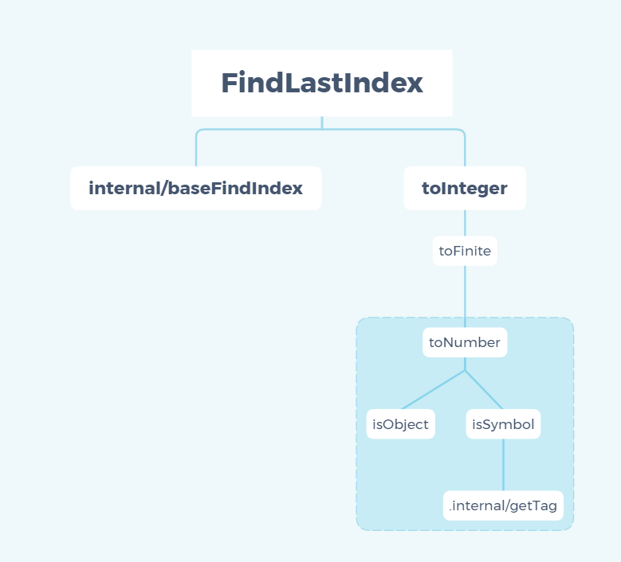

> A modern JavaScript utility library delivering modularity, performance & extras.

> `lodash` 是一个一致性、模块化、高性能的 `JavaScript` 实用工具库

# 一、环境准备

-   `lodash` 版本 `v4.0.0`

-   通过 `github1s` 网页可以 [查看](https://github1s.com/lodash/lodash/blob/HEAD/findLastIndex.js) `lodash - findLastIndex` 源码
-   调试测试用例可以 `clone` 到本地

```shell
git clone https://github.com/lodash/lodash.git

cd axios

npm install

npm run test
```

# 二、结构分析



&emsp;&emsp;这是一张 `findLastIndex` 依赖引用路径图，其中使用到了 `baseFindIndex`、`toInteger`、`toFinite`、`toNumber`、`isObject`、`isSymbol`、`internal/getTag`，接下来会自底向上分析各个依赖模块。
# 三、函数研读

## 1. internal/getTag 模块

**获取 `value` 的 `toStringTag`**

```js
const toString = Object.prototype.toString;
/**
 * @private
 * @param {*} value The value to query.
 * @returns {string} Returns the `toStringTag`.
 */
function getTag(value) {
    if (value == null) {
        return value === undefined ? "[object Undefined]" : "[object Null]";
    }
    return toString.call(value);
}

export default getTag;
```
- 使用非严格等 `==` 无法判断 `value` 是 `null` or `undefined`
- 使用严格等 `===` 判断 `value` 是 `null` or `undefined` 并设定 [toStringTag](https://developer.mozilla.org/zh-CN/docs/Web/JavaScript/Reference/Global_Objects/Symbol/toStringTag)(准确的说应该是`Symbol.toStringTag`)
- 如果 `null` or `undefined` 直接使用 `Object` 原型链函数 `toString()` 获取 `toStringTag`

Tips：许多内置的 `JavaScript` 对象类型即便没有 `toStringTag` 属性，也能被 `toString()` 方法识别并返回特定的类型标签，比如：`Object.prototype.toString.call([1, 2]);   // "[object Array]"`，但是有些对象类型则不然，`toString()` 方法能识别它们是因为`引擎`为它们设置好了 `toStringTag` 标签，比如：`Object.prototype.toString.call(new Map());   // "[object Map]"`

## 2. isSymbol 模块

**检查 `value` 是否是原始 `Symbol` 或者对象**

```js
import getTag from "./.internal/getTag.js";

/**
 * @since 4.0.0
 * @category Lang
 * @param {*} value The value to check.
 * @returns {boolean} Returns `true` if `value` is a symbol, else `false`.
 * @example
 *
 * isSymbol(Symbol.iterator)
 * // => true
 *
 * isSymbol('abc')
 * // => false
 */
function isSymbol(value) {
    const type = typeof value;
    return (
        type == "symbol" ||
        (type === "object" &&
            value != null &&
            getTag(value) == "[object Symbol]")
    );
}

export default isSymbol;
```

-   可以通过 `typeof` 来获取 `未经计算的操作数` 的类型

## 3. isObject 模块

**检查 `value` 是否为 `Object` 的[language type](http://www.ecma-international.org/ecma-262/6.0/#sec-ecmascript-language-types)。  *(例如： arrays, functions, objects, regexes,`new Number(0)`, 以及 `new String('')`)***

```js
/**
 * @since 0.1.0
 * @category Lang
 * @param {*} value The value to check.
 * @returns {boolean} Returns `true` if `value` is an object, else `false`.
 * @example
 *
 * isObject({})
 * // => true
 *
 * isObject([1, 2, 3])
 * // => true
 *
 * isObject(Function)
 * // => true
 *
 * isObject(null)
 * // => false
 */
function isObject(value) {
    const type = typeof value;
    return value != null && (type === "object" || type === "function");
}

export default isObject;
```

-   检查 `value` 是否是普通对象，即排除掉 `null` 类型的所有对象类型，包含 `array`、`date`、`function` 等对象类型

## 4. toNumber 模块

**转换 `value` 为一个数字**

```js
import isObject from "./isObject.js";
import isSymbol from "./isSymbol.js";

/** 用作各种“数字”常量的引用 */
const NAN = 0 / 0;

/** 用于匹配前导和尾随空格 */
const reTrim = /^\s+|\s+$/g;

/** 用于检测错误的有符号十六进制字符串值 */
const reIsBadHex = /^[-+]0x[0-9a-f]+$/i;

/** 用于检测二进制字符串值 */
const reIsBinary = /^0b[01]+$/i;

/** 用于检测八进制字符串值 */
const reIsOctal = /^0o[0-7]+$/i;

/** 不依赖 `root` 的内置方法引用 */
const freeParseInt = parseInt;

/**
 * @since 4.0.0
 * @category Lang
 * @param {*} value The value to process.
 * @returns {number} Returns the number.
 * @see isInteger, toInteger, isNumber
 * @example
 *
 * toNumber(3.2)
 * // => 3.2
 *
 * toNumber(Number.MIN_VALUE)
 * // => 5e-324
 *
 * toNumber(Infinity)
 * // => Infinity
 *
 * toNumber('3.2')
 * // => 3.2
 */
function toNumber(value) {
    if (typeof value === "number") {
        return value;
    }
    if (isSymbol(value)) {
        return NAN;
    }
    if (isObject(value)) {
        const other =
            typeof value.valueOf === "function" ? value.valueOf() : value;
        value = isObject(other) ? `${other}` : other;
    }
    if (typeof value !== "string") {
        return value === 0 ? value : +value;
    }
    value = value.replace(reTrim, "");
    const isBinary = reIsBinary.test(value);
    return isBinary || reIsOctal.test(value)
        ? freeParseInt(value.slice(2), isBinary ? 2 : 8)
        : reIsBadHex.test(value)
        ? NAN
        : +value;
}

export default toNumber;
```

-   `NAN` 是一个不可写、不可配置、不可枚举的数据类型，表示未定义或不可表示的值。常在浮点数运算中使用。首次引入 NaN 的是 1985 年的 IEEE 754 浮点数标准。比如 0/0、0×∞、∞ + (−∞)、∞ - ∞、NANx1、ix1 等计算结果均会返回`NAN`

-   如果是 Number 类型则直接返回，如果是 symbol 类型返回 `NAN`
-   valueOf() 方法返回指定对象的原始值，配合 `typeof value.valueOf === "function"`，如果是 `function`类型则会返回函数本身，如果是其他非 `null`类型的 object 类型，则会返回对象本身
-   如果是非 string 类型且不为 0 则使用 + 操作符转换成 Number 类型
-   去掉首尾空格
-   在返回前对二进制、八进制、十六进制数据格式做最后检查，如果正确就使用 + 操作符转换成 Number 类型返回否则返回 NUll 🐶

## 5. toFinite 模块

**转换 `value` 为一个有限数字**

```js
import toNumber from "./toNumber.js";

/** 用作各种“数字”常量的引用 */
const INFINITY = 1 / 0;
const MAX_INTEGER = 1.7976931348623157e308;

/**
 * @since 4.12.0
 * @category Lang
 * @param {*} value The value to convert.
 * @returns {number} Returns the converted number.
 * @example
 *
 * toFinite(3.2)
 * // => 3.2
 *
 * toFinite(Number.MIN_VALUE)
 * // => 5e-324
 *
 * toFinite(Infinity)
 * // => 1.7976931348623157e+308
 *
 * toFinite('3.2')
 * // => 3.2
 */
function toFinite(value) {
    if (!value) {
        return value === 0 ? value : 0;
    }
    value = toNumber(value);
    if (value === INFINITY || value === -INFINITY) {
        const sign = value < 0 ? -1 : 1;
        return sign * MAX_INTEGER;
    }
    return value === value ? value : 0;
}

export default toFinite;
```

-   首先拿到 toNumber 返回的 value 值，判断是否为正负无穷，然后根据其正负状态转换成 js 可以表示的双精度浮点数。其中使用常量`INFINITY = 1 / 0` 表示无穷。


## 6. toInteger 模块

**转换 `value` 为一个整数**

```js
import toFinite from "./toFinite.js";

/**
 * **Note:** This method is loosely based on
 * [`ToInteger`](http://www.ecma-international.org/ecma-262/7.0/#sec-tointeger).
 *
 * @since 4.0.0
 * @category Lang
 * @param {*} value The value to convert.
 * @returns {number} Returns the converted integer.
 * @see isInteger, isNumber, toNumber
 * @example
 *
 * toInteger(3.2)
 * // => 3
 *
 * toInteger(Number.MIN_VALUE)
 * // => 0
 *
 * toInteger(Infinity)
 * // => 1.7976931348623157e+308
 *
 * toInteger('3.2')
 * // => 3
 */
function toInteger(value) {
    const result = toFinite(value);
    const remainder = result % 1;

    return remainder ? result - remainder : result;
}

export default toInteger;
```

-   将 value 转换成整形操作步骤很简单，关键在于处理各种边界情况，相信也是日常开发以及面试的考察点。
-   这里主要是使用了 toFinite 做了边界处理，然后使用求余运算 `Number.MIN_VALUE`的余数为其本身，其余整数余数为 0 的性质将 `Number.MIN_VALUE`返回值置成 0

## 7. baseFindIndex 模块

**`findIndex` 和 `findLastIndex` 的基本实现`**

```js
/**
 * @private
 * @param {Array} array 要检查的阵列
 * @param {Function} predicate 每次迭代调用的函数
 * @param {number} fromIndex 要从中搜索的索引
 * @param {boolean} [fromRight] 指定从右向左迭代
 * @returns {number} 返回匹配值的索引，否则为 -1 
 */
function baseFindIndex(array, predicate, fromIndex, fromRight) {
  const { length } = array
  let index = fromIndex + (fromRight ? 1 : -1)

  while ((fromRight ? index-- : ++index < length)) {
    if (predicate(array[index], index, array)) {
      return index
    }
  }
  return -1
}

export default baseFindIndex

```
 
-  重点关注 `index = fromIndex + (fromRight ? 1 : -1)` ，由于支持从右向左的迭代，起始 `index` 应该 `+1` 以防止 `index--` 越过`0` 从而进入死循环，同理从左侧查起要确保查到 `array[0]` 从而起始 `index` 需要加一

## 8. findLastIndex 模块

**这个方式类似_.findIndex， 区别是它是从右到左的迭代集合array中的元素**

```js
import baseFindIndex from './.internal/baseFindIndex.js'
import toInteger from './toInteger.js'

/**
 * @since 2.0.0
 * @category Array
 * @param {Array} array 要检查的阵列
 * @param {Function} predicate 每次迭代调用的函数
 * @param {number} [fromIndex=array.length-1] 要从中搜索的索引
 * @returns {number} 返回匹配值的索引，否则为 -1 
 * @see find, findIndex, findKey, findLast, findLastKey
 * @example
 *
 * const users = [
 *   { 'user': 'barney',  'active': true },
 *   { 'user': 'fred',    'active': false },
 *   { 'user': 'pebbles', 'active': false }
 * ]
 *
 * findLastIndex(users, ({ user }) => user == 'pebbles')
 * // => 2
 */
function findLastIndex(array, predicate, fromIndex) {
  const length = array == null ? 0 : array.length
  if (!length) {
    return -1
  }
  let index = length - 1
  if (fromIndex !== undefined) {
    index = toInteger(fromIndex)
    index = fromIndex < 0
      ? Math.max(length + index, 0)
      : Math.min(index, length - 1)
  }
  return baseFindIndex(array, predicate, index, true)
}

export default findLastIndex

```

- `array` 为 `null` 或 `undefined`，则 `length = 0` 否则取 `array.length`
- `array` 为 `null` 或 `undefined` 或 `[]` 返回 `-1`，否则进入 `if(fromIndex !== undefined)` 逻辑
- 重点关注 `index = fromIndex < 0 ? Math.max(length + index, 0) : Math.min(index, length - 1)`，为了确保起始 `index` 为自然数，需要对其进行取整操作（toInteger），同时为了确保起始位置落在合法的查找区间需要对上下边界进行约束，最大不能超过`length - 1`(Math.min(index, length - 1))，最小也不能低于 `0`（Math.max(length + index, 0)）

# 四、参考

1\. [探秘 JavaScript 世界的神秘數字 1.7976931348623157e+308](https://copyfuture.com/blogs-details/20210915164159432s)

2\. [MDN-Math-ceil](https://developer.mozilla.org/zh-TW/docs/Web/JavaScript/Reference/Global_Objects/Math/ceil)

3\. [MDN-toStringTag](https://developer.mozilla.org/zh-CN/docs/Web/JavaScript/Reference/Global_Objects/Symbol/toStringTag)