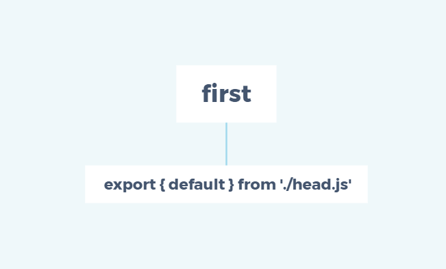

> A modern JavaScript utility library delivering modularity, performance & extras.

> `lodash` 是一个一致性、模块化、高性能的 `JavaScript` 实用工具库

# 一、环境准备

-   `lodash` 版本 `v4.0.0`

-   通过 `github1s` 网页可以 [查看](https://github1s.com/lodash/lodash/blob/HEAD/first.js) `lodash - first` 源码
-   调试测试用例可以 `clone` 到本地

```shell
git clone https://github.com/lodash/lodash.git

cd axios

npm install

npm run test
```

# 二、结构分析



&emsp;&emsp;`first` 使用 `ES6 export` 导出 `head` 中 `export default` 的 `function head(){}` ， `head` 代码块很简短，但其中涉及到的东西还是很有必要了解的，比如惰性运算、显示运算、隐式运算等。

# 三、函数研读

## 1. 功能模块

> Gets the first element of `array`

> 获取数组 array 的第一个元素

```js
/**
 * @since 0.1.0
 * @alias first
 * @category Array
 * @param {Array} array The array to query.
 * @returns {*} Returns the first element of `array`.
 * @see last
 * @example
 *
 * head([1, 2, 3])
 * // => 1
 *
 * head([])
 * // => undefined
 */
function head(array) {
  return (array != null && array.length)
    ? array[0]
    : undefined
}

export default head
```

-  逻辑很简单，如果是 `array` 是 `null` 或者 `[]`，直接返回 `undefined`，否则返回 `array[0]` 

## 2. 测试用例


```js
import assert from 'assert';
import lodashStable from 'lodash';
import { arrayProto, LARGE_ARRAY_SIZE } from './utils.js';
import head from '../head.js';
import first from '../first.js';

describe('head', function() {
  var array = [1, 2, 3, 4];

  it('should return the first element', function() {
    assert.strictEqual(head(array), 1);
  });

  it('should return `undefined` when querying empty arrays', function() {
    arrayProto[0] = 1;
    assert.strictEqual(head([]), undefined);
    arrayProto.length = 0;
  });

  it('should work as an iteratee for methods like `_.map`', function() {
    var array = [[1, 2, 3], [4, 5, 6], [7, 8, 9]],
        actual = lodashStable.map(array, head);

    assert.deepStrictEqual(actual, [1, 4, 7]);
  });

  it('should be aliased', function() {
    assert.strictEqual(first, head);
  });

  it('should return an unwrapped value when implicitly chaining', function() {
    var wrapped = _(array);
    assert.strictEqual(wrapped.head(), 1);
    assert.strictEqual(wrapped.first(), 1);
  });

  it('should return a wrapped value when explicitly chaining', function() {
    var wrapped = _(array).chain();
    assert.ok(wrapped.head() instanceof _);
    assert.ok(wrapped.first() instanceof _);
  });

  it('should not execute immediately when explicitly chaining', function() {
    var wrapped = _(array).chain();
    assert.strictEqual(wrapped.head().__wrapped__, array);
    assert.strictEqual(wrapped.first().__wrapped__, array);
  });

  it('should work in a lazy sequence', function() {
    var largeArray = lodashStable.range(LARGE_ARRAY_SIZE),
        smallArray = array;

    lodashStable.each(['head', 'first'], function(methodName) {
      lodashStable.times(2, function(index) {
        var array = index ? largeArray : smallArray,
            actual = _(array).filter(isEven)[methodName]();

        assert.strictEqual(actual, _[methodName](_.filter(array, isEven)));
      });
    });
  });
});
```


&emsp;&emsp;这是一张 `head` 测试用例运行情况图，我们可以看到对于 `head`官方期望更健壮，在惰性运算符、隐式链接和显示链接中也应当正常工作，但目前暴露给用户的只有返回第一个元素 `should return the first element`、空数组返回undefined`should return undefined when querying empty arrays`、允许像 `_.map` 一样迭代内部元素 `should work as an iteratee for methods like _.map`、允许重命名 `should be aliased`、 功能，并且全局跑测试用例时也绕过了这个测试文件（不是.test.js结尾）。
  
**什么是惰性运算？**
> 在编程语言理论中，惰性求值（英语：Lazy Evaluation），又译为惰性计算、懒惰求值，也称为传需求调用（call-by-need），是一个计算机编程中的一个概念，它的目的是要最小化计算机要做的工作。它有两个相关而又有区别的含意，可以表示为“延迟求值”和“最小化求值”，除可以得到性能的提升外，惰性计算的最重要的好处是它可以构造一个无限的数据类型。

&emsp;&emsp;用白话讲就是计算返回的不是一个值，而是一个表达式 `x:=expression`， 比如下图反映的就是测试用例中 `compact(slice(largeArray, 1)).reverse())` 的处理流程。在运行 `compact` 之前需要先运行 `slice`， 在 `slice` 运行完毕后还需要再运行 `reverse`，这就需要在三个求值函数之间维持一个数据流关系 `flow`，并且由于每次求值函数都会返回各种数据，所以得使用一个独一无二的值来作为判断流是否完成的标志，这就需要 `compact` 额外定义一个唯一表示符来充当完成标志，比如 `const over = Symbol()`。显然这对很多非惰性计算的 `compact` 操作是额外开销，也增加了耦合性，并不是一个好的选择。


Tips：修改一下package.json中的测试命令 `"test": "mocha -r esm test/*.test.js"` ==> `"test": "mocha -r esm test/head.js"` 即可运行。

