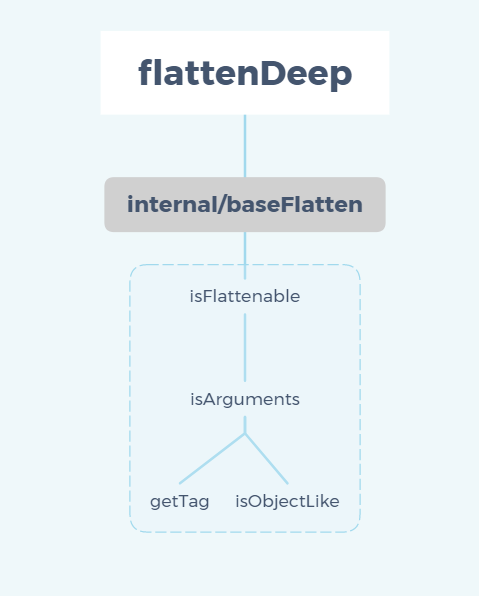

> A modern JavaScript utility library delivering modularity, performance & extras.

> `lodash` 是一个一致性、模块化、高性能的 `JavaScript` 实用工具库

# 一、环境准备

-   `lodash` 版本 `v4.0.0`

-   通过 `github1s` 网页可以 [查看](https://github1s.com/lodash/lodash/blob/HEAD/flattenDeep.js) `lodash - flatten` 源码
-   调试测试用例可以 `clone` 到本地

```shell
git clone https://github.com/lodash/lodash.git

cd axios

npm install

npm run test
```

# 二、结构分析



本篇主要讲述 `flattenDeep` 模块，包含 `getTag`、`isObjectLike`、`isArguments`、`isFlattenable`、`baseFlatten`。

# 三、函数研读

## 1. internal/getTag 模块

```js
const toString = Object.prototype.toString;

/**
 * Gets the `toStringTag` of `value`.
 *
 * @private
 * @param {*} value The value to query.
 * @returns {string} Returns the `toStringTag`.
 */
function getTag(value) {
    if (value == null) {
        return value === undefined ? "[object Undefined]" : "[object Null]";
    }
    return toString.call(value);
}

export default getTag;
```

- 使用非严格等 `==` 无法判断 `value` 是 `null` or `undefined`
- 使用严格等 `===` 判断 `value` 是 `null` or `undefined` 并设定 [toStringTag](https://developer.mozilla.org/zh-CN/docs/Web/JavaScript/Reference/Global_Objects/Symbol/toStringTag)(准确的说应该是`Symbol.toStringTag`)
- 如果 `null` or `undefined` 直接使用 `Object` 原型链函数 `toString()` 获取 `toStringTag`

Tips：许多内置的 `JavaScript` 对象类型即便没有 `toStringTag` 属性，也能被 `toString()` 方法识别并返回特定的类型标签，比如：`Object.prototype.toString.call([1, 2]);   // "[object Array]"`，但是有些对象类型则不然，`toString()` 方法能识别它们是因为`引擎`为它们设置好了 `toStringTag` 标签，比如：`Object.prototype.toString.call(new Map());   // "[object Map]"`

## 2. isObjectLike 模块

**检查“value”是否与对象类似，如果不为空则是一个对象，并且会有一个“typeof”运算结果为“object”返回值**

```js
/**
 * @since 4.0.0
 * @category Lang
 * @param {*} value The value to check.
 * @returns {boolean} Returns `true` if `value` is object-like, else `false`.
 * @example
 *
 * isObjectLike({})
 * // => true
 *
 * isObjectLike([1, 2, 3])
 * // => true
 *
 * isObjectLike(Function)
 * // => false
 *
 * isObjectLike(null)
 * // => false
 */
function isObjectLike(value) {
  return typeof value === 'object' && value !== null
}

export default isObjectLike

```

-   可以通过 `typeof` 来获取 `未经计算的操作数` 的类型，下面是一个 `typeof` 运算结果集

|                      类型                       | 结果              |
| :---------------------------------------------: | :---------------- |
|                    Undefined                    | "undefined"       |
|                      Null                       | "object"          |
|                     Boolean                     | "boolean"         |
|                     Number                      | "number"          |
|          BigInt(ECMAScript 2020 新增)           | "bigint"          |
|                     String                      | "string"          |
|          Symbol (ECMAScript 2015 新增)          | "symbol"          |
|           宿主对象（由 JS 环境提供）            | 取决于具体实现    |
| Function 对象 (按照 ECMA-262 规范实现 [[Call]]) | "function"        |
|                  其他任何对象                   | "object"          |


## 3. isArguments 模块

**检查'value'是否与'arguments'对象类似**

```js
import getTag from './.internal/getTag.js'
import isObjectLike from './isObjectLike.js'

/**
 * @since 0.1.0
 * @category Lang
 * @param {*} value The value to check.
 * @returns {boolean} Returns `true` if `value` is an `arguments` object, else `false`.
 * @example
 *
 * isArguments(function() { return arguments }())
 * // => true
 *
 * isArguments([1, 2, 3])
 * // => false
 */
function isArguments(value) {
  return isObjectLike(value) && getTag(value) == '[object Arguments]'
}

export default isArguments
```
-  `arguments` 对象是所有（非箭头）函数中都可用的局部变量。你可以使用 `arguments` 对象在函数中引用函数的参数。此对象包含传递给函数的每个参数，第一个参数在索引 `0` 处。
-  需要注意的是，`arguments` 对象不是一个 `Array`，它类似于 `Array`，但除了 `length` 属性和索引元素之外没有任何 `Array` 属性。例如，它没有 `pop` 方法。
-  `arguments` 对象只能在函数内使用，对其使用 `Object.prototype.toString.call(arguments)` 运算的返回值是 `[object Arguments]`


## 4. isFlattenable 模块

**检查'value'是否为可展平的'arguments'对象或数组**

```js
import isArguments from '../isArguments.js'

/** Built-in value reference. */
const spreadableSymbol = Symbol.isConcatSpreadable

/**
 * @private
 * @param {*} value The value to check.
 * @returns {boolean} Returns `true` if `value` is flattenable, else `false`.
 */
function isFlattenable(value) {
  return Array.isArray(value) || isArguments(value) ||
    !!(value && value[spreadableSymbol])
}

export default isFlattenable
```

-  重点关注 `value[spreadableSymbol]`，在这之前我们需要知道 `Array` 的 `concat` 运算，正常情况下 `['a', 'b', 'c'].concat([1, 2, 3]) = ["a", "b", "c", 1, 2, 3]`，但可通过设定被连接 `array`，`array[Symbol.isConcatSpreadable] = false;`，使得 `array` 不被展开到发起连接的 `array` 而是作为一个元素连接到其中，如 `['a', 'b', 'c'].concat([1, 2, 3]) = ["a", "b", "c", [ 1, 2, 3] ]`
-  前文介绍过 `!!` 运算符表示逻辑非的取反运算，如`!!obj`与 `obj != null && typeof obj === undefined && obj != "" && obj != false` 在计算上等价
  

## 5. baseFlatten 模块

**扁平化”的基本实现，支持限制扁平化**

```js
import isFlattenable from './isFlattenable.js'

/**
 * @private
 * @param {Array} array The array to flatten.
 * @param {number} depth 最大递归深度
 * @param {boolean} [predicate=isFlattenable] 每次迭代调用的函数
 * @param {boolean} [isStrict] 限制为通过“谓词”检查的值
 * @param {Array} [result=[]] 初始结果值
 * @returns {Array} 返回新的展平数组
 */
function baseFlatten(array, depth, predicate, isStrict, result) {
  predicate || (predicate = isFlattenable)
  result || (result = [])

  if (array == null) {
    return result
  }

  for (const value of array) {
    if (depth > 0 && predicate(value)) {
      if (depth > 1) {
        // 递归展平阵列（易受调用堆栈限制的影响）
        baseFlatten(value, depth - 1, predicate, isStrict, result)
      } else {
        result.push(...value)
      }
    } else if (!isStrict) {
      result[result.length] = value
    }
  }
  return result
}

export default baseFlatten

```

- 如果待展平数组 `array` 是 `null`，直接返回 `result` (result=[]) 
- 使用 `for...of` 迭代待展平 `array` 中的每一项，如果最大递归深度  `depth` 仍然未减至 `1` 则递归调用 `baseFlatten`，每次`depth - 1`，直至 `depth = 1` 将返回值放入 `result`。
- `depth = 1` 时由于所有项都已展平 `predicate(value)` 返回 `false`，进入 `else if (!isStrict)` 语句块，目的是限制“谓词”展平到`result`，这里我们就需要了解谓词的概念了
- 谓词是一个可调用的表达式，其返回结果是一个能用作条件的值。通俗的说就是一个函数，会返回一个符合该条件(“truthy值”)的数组🐶


## 6. flattenDeep 模块

**将array递归为一维数组**

```js
import baseFlatten from './.internal/baseFlatten.js'

/** 无穷大，用作各种"Number"常量的引用 */
const INFINITY = 1 / 0

/**
 * 递归展平`数组`
 *
 * @since 3.0.0
 * @category Array
 * @param {Array} array 需要处理的数组
 * @returns {Array} 返回一个的新一维数组
 * @see flatMap, flatMapDeep, flatMapDepth, flatten, flattenDepth
 * @example
 *
 * flattenDeep([1, [2, [3, [4]], 5]])
 * // => [1, 2, 3, 4, 5]
 */
function flattenDeep(array) {
  const length = array == null ? 0 : array.length
  return length ? baseFlatten(array, INFINITY) : []
}

export default flattenDeep

```

- 使用非严格等 `==` 判断 `array` 是 `null` or `undefined`，如果是返回空数组，否则取 `array.length`
- 如果 `array` 不是空数组，使用无穷大`INFINITY`递归调用 `baseFlatten(array, INFINITY)` 并返回