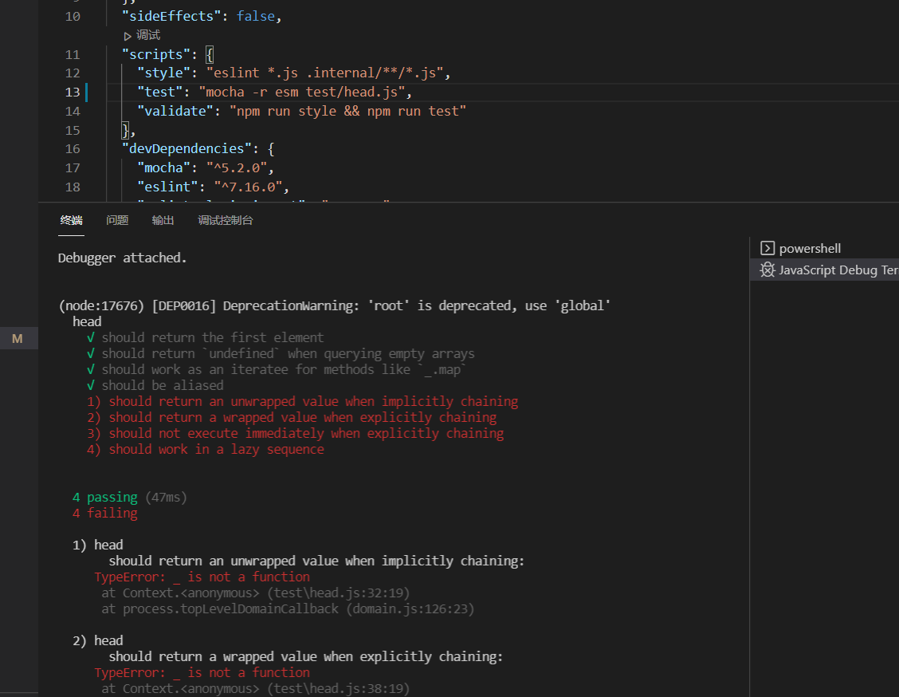

> A modern JavaScript utility library delivering modularity, performance & extras.

> `lodash` 是一个一致性、模块化、高性能的 `JavaScript` 实用工具库

# 一、环境准备

-   `lodash` 版本 `v4.0.0`

-   通过 `github1s` 网页可以 [查看](https://github1s.com/lodash/lodash/blob/HEAD/head.js) `lodash - head` 源码
-   调试测试用例可以 `clone` 到本地

```shell
git clone https://github.com/lodash/lodash.git

cd axios

npm install

npm run test
```

# 二、结构分析



&emsp;&emsp;本篇主要讲述 `head` 模块。

# 三、函数研读

```js
/**
 * 获取数组 array 的第一个元素
 *
 * @since 0.1.0
 * @alias first
 * @category Array
 * @param {Array} array 要查询的数组
 * @returns {*} 返回数组 array的第一个元素
 * @see last
 * @example
 *
 * head([1, 2, 3])
 * // => 1
 *
 * head([])
 * // => undefined
 */
function head(array) {
  return (array != null && array.length)
    ? array[0]
    : undefined
}

export default head

```

- 如果参数 `array` 不为 `null` 并且有 `length` 属性，则认为其为 `Array` 类型，直接取下标0处值返回，否则直接返回 `undefined`
  
# 四、单元测试

```js
import assert from 'assert';
import lodashStable from 'lodash';
import { arrayProto, LARGE_ARRAY_SIZE } from './utils.js';
import head from '../head.js';
import first from '../first.js';

describe('head', function() {
  var array = [1, 2, 3, 4];

  it('should return the first element', function() {
    assert.strictEqual(head(array), 1);
  });

  it('should return `undefined` when querying empty arrays', function() {
    arrayProto[0] = 1;
    assert.strictEqual(head([]), undefined);
    arrayProto.length = 0;
  });

  it('should work as an iteratee for methods like `_.map`', function() {
    var array = [[1, 2, 3], [4, 5, 6], [7, 8, 9]],
        actual = lodashStable.map(array, head);

    assert.deepStrictEqual(actual, [1, 4, 7]);
  });

  it('should be aliased', function() {
    assert.strictEqual(first, head);
  });

  it('should return an unwrapped value when implicitly chaining', function() {
    var wrapped = _(array);
    assert.strictEqual(wrapped.head(), 1);
    assert.strictEqual(wrapped.first(), 1);
  });

  it('should return a wrapped value when explicitly chaining', function() {
    var wrapped = _(array).chain();
    assert.ok(wrapped.head() instanceof _);
    assert.ok(wrapped.first() instanceof _);
  });

  it('should not execute immediately when explicitly chaining', function() {
    var wrapped = _(array).chain();
    assert.strictEqual(wrapped.head().__wrapped__, array);
    assert.strictEqual(wrapped.first().__wrapped__, array);
  });

  it('should work in a lazy sequence', function() {
    var largeArray = lodashStable.range(LARGE_ARRAY_SIZE),
        smallArray = array;

    lodashStable.each(['head', 'first'], function(methodName) {
      lodashStable.times(2, function(index) {
        var array = index ? largeArray : smallArray,
            actual = _(array).filter(isEven)[methodName]();

        assert.strictEqual(actual, _[methodName](_.filter(array, isEven)));
      });
    });
  });
});
```