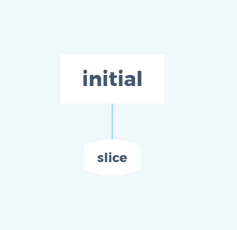

> A modern JavaScript utility library delivering modularity, performance & extras.

> `lodash` 是一个一致性、模块化、高性能的 `JavaScript` 实用工具库

# 一、环境准备

-   `lodash` 版本 `v4.0.0`

-   通过 `github1s` 网页可以 [查看](https://github1s.com/lodash/lodash/blob/HEAD/initial.js) `lodash - initial` 源码
-   调试测试用例可以 `clone` 到本地

```shell
git clone https://github.com/lodash/lodash.git

cd axios

npm install

npm run test
```

# 二、结构分析



&emsp;&emsp;这是一张 `initial` 依赖引用路径图，按照功能划分，包含`slice`、`initial`。

# 三、函数研读

## 1. slice 模块

```js
/**
 * Creates a slice of `array` from `start` up to, but not including, `end`.
 *
 * **Note:** This method is used instead of
 * [`Array#slice`](https://mdn.io/Array/slice) to ensure dense arrays are
 * returned.
 *
 * @since 3.0.0
 * @category Array
 * @param {Array} array The array to slice.
 * @param {number} [start=0] The start position. 负索引将被视为与末尾的偏移量
 * @param {number} [end=array.length] The end position. 负索引将被视为与末尾的偏移量
 * @returns {Array} Returns the slice of `array`.
 * @example
 *
 * var array = [1, 2, 3, 4]
 *
 * _.slice(array, 2)
 * // => [3, 4]
 */
function slice(array, start, end) {
    let length = array == null ? 0 : array.length;
    if (!length) {
        return [];
    }
    start = start == null ? 0 : start;
    end = end === undefined ? length : end;

    if (start < 0) {
        start = -start > length ? 0 : length + start;
    }
    end = end > length ? length : end;
    if (end < 0) {
        end += length;
    }
    length = start > end ? 0 : (end - start) >>> 0;
    start >>>= 0;

    let index = -1;
    const result = new Array(length);
    while (++index < length) {
        result[index] = array[index + start];
    }
    return result;
}

export default slice;
```

-   如果 array 是 null 直接返回空数组
-   如果 start 是 null 则默认为 0
-   如果 end 未定义则默认为 array 的 length 值
-   start 为负数即负索引，则将被视为与末尾的偏移量，需要注意的是如果偏移量大于 length 则默认为 0
-   end 为负数即负索引，则将被视为与末尾的偏移量，若为正数即正索引且大于 length 则默认与 length 值相等
-   根据 start 与 end 计算返回区间，其中 `>>> 0` 确保了 start 和 length 落在 js 双精度有效表达范围【0 ～ 0xFFFFFFFF】中，详情可以查看[js 中表达式 >>> 0 浅析](https://segmentfault.com/a/1190000014613703)
-   最后使用 `new Array(length)`重新创建一个 slice 数组并逐一赋值后返回

## 2. initial 模块

**获取数组array中除了最后一个元素之外的所有元素**

```js
import slice from './slice.js'

/**
 * @since 0.1.0
 * @category Array
 * @param {Array} array 要查询的数组
 * @returns {Array} 返回截取后的数组array
 * @example
 *
 * initial([1, 2, 3])
 * // => [1, 2]
 */
function initial(array) {
  const length = array == null ? 0 : array.length
  return length ? slice(array, 0, -1) : []
}

export default initial

```

-  如果参数 `array` 不为 `null` 并且有 `length` 属性，则认为其为 `Array` 类型，调用 `slice` 获取 `array` 中 `[0，array.length - 2]` 范围的内容，否则直接返回空数组

