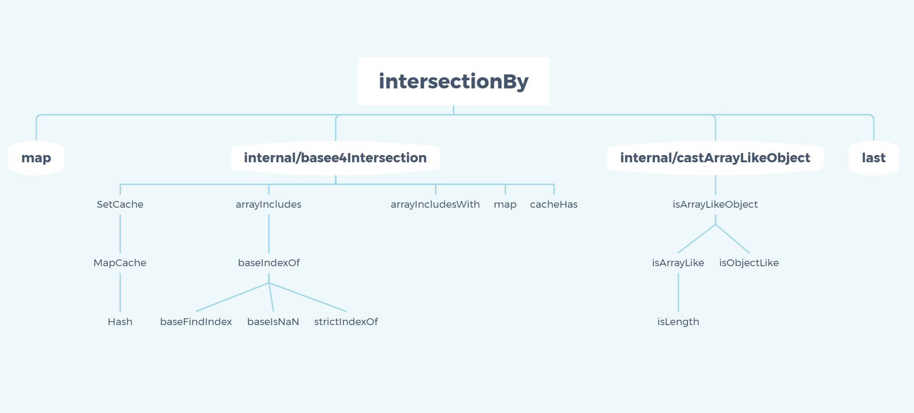

> A modern JavaScript utility library delivering modularity, performance & extras.

> `lodash` 是一个一致性、模块化、高性能的 `JavaScript` 实用工具库

# 一、环境准备

-   `lodash` 版本 `v4.0.0`

-   通过 `github1s` 网页可以 [查看](https://github1s.com/lodash/lodash/blob/HEAD/intersectionBy.js) `lodash - intersectionBy` 源码
-   调试测试用例可以 `clone` 到本地

```shell
git clone https://github.com/lodash/lodash.git

cd axios

npm install

npm run test
```

# 二、结构分析



&emsp;&emsp;这是一张 `intersectionBy` 依赖引用路径图，相对复杂一些，按照功能划分，大致包括`baseIntersection` 模块、`castArrayLikeObject`模块。但其中大部分内容已在[lodash-intersection源码研读解析](./intersection.md)、[lodash-baseIntersection源码研读解析](./baseIntersection)，两篇文章中讲述，现在不再赘述，仅对 `baseIntersection`、`castArrayLikeObject`、以及`intersectionBy` 主体做一下说明。


# 三、函数研读

## 1. map 模块

**创建一个数组， value（值） 是 iteratee（迭代函数）遍历 collection（集合）中的每个元素后返回的结果。 iteratee（迭代函数）调用3个参数(value, index|key, collection)**

```js
/**
 * @since 5.0.0
 * @category Array
 * @param {Array} array 用来迭代的集合
 * @param {Function} iteratee  每次迭代调用的函数
 * @returns {Array} 返回新的映射后数组
 * @example
 *
 * function square(n) {
 *   return n * n
 * }
 *
 * map([4, 8], square)
 * // => [16, 64]
 */
function map(array, iteratee) {
  let index = -1
  const length = array == null ? 0 : array.length
  const result = new Array(length)

  while (++index < length) {
    result[index] = iteratee(array[index], index, array)
  }
  return result
}

export default map

```

-  使用 `new Array` 创建一个对应其长度的数组 `result`，其中 `array` 为 `null` 时，长度为 `0`，将会创建一个空数组
-  按照 `array` 长度循环调用 `iteratee`，每次循环步长 + 1，
-  lodash规定了一些内部关键词不可用于对 `iteratee` 命名，如 `every`、`fill` 等，关于 `map` 的使用规则参见[Lodash 文档 - map](https://www.lodashjs.com/docs/lodash.map#_mapcollection-iteratee_identity)

## 2. last

**`Array` 类型的一个方法，目的是获取数组最后一个元素**

```js
/**
 * @since 0.1.0
 * @category Array
 * @param {Array} array 要检索的数组
 * @returns {*} 返回array中的最后一个元素
 * @example
 *
 * last([1, 2, 3])
 * // => 3
 */
function last(array) {
  const length = array == null ? 0 : array.length
  return length ? array[length - 1] : undefined
}

export default last
```

- 如果 `array` 为 `null` 则返回 `undefined` 否则取 `array` 最后一位


## 3. castArrayLikeObject 模块

**如果不是类数组对象，则将“value”强制转换为空数组**

```js
import isArrayLikeObject from '../isArrayLikeObject.js'

/**
 * @private
 * @param {*} value  要检查的值
 * @returns {Array|Object} 返回类似于cast数组的对象
 */
function castArrayLikeObject(value) {
  return isArrayLikeObject(value) ? value : []
}

export default castArrayLikeObject

```

- 封装了 `isArrayLikeObject` ，当 `value` 同时符合 `isArrayLikeObject` 所检测的目标类型时返回 `true`，此时返回 `value`，否则返回空数组

## 4. baseIntersection 模块

**“intersection”之类的方法的基本实现，接受要检查的数组**

```js
import SetCache from './SetCache.js'
import arrayIncludes from './arrayIncludes.js'
import arrayIncludesWith from './arrayIncludesWith.js'
import map from '../map.js'
import cacheHas from './cacheHas.js'

/**
 * @private
 * @param {Array} arrays 要检查的阵列
 * @param {Function} [iteratee] 每个元素调用的迭代对象
 * @param {Function} [comparator] 每个元素调用的比较器
 * @returns {Array} 返回共享值的新数组
 */
function baseIntersection(arrays, iteratee, comparator) {
  const includes = comparator ? arrayIncludesWith : arrayIncludes
  const length = arrays[0].length
  const othLength = arrays.length
  const caches = new Array(othLength)
  const result = []

  let array
  let maxLength = Infinity
  let othIndex = othLength

  while (othIndex--) {
    array = arrays[othIndex]
    if (othIndex && iteratee) {
      array = map(array, (value) => iteratee(value))
    }
    maxLength = Math.min(array.length, maxLength)
    caches[othIndex] = !comparator && (iteratee || (length >= 120 && array.length >= 120))
      ? new SetCache(othIndex && array)
      : undefined
  }
  array = arrays[0]

  let index = -1
  const seen = caches[0]

  outer:
  while (++index < length && result.length < maxLength) {
    let value = array[index]
    const computed = iteratee ? iteratee(value) : value

    value = (comparator || value !== 0) ? value : 0
    if (!(seen
      ? cacheHas(seen, computed)
      : includes(result, computed, comparator)
    )) {
      othIndex = othLength
      while (--othIndex) {
        const cache = caches[othIndex]
        if (!(cache
          ? cacheHas(cache, computed)
          : includes(arrays[othIndex], computed, comparator))
        ) {
          continue outer
        }
      }
      if (seen) {
        seen.push(computed)
      }
      result.push(value)
    }
  }
  return result
}

export default baseIntersection
```

- 如果有比较器 `comparator` 则使用比较器查找，否则使用默认查找方法 `baseIndexOf`
- 要检查的 `array` 过长（length > 120）时使用 `caches` 做缓存
- `outer` 执行多层嵌套语句

## 5. intersectionBy 模块

**这个方法类似_.intersection，区别是它接受一个 iteratee 调用每一个arrays的每个值以产生一个值，通过产生的值进行了比较。结果值是从第一数组中选择。iteratee 会传入一个参数：(value)**

```js
import map from './map.js'
import baseIntersection from './.internal/baseIntersection.js'
import castArrayLikeObject from './.internal/castArrayLikeObject.js'
import last from './last.js'

/**
 * @since 4.0.0
 * @category Array
 * @param {...Array} [arrays] 待检查的数组
 * @param {Function} iteratee iteratee（迭代器）调用每个元素
 * @returns {Array} 返回一个包含所有传入数组交集元素的新数组
 * @example
 *
 * intersectionBy([2.1, 1.2], [2.3, 3.4], Math.floor)
 * // => [2.1]
 */
function intersectionBy(...arrays) {
  let iteratee = last(arrays)
  const mapped = map(arrays, castArrayLikeObject)

  if (iteratee === last(mapped)) {
    iteratee = undefined
  } else {
    mapped.pop()
  }
  return (mapped.length && mapped[0] === arrays[0])
    ? baseIntersection(mapped, iteratee)
    : []
}

export default intersectionBy

```

- 与 `intersection` 不同的是 `intersectionBy` 最后一位是传入的迭代器 `iteratee`，所以需要使用 `last` 获取 `iteratee`，但需要注意的是最后一位有可能并不是合法的 `iteratee`
- 使用 `map` 配合迭代器 `castArrayLikeObject` 检测入参 `arrays` 是否是合法数组，返回 `mapped`
- 使用 `last` 获取 `mapped` 最后一位，并与 `iteratee` 做对比，当 `iteratee` 不合法（在 `isLikeObject` 中使用 `typeof` 判断为 `function` 类型返回为空，从而 `mapped` 最后一项为空）取 `undefined` 否则弹出最后一位（此时最后一位为 `iteratee`，为非处理数据）
- 如 `mapped` 存在并且入参第一项 `arrays` 是合法数组，则调用 `baseIntersection` 检测公共元素，否则返回空数组 