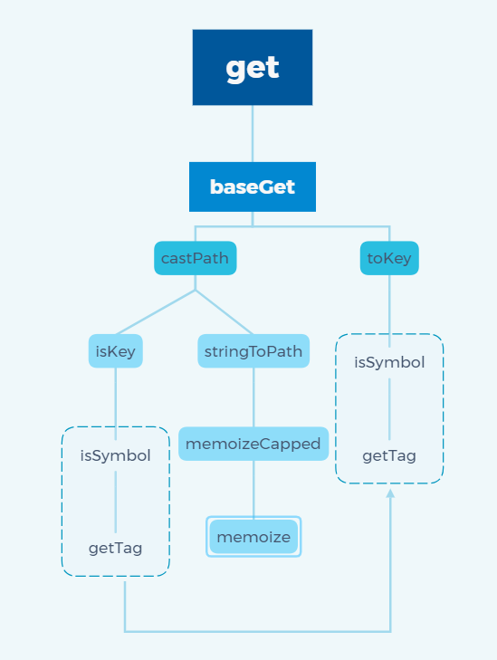

# 一、题目
**实现 lodash 中的 get 函数【难度⭐，对标百度 T4，阿里 P5，腾讯T2.2】**
```js
// var object = { 'a': [{ 'b': { 'c': 3 } }] };
// get(object, 'a[0].b.c'); // 3
// get(object, ['a', '0', 'b', 'c']); // 3

const get = (data, path, defaultValue = void 0)
=> {
    // todo
}
```

# 二、题目情景与分析
|           情景             |    效果   |
| :------------------------: | :------- |
|       object.a.b.c         |    ❌    |
|_get(object,'a[0].b.c',null)|    ✅    |
|     object?.a?.b?.c        |    ✅    |

# 三、手写
```js
const get = (data, path, defaultValue = 0)
=> {
    // 'a[0].b.c' ==> 'a.0.b.c' ==> ['a', '0', 'b', 'c']
    const regPath = path.replace(/\[(\d+)\]/g, '.$1').split('.');

    let result = data;
    for(const path of regPath){
        result = Object(result)[path];

        if(result == null){
            return defaultValue;
        }
    }

    return result;
}
```

- 考察点1：处理数组情况，使用正则表达式将数组元素 `[num]` 替换成 `.num`
- 考察点2：正则表达式书写，
- 考察点3：处理 data 未定义状况，之所以要包一层Object，因为null 与 undefined 取属性会报错，所以使用 Object 包装一下，另外可以借助可选链操作简化 `result = result?.[path]`


# 四、lodash源码分析 - 环境准备

> A modern JavaScript utility library delivering modularity, performance & extras.

> `lodash` 是一个一致性、模块化、高性能的 `JavaScript` 实用工具库

-   `lodash` 版本 `v4.0.0`

-   通过 `github1s` 网页可以 [查看](https://github1s.com/lodash/lodash/blob/HEAD/get.js) `lodash - get` 源码
-   调试测试用例可以 `clone` 到本地

```shell
git clone https://github.com/lodash/lodash.git

cd axios

npm install

npm run test
```

# 五、lodash源码分析 - 结构分析



&emsp;&emsp;这是一张 `get` 依赖引用路径图，相对复杂一些，按照功能划分，大致包括 `tokey` 模块、 `castPath` 模块，分别用于检验 `key` 值是否合法、计算 `path`。整体流程和我们手写的相差不大，主要是功能方面做了扩展，比如不仅可以实现 `a[0]` 还可以实现 `a[0][0]` 这样的操作，并且深度过大时会开启 `Map` 缓存，下面挑其中的重点讲一下。

# 六、lodash源码分析 - 函数研读

## 1. castPath 模块

**如果值不是数组，则将其强制转换路径数组**

```js
import isKey from './isKey.js'
import stringToPath from './stringToPath.js'

/**
 * @private
 * @param {*} value The value to inspect.
 * @param {Object} [object] The object to query keys on.
 * @returns {Array} Returns the cast property path array.
 */
function castPath(value, object) {
  if (Array.isArray(value)) {
    return value
  }
  return isKey(value, object) ? [value] : stringToPath(value)
}

export default castPath
```

- `isKey` 判断 `path` 是不是当前对象的 `key`
- stringToPath 如果传入的 path 不是当前对象的 key，就调用该方法把字符串转成对应的数组

## 2. isKey 模块

**检查'value'是否是属性名而不是属性路径**

```js
import isSymbol from '../isSymbol.js'

/** 用于匹配属性路径中的属性名称 **/
const reIsDeepProp = /\.|\[(?:[^[\]]*|(["'])(?:(?!\1)[^\\]|\\.)*?\1)\]/
const reIsPlainProp = /^\w*$/

/**
 * @private
 * @param {*} value The value to check.
 * @param {Object} [object] The object to query keys on.
 * @returns {boolean} Returns `true` if `value` is a property name, else `false`.
 */
function isKey(value, object) {
  if (Array.isArray(value)) {
    return false
  }
  const type = typeof value
  if (type === 'number' || type === 'boolean' || value == null || isSymbol(value)) {
    return true
  }
  return reIsPlainProp.test(value) || !reIsDeepProp.test(value) ||
    (object != null && value in Object(object))
}

export default isKey
```

- `reIsDeepProp` 用于界定分隔内容，比如会匹配到 `a.b[1].c[2]` 中的 `.`、`[1]`、`[2]`
- `reIsPlainProp` 用于匹配 `0-n` 个字符，目的是匹配属性名

## 3. stringToPath 模块

** **

```js
import memoizeCapped from './memoizeCapped.js'

const charCodeOfDot = '.'.charCodeAt(0)
const reEscapeChar = /\\(\\)?/g
const rePropName = RegExp(
  // 匹配任何不是点或括号的内容
  '[^.[\\]]+' + '|' +
  // 或者在括号内匹配属性名称
  '\\[(?:' +
    // 匹配非字符串表达式
    '([^"\'][^[]*)' + '|' +
    // 或匹配字符串（支持转义字符）
    '(["\'])((?:(?!\\2)[^\\\\]|\\\\.)*?)\\2' +
  ')\\]'+ '|' +
  // 或将""匹配为连续点或空括号之间的间距
  '(?=(?:\\.|\\[\\])(?:\\.|\\[\\]|$))'
  , 'g')

/**
 * 将'string'转换为属性路径数组
 * @private
 * @param {string} string The string to convert.
 * @returns {Array} Returns the property path array.
 */
const stringToPath = memoizeCapped((string) => {
  const result = []
  if (string.charCodeAt(0) === charCodeOfDot) {
    result.push('')
  }
  string.replace(rePropName, (match, expression, quote, subString) => {
    let key = match
    if (quote) {
      key = subString.replace(reEscapeChar, '$1')
    }
    else if (expression) {
      key = expression.trim()
    }
    result.push(key)
  })
  return result
})

export default stringToPath
```

- 关键是看懂 `rePropName` 这个正则表达式
- `[^.[\\]]+` 匹配任何不是点或括号的内容，其中`\\]`用于对`]`转义，可以理解为`[^.]+` 或`[^[\\]]+` 
- `\\[(?:` 匹配 `[(` 其中 `?:` 表示非捕获性分组（不保存子组）
- `(["\'])((?:(?!\\2)[^\\\\]|\\\\.)*?)\\2`，这个比较复杂了，其中`(?!)`表示 `Case-Insensitive` 即不区分大小写模式，`\2` 表示分组引用，比如`(1)(2)(3)\2` 表示引用第二个分组 `(2)` 🐶


