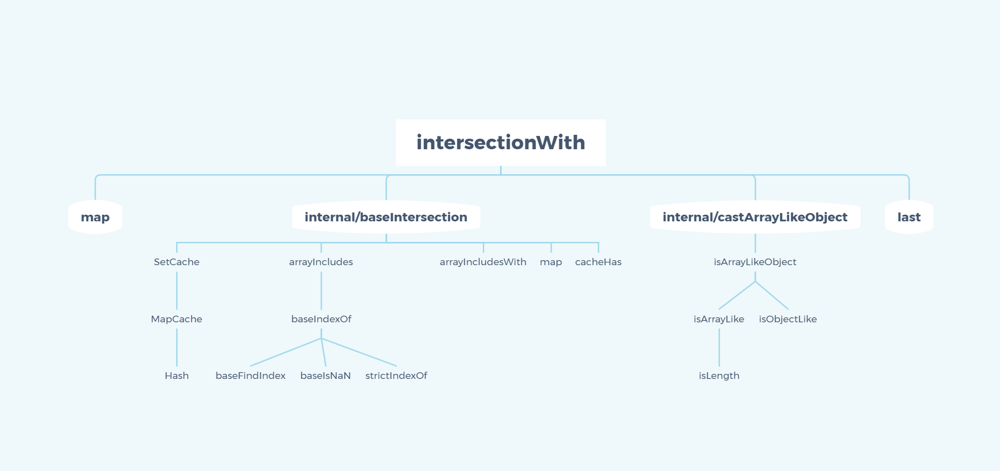

> A modern JavaScript utility library delivering modularity, performance & extras.

> `lodash` 是一个一致性、模块化、高性能的 `JavaScript` 实用工具库

# 一、环境准备

-   `lodash` 版本 `v4.0.0`

-   通过 `github1s` 网页可以 [查看](https://github1s.com/lodash/lodash/blob/HEAD/intersectionWith.js) `lodash - intersectionWith` 源码
-   调试测试用例可以 `clone` 到本地

```shell
git clone https://github.com/lodash/lodash.git

cd axios

npm install

npm run test
```

# 二、结构分析



&emsp;&emsp;这是一张 `intersectionWith` 依赖引用路径图，相对复杂一些，按照功能划分，大致包括`baseIntersection` 模块、`castArrayLikeObject`模块，与[lodash-intersectionBy源码研读解析](./IntersectionBy.md)相同，现在不再赘述，仅对 `intersectionWith` 主体及其测试用例做一下说明。


# 三、函数研读

## intersectionWith 模块

**这个方法类似_.intersection，区别是它接受一个 comparator 调用比较arrays中的元素。结果值是从第一数组中选择。comparator 会传入两个参数：(arrVal, othVal)**

```js
import map from './map.js'
import baseIntersection from './.internal/baseIntersection.js'
import castArrayLikeObject from './.internal/castArrayLikeObject.js'
import last from './last.js'

/**
 * @since 4.0.0
 * @category Array
 * @param {...Array} [arrays] 待检查的数组
 * @param {Function} [comparator] comparator（比较器）调用每个元素
 * @returns {Array} 返回一个包含所有传入数组交集元素的新数组
 * @example
 *
 * const objects = [{ 'x': 1, 'y': 2 }, { 'x': 2, 'y': 1 }]
 * const others = [{ 'x': 1, 'y': 1 }, { 'x': 1, 'y': 2 }]
 *
 * intersectionWith(objects, others, isEqual)
 * // => [{ 'x': 1, 'y': 2 }]
 */
function intersectionWith(...arrays) {
  let comparator = last(arrays)
  const mapped = map(arrays, castArrayLikeObject)

  comparator = typeof comparator === 'function' ? comparator : undefined
  if (comparator) {
    mapped.pop()
  }
  return (mapped.length && mapped[0] === arrays[0])
    ? baseIntersection(mapped, undefined, comparator)
    : []
}

export default intersectionWith

```

- 与 `intersectionBy` 不同的是 `intersectionWith` 最后一位是传入的比较器 `comparator`，同样是使用 `last` 获取 `comparator`
- 使用 `map` 配合迭代器 `castArrayLikeObject` 检测入参 `arrays` 是否是合法数组，返回 `mapped`
- 使用 `typeof` 判断为 `comparator` 类型，如果是 `function` 则表明最后一项为合法比较器，否则比较器取值 `undefined`
- 如 `mapped` 存在并且入参第一项 `arrays` 是合法数组，则调用 `baseIntersection` 检测公共元素，否则返回空数组 

# 四、测试用例

```js
import assert from 'assert';
import lodashStable from 'lodash';
import { LARGE_ARRAY_SIZE, stubZero } from './utils.js';
import intersectionWith from '../intersectionWith.js';

describe('intersectionWith', function() {
  it('should work with a `comparator`', function() {
    var objects = [{ 'x': 1, 'y': 2 }, { 'x': 2, 'y': 1 }],
        others = [{ 'x': 1, 'y': 1 }, { 'x': 1, 'y': 2 }],
        actual = intersectionWith(objects, others, lodashStable.isEqual);

    assert.deepStrictEqual(actual, [objects[0]]);
  });

  it('should preserve the sign of `0`', function() {
    var array = [-0],
        largeArray = lodashStable.times(LARGE_ARRAY_SIZE, stubZero),
        others = [[0], largeArray],
        expected = lodashStable.map(others, lodashStable.constant(['-0']));

    var actual = lodashStable.map(others, function(other) {
      return lodashStable.map(intersectionWith(array, other, lodashStable.eq), lodashStable.toString);
    });

    assert.deepStrictEqual(actual, expected);
  });
});

```