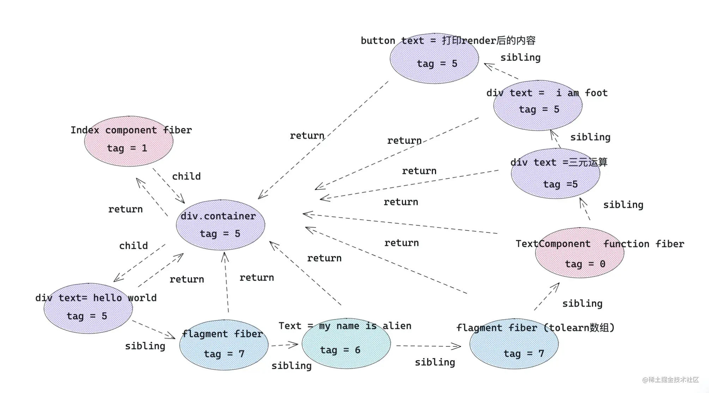

## 目标
- 了解常用的元素会被 React 处理成什么，有利于后续理解 react fiber 类型
- 理解 jsx 的编译过程，方便操纵 children、控制 React 渲染，有利于便捷使用 React 插槽组件

### babel编译结果

```js
<div>
   <TextComponent />
   <div>hello,world</div>
   let us learn React!
</div>

==babel==> 
React.createElement("div", null,
    React.createElement(TextComponent, null),
    React.createElement("div", null, "hello,world"),
    "let us learn React!"
)
```

### babel编译结果归纳
```js
React.createElement(
  type,
  [props],
  [...children]
)
```

- `type` 如果是组件类型，会传入组件对应的类或函数；如果是 dom 元素类型，传入 div 或者 span 之类的字符串

- `[props]` 一个对象，在 dom 类型中为标签属性，在组件类型中为 props 

- `[...children]` children，根据顺序排列。

### JSX转换规则

| jsx元素类型 |	react.createElement 转换后 | type 属性 |
| :------: | :----------: | :-----------: |
| element元素类型 | react element类型 | 标签字符串，例如 div |
| fragment类型 |  react element类型 | symbol react.fragment类型 |
| 文本类型 | 直接字符串 | 无 |
| 数组类型 | 返回数组结构，里面元素被react.createElement转换 | 无 |
| 组件类型 | react element类型 | 组件类或者组件函数本身 |
| 三元运算 / 表达式 | 先执行三元运算，然后按照上述规则处理 | 看三元运算返回结果 |
| 函数执行	| 先执行函数，然后按照上述规则处理 | 看函数执行返回结果 |


### react 调和处理
在调和阶段，上述 React element 对象的每一个子节点都会形成一个与之对应的 fiber 对象，然后通过 sibling、return、child 将每一个 fiber 对象联系起来。

#### 不同种类的 fiber Tag

```js
export const FunctionComponent = 0;       // 函数组件
export const ClassComponent = 1;          // 类组件
export const IndeterminateComponent = 2;  // 初始化的时候不知道是函数组件还是类组件 
export const HostRoot = 3;                // Root Fiber 可以理解为根元素 ， 通过reactDom.render()产生的根元素
export const HostPortal = 4;              // 对应  ReactDOM.createPortal 产生的 Portal 
export const HostComponent = 5;           // dom 元素 比如 <div>
export const HostText = 6;                // 文本节点
export const Fragment = 7;                // 对应 <React.Fragment> 
export const Mode = 8;                    // 对应 <React.StrictMode>   
export const ContextConsumer = 9;         // 对应 <Context.Consumer>
export const ContextProvider = 10;        // 对应 <Context.Provider>
export const ForwardRef = 11;             // 对应 React.ForwardRef
export const Profiler = 12;               // 对应 <Profiler/ >
export const SuspenseComponent = 13;      // 对应 <Suspense>
export const MemoComponent = 14;          // 对应 React.memo 返回的组件
```

#### fiber 对应关系



- child： 一个由父级 fiber 指向子级 fiber 的指针
- return：一个子级 fiber 指向父级 fiber 的指针
- sibling: 一个 fiber 指向下一个兄弟 fiber 的指针


### 面试题
1\. 问: 老版本的 React 中，为什么写 jsx 的文件要默认引入 React? 如下
```js
import React from 'react'
function Index(){
    return <div>hello,world</div>
}
```
答: 因为 jsx 在被 babel 编译后，写的 jsx 会变成上述 React.createElement 形式，所以需要引入 React，防止找不到 React 引起报错。

2\. react17 jsx 为什么不需要引入React
答: [介绍全新的 JSX 转换](https://react.docschina.org/blog/2020/09/22/introducing-the-new-jsx-transform.html)、[介绍全新的 JSX 转换](https://reactjs.org/blog/2020/09/22/introducing-the-new-jsx-transform.html)

3\. 问: React.createElement 和 React.cloneElement 到底有什么区别呢?
答: 可以完全理解为，一个是用来创建 element 。另一个是用来修改 element，并返回一个新的 React.element 对象。

4\. 问: 为什么需要cloneElement，不能在原来的element上修改更新
答: 原来的 element 的属性是notextensible 不可拓展的， React 不能轻易让开发者修改 Element

5\. 问: jsx更新流程
答: [1] babel 编译成 React Element 形式，jsx 内容被 react.createElement 转换成 react element 对象 
    [2] 调和处理，上述 React element 对象的每一个子节点都会形成一个与之对应的 fiber 对象，然后通过 sibling、return、child 将每一个 fiber 对象联系起来
    [3]

    [总结] JSX --- babel编译 ---> ReactElement --- reconciler ---> fiber

6\. 问: 如何手动控制jsx来生成React.element来实现render的一个可控性
答: [1] 将children扁平化处理，将数组类型的子节点打开 ；
    [2] 去除children中文本类型节点；
    [3] 向children最后插入say goodbye元素；
    [4] 克隆新的元素节点并渲染。

7\. 问: jsx通过Babel来转化成js识别的对象的流程
答: [1] createElement方式（需要因引入React） 
    [2] runtime方式(需要 .babelrc 设置 runtime: automatic), @babel/plugin-syntax-jsx ,在编译的过程中注入 _jsxRuntime api ，使得新版本 React 已经不需要引入 createElement
