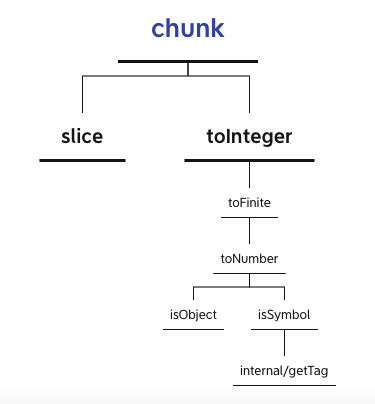
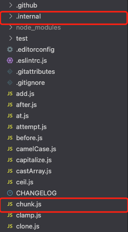

> A modern JavaScript utility library delivering modularity, performance & extras.

> `lodash` 是一个一致性、模块化、高性能的 `JavaScript` 实用工具库

# 一、环境准备

-   `lodash` 版本 `v4.0.0`

-   通过 `github1s` 网页可以 [查看](https://github1s.com/lodash/lodash/blob/HEAD/chunk.js) `lodash - chunk` 源码
-   调试测试用例可以 `clone` 到本地

```shell
git clone https://github.com/lodash/lodash.git

cd axios

npm install

npm run test
```

# 二、结构分析



&emsp;&emsp;这是一张 `chunk` 依赖引用路径图，其中使用到了 `slice`、`toInteger`、`toFinite`、`toNumber`、`isObject`、`isSymbol`、`internal/getTag`，接下来会自底向上分析各个依赖模块。由于依赖较多，篇幅较长，分成上下两部分，上篇涉及到 `toFinite`、`toNumber`、`isObject`、`isSymbol`、`internal/getTag` 五个部分。



&emsp;&emsp;这是一张 `lodash` 项目结构图，其中 `internal` 为内部函数库，其余对外暴露的功能模块如 `chunk` 在根目录下。

# 三、函数研读

## 1. internal/getTag 模块

>

```js
const toString = Object.prototype.toString;

/**
 * Gets the `toStringTag` of `value`.
 *
 * @private
 * @param {*} value The value to query.
 * @returns {string} Returns the `toStringTag`.
 */
function getTag(value) {
    if (value == null) {
        return value === undefined ? "[object Undefined]" : "[object Null]";
    }
    return toString.call(value);
}

export default getTag;
```

-   getTag 封装了 Object 原型链函数 toString()，借助 toString()判断属性类型的性质判断 value 是否为 Undefined 或者 Null

## 2. isSymbol 模块

```js
import getTag from "./.internal/getTag.js";

/**
 * Checks if `value` is classified as a `Symbol` primitive or object.
 *
 * @since 4.0.0
 * @category Lang
 * @param {*} value The value to check.
 * @returns {boolean} Returns `true` if `value` is a symbol, else `false`.
 * @example
 *
 * isSymbol(Symbol.iterator)
 * // => true
 *
 * isSymbol('abc')
 * // => false
 */
function isSymbol(value) {
    const type = typeof value;
    return (
        type == "symbol" ||
        (type === "object" &&
            value != null &&
            getTag(value) == "[object Symbol]")
    );
}

export default isSymbol;
```

-   可以通过 `typeof` 来获取 `未经计算的操作数` 的类型

## 3. isObject 模块

```js
/**
 * Checks if `value` is the
 * [language type](http://www.ecma-international.org/ecma-262/7.0/#sec-ecmascript-language-types)
 * of `Object`. (e.g. arrays, functions, objects, regexes, `new Number(0)`, and `new String('')`)
 *
 * @since 0.1.0
 * @category Lang
 * @param {*} value The value to check.
 * @returns {boolean} Returns `true` if `value` is an object, else `false`.
 * @example
 *
 * isObject({})
 * // => true
 *
 * isObject([1, 2, 3])
 * // => true
 *
 * isObject(Function)
 * // => true
 *
 * isObject(null)
 * // => false
 */
function isObject(value) {
    const type = typeof value;
    return value != null && (type === "object" || type === "function");
}

export default isObject;
```

-   检查 value 是否是普通对象，即排除掉 null 类型的所有对象类型，包含 array、date、function 等对象类型

## 4. toNumber 模块

>

```js
import isObject from "./isObject.js";
import isSymbol from "./isSymbol.js";

/** 用作各种“数字”常量的引用 */
const NAN = 0 / 0;

/** 用于匹配前导和尾随空格 */
const reTrim = /^\s+|\s+$/g;

/** 用于检测错误的有符号十六进制字符串值 */
const reIsBadHex = /^[-+]0x[0-9a-f]+$/i;

/** 用于检测二进制字符串值 */
const reIsBinary = /^0b[01]+$/i;

/** 用于检测八进制字符串值 */
const reIsOctal = /^0o[0-7]+$/i;

/** 不依赖 `root` 的内置方法引用 */
const freeParseInt = parseInt;

/**
 * 将 `value` 转换成 number
 * @since 4.0.0
 * @category Lang
 * @param {*} value The value to process.
 * @returns {number} Returns the number.
 * @see isInteger, toInteger, isNumber
 * @example
 *
 * toNumber(3.2)
 * // => 3.2
 *
 * toNumber(Number.MIN_VALUE)
 * // => 5e-324
 *
 * toNumber(Infinity)
 * // => Infinity
 *
 * toNumber('3.2')
 * // => 3.2
 */
function toNumber(value) {
    if (typeof value === "number") {
        return value;
    }
    if (isSymbol(value)) {
        return NAN;
    }
    if (isObject(value)) {
        const other =
            typeof value.valueOf === "function" ? value.valueOf() : value;
        value = isObject(other) ? `${other}` : other;
    }
    if (typeof value !== "string") {
        return value === 0 ? value : +value;
    }
    value = value.replace(reTrim, "");
    const isBinary = reIsBinary.test(value);
    return isBinary || reIsOctal.test(value)
        ? freeParseInt(value.slice(2), isBinary ? 2 : 8)
        : reIsBadHex.test(value)
        ? NAN
        : +value;
}

export default toNumber;
```

-   `NAN` 是一个不可写、不可配置、不可枚举的数据类型，表示未定义或不可表示的值。常在浮点数运算中使用。首次引入 NaN 的是 1985 年的 IEEE 754 浮点数标准。比如 0/0、0×∞、∞ + (−∞)、∞ - ∞、NANx1、ix1 等计算结果均会返回`NAN`

-   如果是 Number 类型则直接返回，如果是 symbol 类型返回 `NAN`
-   valueOf() 方法返回指定对象的原始值，配合 `typeof value.valueOf === "function"`，如果是 `function`类型则会返回函数本身，如果是其他非 `null`类型的 object 类型，则会返回对象本身
-   如果是非 string 类型且不为 0 则使用 + 操作符转换成 Number 类型
-   去掉首尾空格
-   在返回前对二进制、八进制、十六进制数据格式做最后检查，如果正确就使用 + 操作符转换成 Number 类型返回否则返回 NUll 🐶

## 5. toFinite 模块

```js
import toNumber from "./toNumber.js";

/** 用作各种“数字”常量的引用 */
const INFINITY = 1 / 0;
const MAX_INTEGER = 1.7976931348623157e308;

/**
 *  将 `value` 转换成有限 number
 * @since 4.12.0
 * @category Lang
 * @param {*} value The value to convert.
 * @returns {number} Returns the converted number.
 * @example
 *
 * toFinite(3.2)
 * // => 3.2
 *
 * toFinite(Number.MIN_VALUE)
 * // => 5e-324
 *
 * toFinite(Infinity)
 * // => 1.7976931348623157e+308
 *
 * toFinite('3.2')
 * // => 3.2
 */
function toFinite(value) {
    if (!value) {
        return value === 0 ? value : 0;
    }
    value = toNumber(value);
    if (value === INFINITY || value === -INFINITY) {
        const sign = value < 0 ? -1 : 1;
        return sign * MAX_INTEGER;
    }
    return value === value ? value : 0;
}

export default toFinite;
```

-   首先拿到 toNumber 返回的 value 值，判断是否为正负无穷，然后根据其正负状态转换成 js 可以表示的双精度浮点数。其中使用常量`INFINITY = 1 / 0` 表示无穷。
