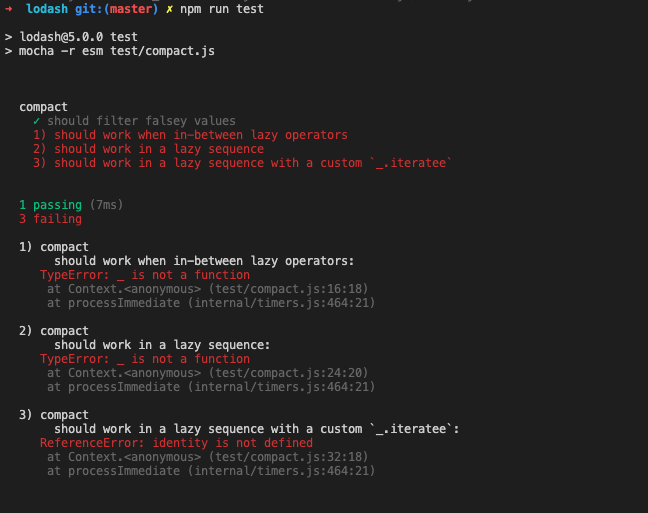

<!--
 * @Descripttion: 
 * @version: 
 * @Author: zhangxiangyu
 * @Date: 2022-02-15 16:27:34
 * @LastEditors: zhangxiangyu
 * @LastEditTime: 2022-02-15 18:20:20
-->
---
title: lodash-compact源码研读解析
search: true

date: 2021-12-25 14:05:23
tags: [lodash, compact]
photos:
description:
comments:
---

> A modern JavaScript utility library delivering modularity, performance & extras.

> `lodash` 是一个一致性、模块化、高性能的 `JavaScript` 实用工具库

# 一、环境准备

-   `lodash` 版本 `v4.0.0`

-   通过 `github1s` 网页可以 [查看](https://github1s.com/lodash/lodash/blob/HEAD/compact.js) `lodash - compact` 源码
-   调试测试用例可以 `clone` 到本地

```shell
git clone https://github.com/lodash/lodash.git

cd axios

npm install

npm run test
```

# 二、结构分析

&emsp;&emsp;`compact` 没有其他依赖，代码块很简短，但其中涉及到的东西还是很有必要了解的，比如假值-falsey、惰性运算等。

# 三、函数研读

## 1. 功能模块

> Creates an array with all falsey values removed. The values `false`, `null`, `0`, `""`, `undefined`, and `NaN` are falsey.

> 创建一个新数组，包含原数组中所有的非假值元素。例如false, null,0, "", undefined, 和 NaN 都是被认为是“假值”。

```js
/**
 * @since 0.1.0
 * @category Array
 * @param {Array} array The array to compact.
 * @returns {Array} Returns the new array of filtered values.
 * @example
 *
 * compact([0, 1, false, 2, '', 3])
 * // => [1, 2, 3]
 */
function compact(array) {
  let resIndex = 0
  const result = []

  if (array == null) {
    return result
  }

  for (const value of array) {
    if (value) {
      result[resIndex++] = value
    }
  }
  return result
}

export default compact

```

-  逻辑很简单，如果是 array 是 null，直接返回空数组，否则使用for...of 循环读取 array 键值，将满足条件的键值放到 result 并返回 
-  关键在于 `if (value)`可以过滤掉所有的falsy，看一下[MDN](https://developer.mozilla.org/en-US/docs/Glossary/Falsy)中对于falsy 值的定义 - `A falsy (sometimes written falsey) value is a value that is considered false when encountered in a Boolean context.` 意味着不符合的键值在`布尔值上下文`中被转换为 false，从而绕过了 if 代码块

## 2. 测试用例


```js
import assert from 'assert'
import lodashStable from 'lodash'
import { LARGE_ARRAY_SIZE, _, falsey } from './utils.js'
import compact from '../compact.js'
import slice from '../slice.js'

describe('compact', () => {
  const largeArray = lodashStable.range(LARGE_ARRAY_SIZE).concat(null)

  it('should filter falsey values', () => {
    const array = ['0', '1', '2']
    assert.deepStrictEqual(compact(falsey.concat(array)), array)
  })

  it('should work when in-between lazy operators', () => {
    let actual = _(falsey).thru(slice).compact().thru(slice).value()
    assert.deepEqual(actual, [])

    actual = _(falsey).thru(slice).push(true, 1).compact().push('a').value()
    assert.deepEqual(actual, [true, 1, 'a'])
  })

  it('should work in a lazy sequence', () => {
    const actual = _(largeArray).slice(1).compact().reverse().take().value()
    assert.deepEqual(actual, _.take(compact(slice(largeArray, 1)).reverse()))
  })

  it('should work in a lazy sequence with a custom `_.iteratee`', () => {
    let iteratee = _.iteratee,
      pass = false

    _.iteratee = identity

    try {
      const actual = _(largeArray).slice(1).compact().value()
      pass = lodashStable.isEqual(actual, compact(slice(largeArray, 1)))
    } catch (e) {console.log(e)}

    assert.ok(pass)
    _.iteratee = iteratee
  })
})

```



&emsp;&emsp;这是一张 `compact` 测试用例运行情况图，我们可以看到对于 `compact`官方期望更健壮，在惰性运算符中也应当正常工作
- 

Tips：修改一下package.json中的测试命令 `"test": "mocha -r esm test/*.test.js"` ==> `"test": "mocha -r esm test/compact.js"` 即可运行。

