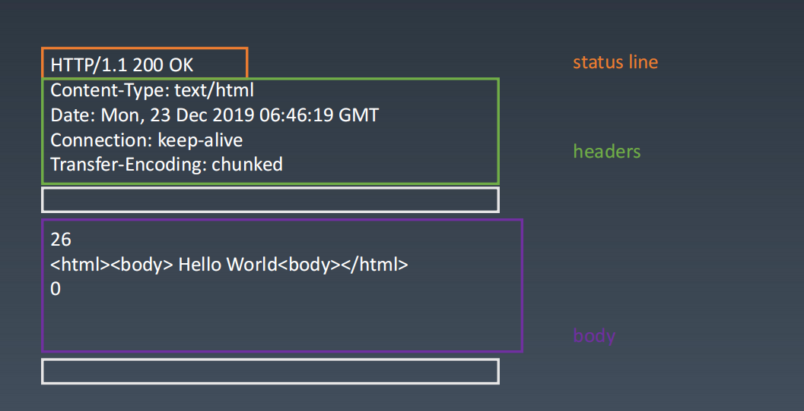

> `defaults` The default config for the instance

> `defaults` 初始化实例的默认配置的库函数

# 一、环境准备

-   `axios` 版本 `v0.24.0`

-   通过 `github1s` 网页可以 [查看](https://github1s.com/axios/axios/blob/HEAD/CONTRIBUTING.md) axios 源码
-   调试需要 `clone` 到本地

```shell
git clone https://github.com/axios/axios.git

cd axios

npm start

http://localhost:3000/
```

# 二、函数研读

## 1. helper 函数

> 包含辅助函数库 `utils` 、非通用的函数库`normalizeHeaderName`及核心函数库`enhanceError`

### 【1.1】 utils

> `utils`是一个非特定于 `axios` 的通用辅助函数库。见名思义，其中包含了一些与业务逻辑无关但或可以提升效率或频繁使用到的代码段，谓之工具函数。关于 `axios` 的工具函数库 `utils` 更多内容，详情见[utils](./Utils.md)

### 【1.2】 normalizeHeaderName

```js
var normalizeHeaderName = require('./helpers/normalizeHeaderName');

===>
'use strict';

var utils = require('../utils');

module.exports = function normalizeHeaderName(headers, normalizedName) {
  utils.forEach(headers, function processHeader(value, name) {
    if (name !== normalizedName && name.toUpperCase() === normalizedName.toUpperCase()) {
      headers[normalizedName] = value;
      delete headers[name];
    }
  });
};

```

-   作用是规范化请求头`Header`中的`键`名，替换不满足`Axios`内部要求的`键`名
-   通过`toUpperCase()`将用户自定义`Header`中键名转换成大写并与 Axios 内部默认配置的对应`键`大写形式比较
-   `forEach`循环键值对`headers`时，每次都会回调`processHeader`，入参`key`、`value`对应`headers`中每一项的`键`和`键值`

Tips: 这里用到了`utils`中的`forEach`函数，每次调用`normalizeHeaderName`会对`headers`所有`键`做一次检查

### 【1.3】 enhanceError

```js
var enhanceError = require('./core/enhanceError');

===>
'use strict';

/**
 * Update an Error with the specified config, error code, and response.
 *
 * @param {Error} error The error to update.
 * @param {Object} config The config.
 * @param {string} [code] The error code (for example, 'ECONNABORTED').
 * @param {Object} [request] The request.
 * @param {Object} [response] The response.
 * @returns {Error} The error.
 */
module.exports = function enhanceError(error, config, code, request, response) {
  error.config = config;
  if (code) {
    error.code = code;
  }

  error.request = request;
  error.response = response;
  error.isAxiosError = true;

  error.toJSON = function toJSON() {
    return {
      // Standard
      message: this.message,
      name: this.name,
      // Microsoft
      description: this.description,
      number: this.number,
      // Mozilla
      fileName: this.fileName,
      lineNumber: this.lineNumber,
      columnNumber: this.columnNumber,
      stack: this.stack,
      // Axios
      config: this.config,
      code: this.code,
      status: this.response && this.response.status ? this.response.status : null
    };
  };
  return error;
};
```

-   作用是组织错误信息，对错误信息作一些补充说明
-   Javscript 执行出错时编译器提供的错误信息可能并非总是完善的，关于这一点可以参见[`MDN` - These errors can be a helpful debugging aid, but the reported problem isn't always immediately clear. ](https://developer.mozilla.org/en-US/docs/Web/JavaScript/Reference/Errors)
-   关于编译器如何检测 JS 运行时的错误并抛出给浏览器，这里有一个关于`StackOverflowError`栈溢出错讲的很好的文章，李兵老师的专栏[堆和栈：函数调用是如何影响到内存布局的？](https://time.geekbang.org/column/article/221928)

## 2. 正文

### 【2.1】常量

```js
var DEFAULT_CONTENT_TYPE = {
    "Content-Type": "application/x-www-form-urlencoded",
};
```



-   由于`http`协议规定网页传输内容以文本形式传递，因此需要约定传输内容`body`的格式
-   `Content-Type`是一个必要的字段，需要有默认值，不同的`Content-Type`影响`body`的格式
-   `Cntent-Type `默认被指定为`application/x-www-form-urlencoded`时提交的数据按照 key1=val1&key2=val2 的方式进行编码，具有良好的兼容性

### 【2.2】内部函数 setContentTypeIfUnset

```js
function setContentTypeIfUnset(headers, value) {
    if (
        !utils.isUndefined(headers) &&
        utils.isUndefined(headers["Content-Type"])
    ) {
        headers["Content-Type"] = value;
    }
}
```

-   使用到了[`utils`](./Utils.md)中的`isUndefined`方法判定数据是否定义
-   请求头`headers`有定义但其中`Content-Type`未定义，需要设定初值`val`

### 【2.3】内部函数 getDefaultAdapter

```js
function getDefaultAdapter() {
    var adapter;
    if (typeof XMLHttpRequest !== "undefined") {
        // For browsers use XHR adapter
        adapter = require("./adapters/xhr");
    } else if (
        typeof process !== "undefined" &&
        Object.prototype.toString.call(process) === "[object process]"
    ) {
        // For node use HTTP adapter
        adapter = require("./adapters/http");
    }
    return adapter;
}
```

-   根据不同宿主环境`[Browser、node]`获取适配器，可以理解为创建了一个用于与服务器交互的`实例对象`
-   关于适配器的更多内容可以在[`MDN`](<https://developer.mozilla.org/en-US/docs/Glossary/XHR_(XMLHttpRequest)>)上看一下`浏览器(Browser)`端的`xhr(XMLHttpRequest)`

Tips: 不用过多的纠结适配器的概念，后面的文章会深入分析`[Browser、node]`的适配器

### 【2.4】内部函数 stringifySafely

```js
function stringifySafely(rawValue, parser, encoder) {
    if (utils.isString(rawValue)) {
        try {
            (parser || JSON.parse)(rawValue);
            return utils.trim(rawValue);
        } catch (e) {
            if (e.name !== "SyntaxError") {
                throw e;
            }
        }
    }

    return (encoder || JSON.stringify)(rawValue);
}
```

-   严格化`rawValue`，说白了就是去除首位空格
-   使用自定义`parser`或`JSON.parse`解析 JSON 字符串，转化成对应的`值`或`对象`
-   若字符串不符合 JSON 规范，其中`try {} catch()`会捕获并会抛出 SyntaxError 异常，否则调用`utils`中的`trim`函数去除首位空格
-   返回时使用自定义`encoder`或`JSON.stringify`再将`rawValue`转换成`Json`字符串

Tips: 目前为止源码没有出现自定义的`parser`和`encoder`🐶

### 【2.5】构造对象 defaults

> 这里到了默认配置的主体

```js
var defaults = {
    transitional: {
        silentJSONParsing: true,
        forcedJSONParsing: true,
        clarifyTimeoutError: false,
    },

    adapter: getDefaultAdapter(),

    transformRequest: [
        function transformRequest(data, headers) {
            normalizeHeaderName(headers, "Accept");
            normalizeHeaderName(headers, "Content-Type");

            if (
                utils.isFormData(data) ||
                utils.isArrayBuffer(data) ||
                utils.isBuffer(data) ||
                utils.isStream(data) ||
                utils.isFile(data) ||
                utils.isBlob(data)
            ) {
                return data;
            }
            if (utils.isArrayBufferView(data)) {
                return data.buffer;
            }
            if (utils.isURLSearchParams(data)) {
                setContentTypeIfUnset(
                    headers,
                    "application/x-www-form-urlencoded;charset=utf-8"
                );
                return data.toString();
            }
            if (
                utils.isObject(data) ||
                (headers && headers["Content-Type"] === "application/json")
            ) {
                setContentTypeIfUnset(headers, "application/json");
                return stringifySafely(data);
            }
            return data;
        },
    ],

    transformResponse: [
        function transformResponse(data) {
            var transitional = this.transitional || defaults.transitional;
            var silentJSONParsing =
                transitional && transitional.silentJSONParsing;
            var forcedJSONParsing =
                transitional && transitional.forcedJSONParsing;
            var strictJSONParsing =
                !silentJSONParsing && this.responseType === "json";

            if (
                strictJSONParsing ||
                (forcedJSONParsing && utils.isString(data) && data.length)
            ) {
                try {
                    return JSON.parse(data);
                } catch (e) {
                    if (strictJSONParsing) {
                        if (e.name === "SyntaxError") {
                            throw enhanceError(e, this, "E_JSON_PARSE");
                        }
                        throw e;
                    }
                }
            }

            return data;
        },
    ],

    /**
     * A timeout in milliseconds to abort a request. If set to 0 (default) a
     * timeout is not created.
     */
    timeout: 0,

    xsrfCookieName: "XSRF-TOKEN",
    xsrfHeaderName: "X-XSRF-TOKEN",

    maxContentLength: -1,
    maxBodyLength: -1,

    validateStatus: function validateStatus(status) {
        return status >= 200 && status < 300;
    },

    headers: {
        common: {
            Accept: "application/json, text/plain, */*",
        },
    },
};
```

-   这里对请求头`header`和传输内容`data`作了一些处理，此外还做了一些配置的初始化
-   `transitional`包含了一些过度属性配置项，这些项对开发者不可见，主要是为了兼容之前的版本，经过配置可在较新版本中删除向后兼容的某些性质
-   `transformResponse`在向服务器发送请求前对数据作一些修改，会对请求内容`data`作一些格式化操作，转换成服务器更易于接收的格式，可以搭配[`utils`](./Utils.md)函数库分析
-   `transformResponse`主要是根据`transitional`配置对返回内容作一些格式上的调整，并在出错时对错误信息作一些补充说明

|               配置项               | 作用                                                                 |
| :--------------------------------: | :------------------------------------------------------------------- |
|  [transitional-silentJSONParsing]  | 版本兼容配置-返回值转换为 Json 出错时是否置为 null 返回              |
|  [transitional-forcedJSONParsing]  | 版本兼容配置-responseType 设置非 json 类型时是否强制转换成 json 格式 |
| [transitional-clarifyTimeoutError] | 版本兼容配置-请求超时时是否默认返回 ETIMEDOUT 类型错                 |
|              adapter               | 选择默认的适配器，需要注意的是这里允许自定义处理请求                 |
|          transformRequest          | 允许在向服务器发送前，修改请求数据                                   |
|         transformResponse          | 在传递给 then/catch 前，允许修改响应数据                             |
|              timeout               | 指定请求超时的毫秒数(0 表示无超时时间)                               |
|           xsrfCookieName           | 用作 xsrf token 的值的 cookie 的名称                                 |
|           xsrfHeaderName           | 承载 xsrf 令牌值的 http 头的名称                                     |
|          maxContentLength          | 定义允许的响应内容的最大尺寸                                         |
|           maxBodyLength            | 默认 body 最大长度限制                                               |
|           validateStatus           | 定义对于给定的 HTTP 响应状态码是 resolve 或 reject 或 promise        |
|      [headers-common-Accept]       | "object"                                                             |

Tips： 关于配置更多的说明，详情见[axios 请求配置](http://www.axios-js.com/zh-cn/docs/#%E8%AF%B7%E6%B1%82%E9%85%8D%E7%BD%AE)，以及[axios Readme](https://github1s.com/axios/axios/blob/HEAD/README.md)

### 【2.6】内部函数 stringifySafely

```js
utils.forEach(["delete", "get", "head"], function forEachMethodNoData(method) {
    defaults.headers[method] = {};
});

utils.forEach(["post", "put", "patch"], function forEachMethodWithData(method) {
    defaults.headers[method] = utils.merge(DEFAULT_CONTENT_TYPE);
});
```

-   这里对几种请求初始化请求头，[`delete`, `get`, `head`]三种不需要提交表单内容的请求头`header`为空，[`post`, `put`, `patch`]三种需要提交表单内容的请求头`header`设定`Content-Type`为`application/x-www-form-urlencoded`，很好理解，不做过多赘述

# 三、参考

1\. `我`的文章[工具函数 utils 研读解析](https://juejin.cn/post/7054387752527200270)

2\. `李冰`老师的专栏[图解 Google V8 - 函数调用是如何影响到内存布局的](https://time.geekbang.org/column/article/221928)

3\. `winter`老师的[前端训练营 - 我总结的笔记](https://note.youdao.com/ynoteshare/index.html?id=e7ffd67b607685e3106d40ec837f9a42&type=note&_time=1642577508263)

4\. [MDN](https://developer.mozilla.org/zh-CN/)
